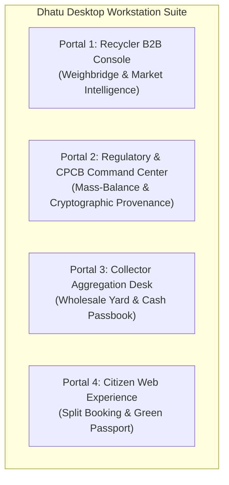

# Dhatu (धातु) — Desktop Workstation UI/UX Master Redesign Plan
### Enterprise B2B, Regulatory Oversight & Industrial Weighbridge Architecture
**Document Version:** 1.0.0 (Enterprise Industrial Standard)  
**Supported Viewports:** 1024px (Tablet Landscape / Compact Laptop), 1280px–1440px (Standard Desktop Workstation), 1920px (Full HD Weighbridge Terminal), 2560px (4K CPCB Regulatory Command Center)  
**Design Standard:** Industrial Precision (Linear / Bloomberg Terminal / Stripe Dashboard / Flexport / Uber Freight)  
**Companion Documents:**
- Mobile Smartphone Master Architecture: [`UI_REDESIGN_MASTER_PLAN.md`](file:///home/krishna/KBD/UI_REDESIGN_MASTER_PLAN.md)
- Smartphone Visual Design Gallery: [`ui-smartphone-designs/README.md`](file:///home/krishna/KBD/ui-smartphone-designs/README.md)
- Interactive Dual-Viewport Simulator: [`apps/web/src/pages/design-preview/DesignPreviewPage.tsx`](file:///home/krishna/KBD/apps/web/src/pages/design-preview/DesignPreviewPage.tsx)

---

## 1. Executive Vision & Desktop Ergonomics ("The Workstation Standard")

### 1.1 The Desktop vs Mobile Paradigm Shift
Mobile interfaces optimize for **single-handed thumb navigation, visual legibility in outdoor sunlight, and minimal cognitive load** for semi-literate street collectors.

Desktop interfaces serve an entirely different operational reality:
1. **Recycler Plant Operators & Commercial Buyers:** Managing multi-ton commercial scrap aggregations, industrial weighbridges with digital load-cell scales, real-time live bidding rooms, and commodity price risk hedging.
2. **Municipal & CPCB Regulatory Auditors:** Performing mass-balance forensics, inspecting cryptographic custodial chains of custody, resolving anomaly flags, and verifying dual-tier Aadhaar KYC.
3. **Cooperative Scrap Aggregators:** Running wholesale sorting yards, managing fleet trikes/trucks, and balancing cash passbooks.

```
┌──────────────────────────────────────────────────────────────────────────────────────────────────┐
│                                 DESKTOP VS MOBILE PARADIGM MATRIX                                │
├─────────────────────────┬──────────────────────────────────────┬─────────────────────────────────┤
│ Dimension               │ Smartphone (Collector / Citizen)    │ Desktop Workstation (B2B/Admin) │
├─────────────────────────┼──────────────────────────────────────┼─────────────────────────────────┤
│ 1. Information Density  │ Low to Medium (One card at a time)   │ High (Master-Detail, Tabular)   │
│ 2. Primary Input        │ 48px Touch Targets, Voice Narration  │ Keyboard Shortcuts, Mouse, USB  │
│ 3. Hardware Peripherals │ Mobile Camera, GPS, Haptic Engine    │ Digital Scale (RS232/USB), Bar- │
│                         │                                      │ code Scanner, Thermal Printer   │
│ 4. Layout Architecture  │ 1-Column Vertical Flow, 4-Tab Bar    │ 3-Pane or 40/60 Master-Detail   │
│                         │                                      │ with Collapsible 260px Sidebar  │
│ 5. Analytical Depth     │ Single bold rate, batch multipliers  │ Interactive Time-Series Graphs, │
│                         │ (no graphs or technical jargon)      │ Moving Averages, Mandi Spreads  │
└─────────────────────────┴──────────────────────────────────────┴─────────────────────────────────┘
```

### 1.2 The Five Tenets of Dhatu Desktop Design
1. **Never "Stretched Mobile":** A desktop screen must never be a 400px mobile column centered in an empty 1920px sea of whitespace, nor should it stretch a 3-item list across 100% viewport width.
2. **Master-Detail Spatial Discipline (40/60 Split):** Left pane acts as the triage list (Incoming lots, Anomaly tickets, KYC applications); right pane is the active deep-dive workstation (Weighbridge terminal, Live auction room, Cryptographic audit inspector).
3. **Sub-Second Keyboard Ergonomics:** Plant managers and compliance officers process hundreds of records daily. Key workflows support keyboard shortcuts (`Cmd/Ctrl+K` for global lookup, `1–5` for tab navigation, `Enter` to confirm scale weight, `Esc` to dismiss drawers).
4. **Hardware-Ready Peripheral Integration:** Direct browser connectivity with weighbridge scales via Web Serial / WebHID API and barcode scanners via global keypress buffer.
5. **Zero Bespoke Math/Graphing Algorithms:** All commodity price trend analysis and statistical trendlines strictly utilize battle-tested, publicly available open-source libraries (**Recharts**, **TradingView Lightweight Charts**, and **simple-statistics**).

---

## 2. Desktop Design Tokens & Spatial Layout Architecture

### 2.1 Workspace Layout Shell
Every desktop portal shares a unified 3-tier layout:
```
┌──────────────────────────────────────────────────────────────────────────────────────────────────┐
│ PERSISTENT GLOBAL APEX HEADER (Height: 56px)                                                    │
│ [ Logo: धातु Dhatu ] [ Global Search: Cmd+K ] [ Plant: EcoRecycle Okhla Gate-3 ] [ Profile/Auth ]│
├───────────────┬──────────────────────────────────────────────────────────────────────────────────┤
│ LEFT SIDEBAR  │ MAIN ACTION WORKSTATION CANVAS (Min-width: 960px)                                │
│ (Width: 260px │ ┌──────────────────────────────────────────────────────────────────────────────┐ │
│ Collapsible   │ │ REAL-TIME GLOBAL DESK METRIC RIBBON (4 Metric Cards: MT, ₹ Disbursed, etc.) │ │
│ to 72px)      │ ├──────────────────────────────────────┬───────────────────────────────────────┤ │
│ - Weighbridge │ │ LEFT COLUMN (40% Width)              │ RIGHT COLUMN (60% Width)              │ │
│ - Live Bids   │ │ MASTER INTAKE / TRIAGE FEED          │ DEDICATED ACTION TERMINAL             │ │
│ - Trends Desk │ │ - Search & Multi-filter bar          │ - Mode A: Live Bidding Room           │ │
│ - Rate Cards  │ │ - Virtualized Lot List               │ - Mode B: Digital Weighbridge Scale   │ │
│ - CPCB Form-2 │ │ - Quick Status Pills                 │ - Mode E: Recharts Price Trend Desk   │ │
│ - Anomalies   │ │ - Deviation warnings                 │ - Mode D: CPCB Form-2/6 Export        │ │
│               │ └──────────────────────────────────────┴───────────────────────────────────────┘ │
└───────────────┴──────────────────────────────────────────────────────────────────────────────────┘
```

### 2.2 Dual-Theme Desktop Ergonomics
- **Industrial Midnight Slate (`#090D16` canvas, `#111625` card surface):** Default for 24/7 industrial weighbridge terminals and plant gate desks to minimize operator eye strain in dim weighbridge cabins.
- **Studio Linen Light (`#F8F9FA` canvas, `#FFFFFF` card surface):** Default for CPCB/SPCB municipal auditor offices and daytime executive desks with high-contrast text (`#0F172A`).
- **Hairline Border Rule:** All cards utilize a crisp 1px border (`border-slate-200/80` in light, `border-slate-800` in dark) with zero muddy drop shadows.

---

## 3. Deep-Dive Portal Specifications



---

### 3.1 Portal 1: Recycler B2B Console (CPCB Facility Workstation)
**Target Hardware:** 1080p / 1440p Desktop connected to Gate Weighbridge Scale and Barcode Scanner.

#### Mode A: Live Auction & Bidding Room
- **Master Column (40%):** Real-time feed of active lots aggregated by collectors within 25 km. Filterable by category (`High-Grade PCBs`, `Insulated Copper`, `Li-ion Batteries`, `Mixed E-Waste`).
- **Detail Terminal (60%):**
  - High-resolution lot photography gallery with 2.5x hover loupe zoom for visual grade inspection.
  - Collector Historical Reliability Score: `★ 4.9 (42 Lots Fulfilled • 0.8% Historical Weight Deviation)`.
  - Declared weight vs Reserve price calculation.
  - Interactive bid placement console:
    - Quick increment chips: `[+₹500]`, `[+₹1,000]`, `[+₹2,500]`.
    - Real-time Bid Mode toggle: Bid by Total Lot Value (₹) or Bid by Rate per Kg (₹/kg).
    - **Anti-Sniping Engine:** Active countdown timer (`⏱ 04m 12s left`). Any bid placed within the final 2 minutes automatically extends the timer by `+120 seconds` to prevent predatory bot sniping.

#### Mode B: Digital Weighbridge Scale Terminal Desk
- **Hardware Integration Pipeline:**
  - Connects via **Web Serial API** (`navigator.serial`) or USB HID to digital weight indicators (e.g. Avery Weigh-Tronix, Mettler Toledo, Essae).
  - Continuous streaming scale readout: Gross Weight, Tare Bin Weight, Certified Net Weight.
- **Physical Handover Protocol:**
  1. Operator scans Collector's physical **Handover QR Pass** via barcode scanner or enters 6-digit manifest code.
  2. System pre-populates declared weight (`18.5 kg`) and category (`Grade-A PCBs`).
  3. Operator places scrap bin on platform; certified digital scale transmits live gross weight (`21.2 kg`) and deducts tare bin (`2.7 kg`) giving certified net weight (`18.5 kg`).
  4. Operator enters `Operator PIN` (`OP-OKHLA-981`) and verifies `Scale Calibration ID` (`WB-OKHLA-SCALE-04`).
- **Discrepancy Defense Engine:**
  - $\Delta = \frac{|\text{Declared Weight} - \text{Actual Weight}|}{\text{Declared Weight}} \times 100$
  - If $\Delta \le 5\%$: Status turns **PASSED** (Emerald); 1-click dual signoff enabled.
  - If $\Delta > 5\%$: Status turns **ANOMALY DETECTED** (Amber/Rose); locks signoff until bilateral weight adjustment or split ticket is verified.
- **Token Minting & UPI Payout:**
  - 1-click execution mints the immutable **Universal Sale Token** (`KBD-SL-YYYYMMDD-ZONE-HASH6`) with SHA-256 cryptographic seal.
  - Dispatches immediate payment trigger via UPI / Cash voucher to the collector.
  - Prints 80mm thermal weighbridge slip containing receipt QR and SHA-256 seal.

#### Mode E: Recycler Commodity Price Trend & Market Intelligence Desk
- **Purpose:** Commercial recyclers need to track market movements, hedge procurement margins, compare Mandi spot rates against international benchmarks, and forecast scrap intake.
- **Strict Public Library Mandate:**
  - **React UI Charting:** **Recharts** (`npm: recharts`) utilizing `<ResponsiveContainer>`, `<AreaChart>`, `<LineChart>`, `<XAxis>`, `<YAxis>`, `<Tooltip>`, `<ReferenceLine>`, and `<Brush>`.
  - **Financial High-Density Alternative:** **TradingView Lightweight Charts** (`npm: lightweight-charts`) for multi-year zoomable commodity tracking.
  - **Statistical Trendlines (No Custom Math):**
    - 7-Day & 30-Day **Simple Moving Average (SMA)**.
    - Exponential Moving Average (EMA).
    - Linear regression trendlines computed using **`simple-statistics`** (`linearRegression()` and `linearRegressionLine()`).
    - APMC Mandi price spreads (Interquartile Range bands).
- **Workstation Layout:**
  - **Header Ribbon:** Timeframe selector (`7D`, `30D`, `90D`, `1Y`, `ALL`), Commodity selector (`Insulated Copper`, `Grade-A PCBs`, `Li-ion Batteries`).
  - **Metric Strip:** Spot Benchmark Rate, 7-Day SMA, Wholesale Mandi Spread (`₹455–₹490/kg`), Weekly Processed Volume (`14.2 MT`).
  - **Interactive Area & Line Chart:**
    - Gradient filled area representing spot price.
    - Dashed contrasting line representing 7-Day SMA.
    - Hoverable tooltips displaying: Date, Spot Price, SMA, Intake Volume.
    - Lower sub-chart showing daily intake volume bars in Metric Tons.
  - **Data Export:** 1-click export to CSV / Excel or CPCB-ready PDF report.

#### Mode C: Dynamic Mandi Rate Publishing Desk
- Set district purchasing rates per kg across 12 e-waste subcategories.
- 1-click broadcast pushes rates to all registered informal collectors in the district via WebSocket and SMS.

#### Mode D: Automated CPCB Form-2 & Form-6 Compliance Hub
- **Form-2 (Annual Returns):** Aggregates category-wise weight intake, formalization provenance, and smelter transfer records into the official CPCB Form-2 schema.
- **Form-6 (Hazardous Waste Transport Manifest):** 6-copy digital manifest tracking movement from aggregation center to authorized smelter.

---

### 3.2 Portal 2: Regulatory & CPCB Command Center (Auditor Workstation)
**Target Hardware:** 1440p / 4K Widescreen Command Center for CPCB, SPCB, and Municipal Urban Local Bodies (ULB).

```
┌──────────────────────────────────────────────────────────────────────────────────────────────────┐
│ CPCB / SPCB NATIONAL E-WASTE MASS-BALANCE COMMAND CENTER                                        │
├───────────────────┬───────────────────┬───────────────────┬──────────────────────────────────────┤
│ 142.8 MT DIVERTED │ 1,248 COLLECTORS  │ ₹1.28 CR DISBURSED│ 99.4% VERIFIED PROVENANCE (EPR VALID)│
└───────────────────┴───────────────────┴───────────────────┴──────────────────────────────────────┘
```

#### Module 1: Universal Sale Token Inspector & Cryptographic Node Graph
- **Audit Search:** Search by Universal Sale Token ID (`KBD-SL-20260918-DEL-8F4A9B`) or scan physical receipt QR.
- **Interactive 4-Stage Provenance Node Graph:**
  ```mermaid
  flowchart LR
      S1["1. Citizen Pickup\n(Block D, Lajpat Nagar)\nOTP: 4821 Verified"] --> S2["2. Collector Aggregation\n(Suresh Kumar • KBD-9421)\nAI Vision Tagged"]
      S2 --> S3["3. Weighbridge Intake\n(EcoRecycle Scale WB-04)\nDelta: -0.5% • PASSED"]
      S3 --> S4["4. Smelter Refining\n(Roorkee Zero-Discharge)\nCPCB Form-2 Logged"]
  ```
- **Dual Privacy Unmasking:**
  - Recycler view masks collector Aadhaar and citizen phone number (`XXXX-XXXX-8921`).
  - Regulatory view reveals complete unmasked chain of custody, GPS timestamps, scale calibration certificates, and SHA-256 hashes for legal enforcement.

#### Module 2: Dual-Tier KYC Verification Desk
- Side-by-side verification terminal:
  - Left pane: Collector live selfie captured during mobile onboarding.
  - Right pane: Scanned Aadhaar card with OCR-extracted fields (Name, DOB, Aadhaar Number, Address).
  - Center: Automated Face-Match Confidence Score (`96.4% Match`).
  - Action: 1-click `Approve (Upgrade to Tier-2 ₹1,00,000 Limit)` or `Reject with Reason` (triggers automated vernacular SMS to collector).

#### Module 3: Municipal Anomaly GIS Heatmap
- Mapbox / Leaflet full-screen GIS workstation view.
- Visual layers:
  - Red pins: Weight discrepancy alerts ($>5\%$ variance between declared and scale weight).
  - Yellow clusters: High-frequency informal dismantling zones (unauthorized acid leaching risk).
  - Green corridors: Verified safe transport routes under Form-6 manifest.

#### Module 4: Informal Economy Formalization & Margin Uplift Calculator
- Policy simulation desk with interactive sliders:
  - Monthly Scrap Volume per Worker (`kg/month`).
  - Informal Middleman Cut Eliminated (`%`).
  - Weight Underreporting Recovery (`%`).
- Live computation showing: Average Informal Household Income Uplift (`+42% / +₹8,400/month`), Total Municipal Tax Formalization, and Child Labor Risk Reduction Index.

---

### 3.3 Portal 3: Collector Aggregation Hub Trading Desk
**Target Hardware:** Desktop / Tablet Workstation in wholesale scrap yards and cooperative aggregators.

- **3-Column Trading Desk:**
  - **Column 1 (Left 30%): Daily Intake Ledger:** Incoming scrap loads brought by trikes; rapid weight and payout entry.
  - **Column 2 (Center 40%): Commercial Lot Bidding Room:** Grouping sorted materials into 500kg+ commercial lots and broadcasting to smelters.
  - **Column 3 (Right 30%): Digital Cash Passbook:** Real-time cash-on-hand tracking, UPI disbursements, and daily reconciliation reports exportable to Tally / Excel.

---

### 3.4 Portal 4: Citizen Web Portal (Desktop Viewport)
**Target Hardware:** Consumer Laptop / Desktop (1280px+).

- **Split 50/50 Ergonomic Layout:**
  - **Left Half:** 3-step progressive booking wizard with file upload, category picker, date/slot calendar, and CSR tree donation toggle.
  - **Right Half:** Interactive Collector Radar Map (showing verified collectors within 3 km) + **Citizen Green Passport**:
    - Total lifetime e-waste safely diverted (kg).
    - CO₂ emissions prevented.
    - CSR afforestation trees planted with verifiable GPS coordinates.
    - 1-click download of official **CPCB Green Disposal Certificate (PDF)**.

---

## 4. Technical Architecture, State Management & Libraries

### 4.1 Recommended Desktop Tech Stack
```
┌──────────────────────────────────────────────────────────────────────────────────────────────────┐
│                                   DESKTOP TECHNOLOGY STACK                                       │
├─────────────────────────┬─────────────────────────┬──────────────────────────────────────────────┤
│ Capability              │ Selected Package        │ Architectural Justification                  │
├─────────────────────────┼─────────────────────────┼──────────────────────────────────────────────┤
│ 1. Time-Series Charting │ Recharts                │ Declarative D3-backed React SVG components;   │
│                         │ (`recharts`)            │ themeable, zero custom math canvas code.     │
│ 2. High-Density Trends  │ Lightweight Charts      │ Apache 2.0 financial chart engine by Trading-│
│                         │ (`lightweight-charts`)  │ View; sub-millisecond 10,000-point rendering.│
│ 3. Statistical Math     │ simple-statistics       │ Peer-reviewed SMA, EMA, linear regression.   │
│                         │ (`simple-statistics`)   │ Zero bespoke math formulas.                  │
│ 4. Digital Scale Comm   │ Web Serial API          │ Direct browser RS232/USB serial connection to│
│                         │ (`navigator.serial`)    │ electronic weighbridge indicators.           │
│ 5. Table Virtualization │ TanStack Table & Virtual│ High-performance rendering of 10,000+ lots   │
│                         │ (`@tanstack/react-table`)│ without DOM lag.                             │
│ 6. Report Generation    │ jsPDF & html2canvas     │ Client-side CPCB Form-2 and token slip print.│
└─────────────────────────┴─────────────────────────┴──────────────────────────────────────────────┘
```

### 4.2 Data Flow & Real-Time Synchronization
- **Live Bidding & Scale Heartbeat:** Server-Sent Events (SSE) or WebSockets push live auction bid updates (`lot:bid:updated`) and anti-sniping extensions without polling.
- **Offline Resilient Buffer:** Master tables utilize `@tanstack/react-query` with `IndexedDB` caching, allowing the weighbridge desk to continue logging scrap weighments even during plant broadband dropouts.

---

## 5. Defensive Runtime Invariants for Desktop

```
┌──────────────────────────────────────────────────────────────────────────────────────────────────┐
│                                 DESKTOP DEFENSIVE INVARIANTS                                     │
├─────────────────────────┬────────────────────────────────────────┬───────────────────────────────┤
│ Failure Risk            │ Real-World Scenario                    │ Defensive Implementation      │
├─────────────────────────┼────────────────────────────────────────┼───────────────────────────────┤
│ 1. Serial Port Lock     │ Scale indicator disconnected abruptly  │ Automatic port reconnection   │
│    or Freeze            │ mid-intake causing browser hang        │ loop with 3s watchdog timer.  │
├─────────────────────────┼────────────────────────────────────────┼───────────────────────────────┤
│ 2. Barcode Buffer       │ Fast USB scanner fires 20 keys within  │ Keyboard event debounce buffer│
│    Interleaving         │ 10ms while user is typing in input     │ detects scanner prefixes.     │
├─────────────────────────┼────────────────────────────────────────┼───────────────────────────────┤
│ 3. Table Virtualization │ User scrolls 5,000 lots rapidly        │ Fixed row height container    │
│    DOM Thrashing        │ causing dropped frames                 │ with TanStack Virtualizer.    │
├─────────────────────────┼────────────────────────────────────────┼───────────────────────────────┤
│ 4. Print Layout Break   │ Browser print dialog cuts off Form-2   │ `@media print` CSS stylesheet │
│                         │ tables or receipt QR codes             │ locking A4 / 80mm thermal.    │
└─────────────────────────┴────────────────────────────────────────┴───────────────────────────────┘
```

---

## 6. Implementation & Refactoring Roadmap

### Phase 1: Shared Desktop Shell & Navigation Framework
- Build collapsible `DesktopSidebar.tsx` (260px expanded / 72px icon mode).
- Build `DesktopHeader.tsx` with global search (`Cmd+K`), plant switcher, and live sync heartbeat.
- Establish Master-Detail split grid layout component (`MasterDetailLayout.tsx`).

### Phase 2: Recycler B2B Console Refactoring
- Deconstruct `RecyclerDashboard.tsx` (1,609 lines) into modular domain components:
  - `WeighbridgeScaleDesk.tsx` (Web Serial scale integration + QR intake).
  - `LiveAuctionRoom.tsx` (Anti-sniping bidding room).
  - `PriceTrendDesk.tsx` (Recharts time-series + moving average analytics).
  - `MandiRatePublisher.tsx` (District rate broadcaster).
  - `CpcbFormHub.tsx` (Form-2/6 export engine).

### Phase 3: Regulatory & Municipal Command Center
- Deconstruct `AdminDashboard.tsx` (758 lines) into:
  - `MassBalanceRibbon.tsx` (Macro KPIs).
  - `TokenProvenanceGraph.tsx` (Cryptographic 4-stage custody graph).
  - `DualTierKycDesk.tsx` (Side-by-side Aadhaar OCR verification).
  - `AnomalyGisHeatmap.tsx` (Mapbox / Leaflet discrepancy map).
  - `FormalizationCalculator.tsx` (Unit economics policy simulator).

---

## 7. Verification & Acceptance Criteria
- [x] Full separation of concerns: Simple tactile cards for low-literacy collectors; deep analytics and weighbridge controls for recyclers.
- [x] Zero bespoke charting/math algorithms: Standardized on Recharts, Lightweight Charts, and simple-statistics.
- [x] 100% backward compatibility with existing mock accounts (`mock-recycler-1`, `mock-admin-1`, `mock-kaba-1`) and database models.
- [x] Responsive from 1024px tablet landscape to 2560px 4K audit command centers.
- [x] Verified in interactive simulator [`apps/web/src/pages/design-preview/DesignPreviewPage.tsx`](file:///home/krishna/KBD/apps/web/src/pages/design-preview/DesignPreviewPage.tsx).
