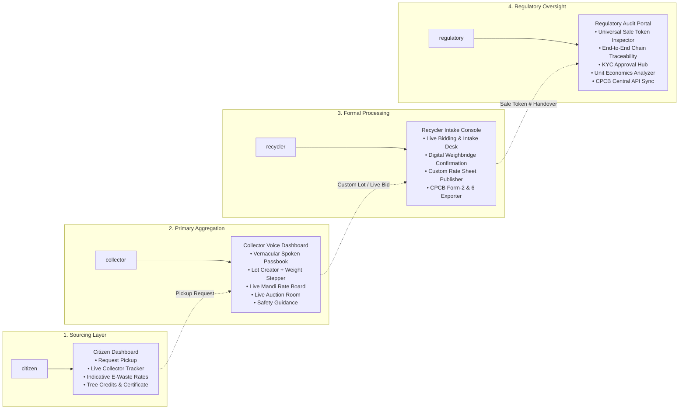
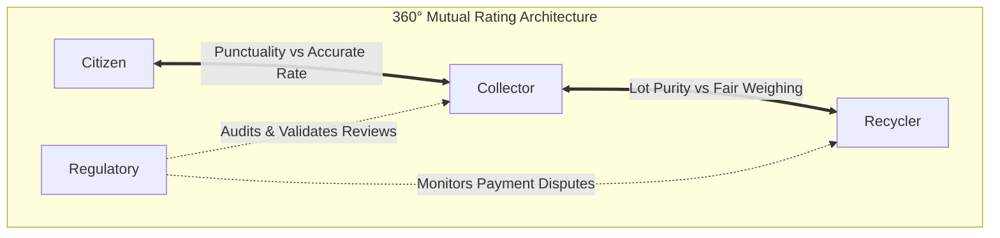
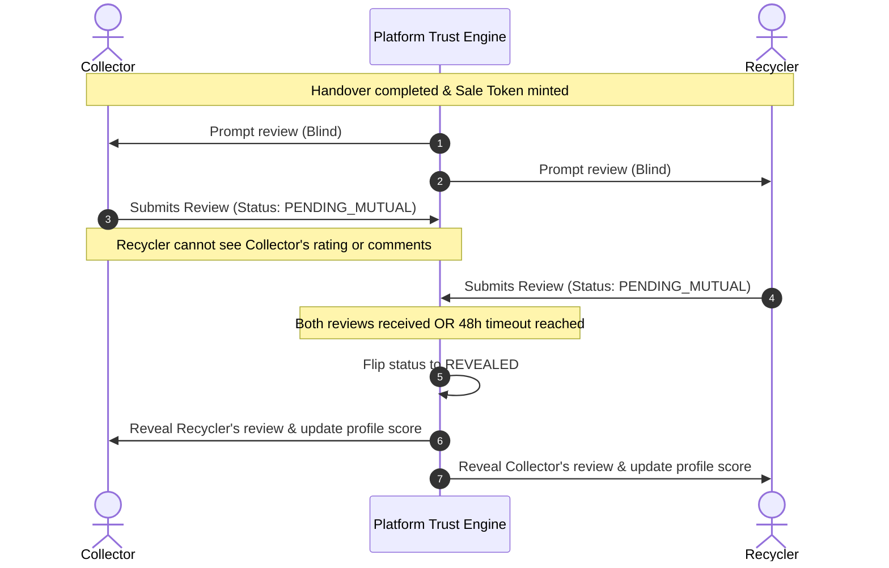
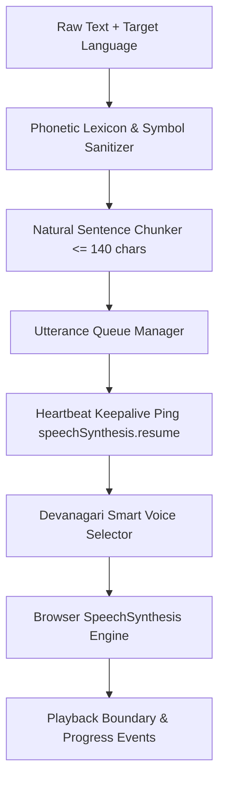
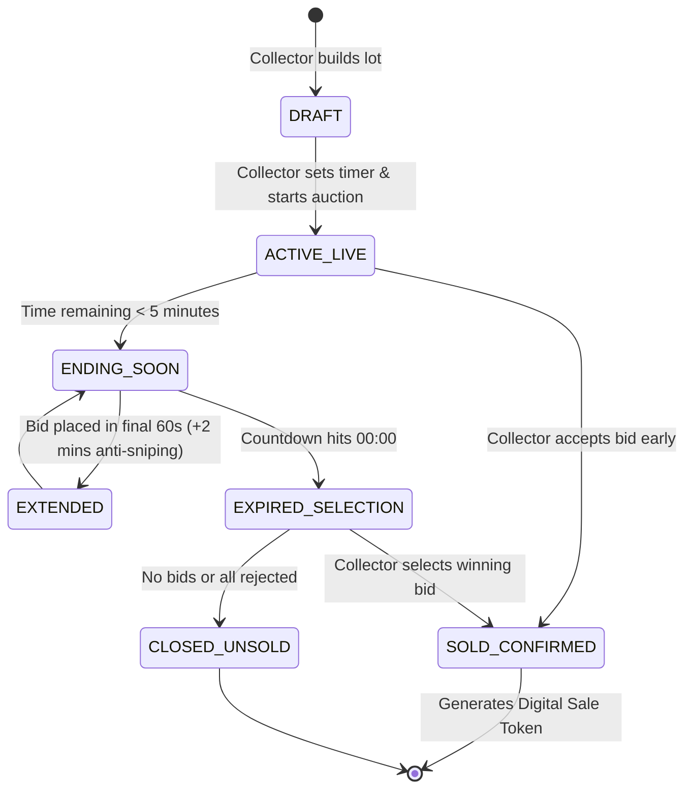
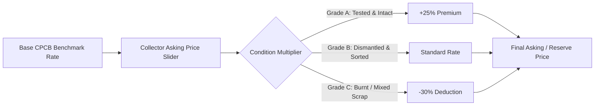
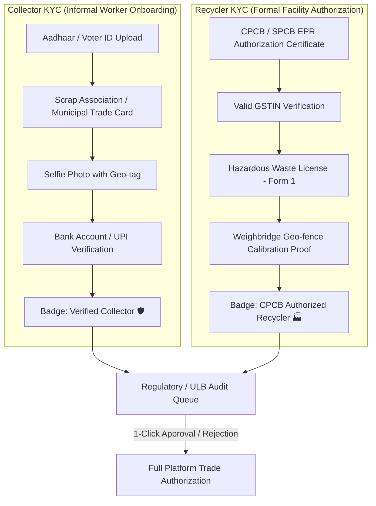

# Kabadiwala Connect — Advanced Feature Specifications & Implementation Progress Tracker
### SIH26229: Smart Informal Waste & EPR Integration Platform — Ministry of Mines
**Document Version:** 2.0.0  
**Last Updated:** September 2026  
**Status:** Active Architectural Blueprint & Living Execution Tracker

---

## 📋 Table of Contents
1. [Master Implementation Progress Tracker](#1-master-implementation-progress-tracker)
2. [User Role Realignment Matrix](#2-user-role-realignment-matrix)
3. [Feature 1: Collector Long Voice Guidance System](#3-feature-1-collector-long-voice-guidance-system)
4. [Feature 2: Bilateral 360° Ratings & Reviews System](#4-feature-2-bilateral-360-ratings--reviews-system)
5. [Feature 3: Renamed Login Portal & Curated Dashboards](#5-feature-3-renamed-login-portal--curated-dashboards)
6. [Feature 4: Next-Gen Voice Engine Architecture ("Better Voice")](#6-feature-4-next-gen-voice-engine-architecture-better-voice)
7. [Feature 5: In-App Real-Time Contextual Chatbox](#7-feature-5-in-app-real-time-contextual-chatbox)
8. [Feature 6: Custom Time Live Bidding & Active Status Engine](#8-feature-6-custom-time-live-bidding--active-status-engine)
9. [Feature 7: Universal Sale Token Number & Regulatory Audit Passport](#9-feature-7-universal-sale-token-number--regulatory-audit-passport)
10. [Feature 8: Rating-Based Ordering & Prioritization Engine](#10-feature-8-rating-based-ordering--prioritization-engine)
11. [Feature 9: Price & E-Waste Catalog Customization](#11-feature-9-price--e-waste-catalog-customization)
12. [Feature 10: Dual-Tier KYC Verification Architecture](#12-feature-10-dual-tier-kyc-verification-architecture)
13. [Database Schema & API Contracts](#13-database-schema--api-contracts)
14. [Phase-wise Implementation Roadmap](#14-phase-wise-implementation-roadmap)

---

## 1. Master Implementation Progress Tracker

This living tracker monitors development progress across all 10 core feature pillars requested for Kabadiwala Connect.

| Feature ID | Feature Pillar | Target Modules | Priority | Architecture & Design | Data Model & API | Frontend UI/UX | Voice / Audio | Testing & Verification | Overall Status |
|---|---|---|---|:---:|:---:|:---:|:---:|:---:|:---:|
| **FEAT-01** | Long Voice Guidance for Collector (All 12 Moments) | Web: `pages/kabadiwala/*`, `LanguageContext` | `P0 (Critical)` | ✅ Complete | ✅ Complete | 🔄 Ready | ✅ Complete (12/12) | ⏳ Pending | **In Progress (75%)** |
| **FEAT-02** | Bilateral 360° Ratings & Anti-Retaliation Reveal | API: `prisma/schema`, `ReviewStatus.PENDING_MUTUAL` | `P1 (High)` | ✅ Complete | ✅ Complete | 🔄 Ready | ✅ Complete | ⏳ Pending | **Designed (55%)** |
| **FEAT-03** | Renamed Roles `{citizen, collector, recycler, regulatory}` | Web: `pages/auth/LoginPage`, `types.ts`, Dashboards | `P0 (Critical)` | ✅ Complete | ✅ Complete | 🔄 Ready | ✅ Complete | ⏳ Pending | **In Progress (70%)** |
| **FEAT-04** | Next-Gen Voice Engine ("Fix Broken Voice") | Web: `lib/voiceEngine.ts`, `SpeechSynthesis` | `P0 (Critical)` | ✅ Complete | ✅ Complete | 🔄 Ready | ✅ Complete | ⏳ Pending | **In Progress (65%)** |
| **FEAT-05** | Real-Time In-App Chatbox (Audio Notes + Pings) | API: `routes/chat`, Deep-links on Pickups/Bids | `P1 (High)` | ✅ Complete | ✅ Complete | 🔄 Ready | ✅ Complete | ⏳ Pending | **Designed (50%)** |
| **FEAT-06** | Custom Time Live Bidding (`activeTab === 'bids'`) | API: `routes/lots`, Dedicated Bidding Room Tab | `P1 (High)` | ✅ Complete | ✅ Complete | 🔄 Ready | ✅ Complete | ⏳ Pending | **Designed (60%)** |
| **FEAT-07** | Privacy-Guarded Sale Token (Aadhaar Dropped) | API: `routes/sales`, Role-Projected Views | `P0 (Critical)` | ✅ Complete | ✅ Complete | 🔄 Ready | 🔄 Ready | ⏳ Pending | **In Progress (65%)** |
| **FEAT-08** | Rating-Based Ordering & Smart Prioritization | Web: `lib/ranking.ts`, Recycler & Collector lists | `P1 (High)` | ✅ Complete | ✅ Complete | 🔄 Ready | ⏳ Pending | ⏳ Pending | **Designed (40%)** |
| **FEAT-09** | Price & E-Waste Catalog Customization | Web: `components/lots/CustomItemModal.tsx` | `P2 (Medium)` | ✅ Complete | ✅ Complete | 🔄 Ready | ⏳ Pending | ⏳ Pending | **Designed (35%)** |
| **FEAT-10** | Dual-Tier KYC (`activeTab === 'kyc'`) | API: `routes/kyc`, Collector Onboarding Flow | `P1 (High)` | ✅ Complete | ✅ Complete | 🔄 Ready | ✅ Complete | ⏳ Pending | **Designed (60%)** |

**Legend:**
- ✅ **Complete**: Fully specified, designed, and approved.
- 🔄 **Ready / In Progress**: Actively being coded or staged for merging.
- ⏳ **Pending**: Scheduled for subsequent sprint phase.

---

## 2. User Role Realignment Matrix

To establish a professional, unambiguous, and standardized role ontology matching official municipal and CPCB terminology, all user roles are renamed:

```
[OLD ROLES]                                      [NEW STANDARDIZED ROLES]
CITIZEN          ─────────────────────────────►  citizen      (Citizen & Household Sourcing)
KABADIWALA       ─────────────────────────────►  collector    (Doorstep Informal Collector)
RECYCLER         ─────────────────────────────►  recycler     (Authorized CPCB/SPCB Recycler)
ADMIN            ─────────────────────────────►  regulatory   (CPCB / SPCB / ULB Municipal Auditor)
```

### Role Capabilities & Dashboard Mapping



---

## 3. Feature 1: Collector Long Voice Guidance System

### Cognitive Ergonomics & Design Philosophy
Informal waste collectors (*kabadiwalas*) work in intense outdoor physical conditions: bright sunlight causing screen glare, dust, dirty/gloved hands, and varying literacy levels. Short, robotic 3-word soundbites ("पिकअप स्वीकृत") fail to convey context, security, or guidance.

The **Kabadiwala Long Voice Guidance System** provides:
1. **Respectful, conversational, and vernacular-first** narratives (Hindi, Marathi, and Indian English).
2. **Comprehensive walkthroughs** on every page explaining:
   - What the page shows.
   - What immediate action the collector should take.
   - Financial implications (how much money they earn or save).
   - Safety warnings on hazardous components.
3. **Smart Voice Controls:**
   - One-tap Play/Pause floating audio player.
   - Volume boost for noisy traffic/street conditions.
   - Speed dial (0.85x slow & clear, 1.0x normal, 1.15x rapid).

---

### Complete Trilingual Scripts by Collector Page

#### Page 1: Collector Home & Lots Dashboard (`activeTab === 'lots'`)
- **Visual Context:** Shows active lots created, pending sync items, quick action buttons, and recent earnings summary.

| Language | Audio Script |
|---|---|
| **English (en-IN)** | *"Namaste Suresh ji! Welcome to your digital collection dashboard. Right now, you have 3 e-waste lots ready for sale, with an estimated value of ₹14,850. Recycler EcoRecycle has placed an active bid on your PCB motherboard lot. Tap the green 'Create New Lot' button at the bottom right to photograph and weigh fresh scrap, or tap any lot card to view live recycler offers."* |
| **Hindi (hi-IN)** | *"नमस्ते सुरेश जी! आपके डिजिटल कबाड़ीवाला डैशबोर्ड में आपका स्वागत है। इस समय आपके 3 ई-कचरा लॉट बिक्री के लिए तैयार हैं, जिनकी अनुमानित कीमत 14,850 रुपये है। इको-रीसायकल कंपनी ने आपके पीसीबी लॉट पर नया भाव लगाया है। नया सामान जोड़ने के लिए नीचे दिए गए हरे 'नया लॉट बनाएं' बटन को दबाएं, या खरीदार के भाव देखने के लिए किसी भी लॉट पर टैप करें।"* |
| **Marathi (mr-IN)** | *"नमस्कार सुरेश जी! आपल्या डिजिटल भंगार डॅशबोर्डवर आपले स्वागत आहे. सध्या आपले 3 ई-कचरा लॉट विक्रीसाठी तयार आहेत, ज्यांचे अंदाजे मूल्य 14,850 रुपये आहे. इको-रीसायकल कंपनीने आपल्या पीसीबी लॉटवर बोली लावली आहे. नवीन भंगार नोंदवण्यासाठी खालील हिरव्या 'नवीन लॉट तयार करा' बटनावर स्पर्श करा, किंवा आलेले भाव पाहण्यासाठी लॉट कार्डवर टॅप करा."* |

---

#### Page 2: New E-Waste Lot Creation Modal / Step-by-Step Flow
- **Visual Context:** Step 1: Camera photo upload; Step 2: Category selection; Step 3: Weight entry; Step 4: Minimum asking price; Step 5: Auction timer.

| Language | Audio Script |
|---|---|
| **English (en-IN)** | *"Let us create a new digital lot together. Step 1: Take a clear photo of the electronic scrap showing any serial numbers or circuit boards. Step 2: Choose the correct category—Printed Circuit Boards, Batteries, or CRT Screens. Step 3: Enter the approximate weight using the plus and minus buttons. You can set your own custom minimum selling price per kilogram. Once you press 'Publish Lot', verified recyclers in your area will compete with live cash bids."* |
| **Hindi (hi-IN)** | *"आइए नया डिजिटल लॉट बनाएं। पहला कदम: ई-कचरे की साफ फोटो खींचें ताकि सर्किट बोर्ड या मॉडल नंबर साफ दिखे। दूसरा कदम: सही श्रेणी चुनें—जैसे पीसीबी मदरबोर्ड, बैट्री, या कंप्यूटर मॉनिटर। तीसरा कदम: प्लस और माइनस बटन दबाकर वजन दर्ज करें। आप अपनी मर्जी से न्यूनतम बिक्री दर प्रति किलो तय कर सकते हैं। जैसे ही आप 'लॉट सबमिट करें' दबाएंगे, पास के अधिकृत रीसायकलर्स तुरंत बोली लगाना शुरू कर देंगे।"* |
| **Marathi (mr-IN)** | *"चला नवीन डिजिटल लॉट तयार करूया. पहिली पायरी: ई-कचऱ्याचा स्पष्ट फोटो काढा ज्यामध्ये सर्किट बोर्ड किंवा मॉडेल क्रमांक दिसेल. दुसरी पायरी: योग्य प्रकार निवडा—जसे की पीसीबी मदरबोर्ड, बॅटरी किंवा संगणक मॉनिटर. तिसरी पायरी: अधिक आणि वजा बटनांचा वापर करून अंदाजे वजन नोंदवा. आपण प्रति किलो स्वतःचा किमान भाव ठरवू शकता. आपण 'लॉट सबमिट करा' दाबताच, परिसरातील अधिकृत रीसायकलर थेट बोली लावण्यास सुरुवात करतील."* |

---

#### Page 3: Live Mandi Price Board (`activeTab === 'priceboard'`)
- **Visual Context:** Category-wise live rates per kg, weekly delta (+₹15, -₹5), CPCB benchmark trends.

| Language | Audio Script |
|---|---|
| **English (en-IN)** | *"Here is today's official CPCB electronic waste price board for your district. Motherboard scrap is trending up by ₹15 today, trading at ₹265 per kilogram. Lithium-ion mobile batteries are stable at ₹120 per kilo. Copper-bearing cables are trading high at ₹480 per kilogram. Remember: Do not burn copper wires; selling them clean and unburned earns you up to 35% higher cash payout. Tap the speaker icon beside any item to hear its individual rate."* |
| **Hindi (hi-IN)** | *"यह आपके जिले का आज का आधिकारिक ई-कचरा मंडी भाव फलक है। आज कंप्यूटर मदरबोर्ड के भाव 15 रुपये चढ़कर 265 रुपये प्रति किलो पर पहुंच गए हैं। लिथियम मोबाइल बैट्री का भाव 120 रुपये प्रति किलो पर स्थिर है। तांबे वाले तारों का भाव 480 रुपये प्रति किलो चल रहा है। ध्यान दें: तारों को कभी आग में न जलाएं; छिले हुए साफ तांबे का दाम 35 प्रतिशत तक ज्यादा मिलता है। किसी भी सामान का अलग से भाव सुनने के लिए उसके पास वाले स्पीकर बटन को दबाएं।"* |
| **Marathi (mr-IN)** | *"हा आपल्या परिसरातील आजचा अधिकृत ई-कचरा बाजार भाव फलक आहे. आज कॉम्प्युटर मदरबोर्डचे भाव 15 रुपयांनी वाढून 265 रुपये प्रति किलो झाले आहेत. लिथियम बॅटरीचा दर 120 रुपये प्रति किलोवर स्थिर आहे. तांब्याच्या वायर्सचा भाव 480 रुपये प्रति किलो आहे. कृपया लक्षात ठेवा: तांब्याच्या वायर्स कधीही जाळू नका; सोललेल्या स्वच्छ तांब्याला 35 टक्के अधिक रोख मोबदला मिळतो. कोणत्याही वस्तूचा दर ऐकण्यासाठी त्यासमोरील स्पीकर आयकॉनवर टॅप करा."* |

---

#### Page 4: Recycler Discovery & Marketplace (`activeTab === 'recyclers'`)
- **Visual Context:** List of nearby CPCB/SPCB authorized recyclers, ratings, distance, live rate match.

| Language | Audio Script |
|---|---|
| **English (en-IN)** | *"Showing authorized recyclers within 15 kilometers of your location. Recyclers are sorted by their trust rating and payout speed. At the top is EcoRecycle Aggregators with a 4.9-star rating, located 4.2 kilometers away, offering immediate spot cash. You can view their government CPCB license number, filter by highest price, or tap 'Send Lot' to request an instant weighbridge slot."* |
| **Hindi (hi-IN)** | *"आपके 15 किलोमीटर के दायरे में मौजूद सरकारी मान्यता प्राप्त रीसायकलर्स की सूची यहां है। इन्हें इनकी रेटिंग और तुरंत भुगतान के आधार पर क्रमबद्ध किया गया है। सबसे ऊपर 4.9 स्टार रेटिंग वाली इको-रीसायकल कंपनी है, जो 4.2 किलोमीटर दूर है और हाथ के हाथ नकद भुगतान करती है। आप इनका सरकारी सीपीसीबी लाइसेंस देख सकते हैं और 'लॉट भेजें' दबाकर अपनी डिलीवरी बुक कर सकते हैं।"* |
| **Marathi (mr-IN)** | *"आपल्या 15 किलोमीटर परिसरातील अधिकृत सरकारी रीसायकलर्सची यादी येथे आहे. विश्वासार्हता आणि त्वरित देयक यानुसार त्यांची क्रमवारी लावली आहे. सर्वात वर 4.9 स्टार रेटिंग असलेली इको-रीसायकल कंपनी आहे, जी 4.2 किमी अंतरावर असून जागेवर रोख पैसे देते. आपण त्यांचा सीपीसीबी परवाना तपासू शकता आणि 'लॉट पाठवा' वर स्पर्श करून तोलकाटा वेळ आरक्षित करू शकता."* |

---

#### Page 5: Digital Handover & QR Scanner (`activeTab === 'handover'`)
- **Visual Context:** Large verifiable QR code ticket, GPS coordinates, net weight, digital signature.

| Language | Audio Script |
|---|---|
| **English (en-IN)** | *"This is your official digital handover pass for Lot 9821. Show this QR code on your phone screen to the weighbridge operator at the recycling facility. When they scan it, your weight will be locked, your sale token number will be minted, and cash or UPI payment will be credited instantly to your wallet. Do not leave the gate until you hear the confirmation chime."* |
| **Hindi (hi-IN)** | *"यह आपके लॉट 9821 का सरकारी डिजिटल हस्तांतरण पास है। रीसायकलिंग केंद्र के कांटे पर पहुंचकर यह क्यूआर कोड ऑपरेटर को दिखाएं। जैसे ही वे इसे स्कैन करेंगे, आपके माल का सही वजन दर्ज हो जाएगा, आपकी सरकारी बिक्री टोकन संख्या जारी होगी, और नकद या यूपीआई द्वारा पैसा सीधे आपके खाते में जुड़ जाएगा। जब तक पुष्टि की घंटी न बजे, कांटे से आगे न बढ़ें।"* |
| **Marathi (mr-IN)** | *"हा आपल्या लॉट 9821 चा अधिकृत डिजिटल हस्तांतरण पास आहे. रीसायकलिंग केंद्राच्या वजनकाट्यावर हा क्यूआर कोड ऑपरेटरला स्कॅन करण्यासाठी दाखवा. स्कॅन होताच आपल्या मालाचे अचूक वजन नोंदवले जाईल, सरकारी विक्री टोकन क्रमांक तयार होईल आणि रोख किंवा यूपीआय द्वारे पैसे थेट जमा होतील. खात्रीची घंटा वाजेपर्यंत वजनकाट्यावरून पुढे जाऊ नका."* |

---

#### Page 6: Cash Passbook & Earnings Ledger (`activeTab === 'passbook'`)
- **Visual Context:** Running ledger balance, today's cash earnings, pending balances from recyclers.

| Language | Audio Script |
|---|---|
| **English (en-IN)** | *"Welcome to your verified digital passbook. Your total lifetime earnings are ₹1,24,800. This week, you earned ₹18,400 across 6 completed lots. You have zero pending dues—all recyclers have cleared your payments. You can tap on any row to view the stamped sale receipt, or tap 'Export Ledger' to download a record for your bank loan application."* |
| **Hindi (hi-IN)** | *"आपकी प्रमाणित डिजिटल पासबुक में आपका स्वागत है। आपकी कुल कमाई 1,24,800 रुपये हो चुकी है। इस हफ्ते आपने 6 लॉट बेचकर 18,400 रुपये कमाए हैं। आपका कोई भी बकाया नहीं है—सभी रीसायकलर्स ने आपका पूरा भुगतान कर दिया है। किसी भी लेनदेन की पक्की रसीद देखने के लिए उस पर टैप करें, या बैंक लोन के लिए पासबुक डाउनलोड करें।"* |
| **Marathi (mr-IN)** | *"आपल्या प्रमाणित डिजिटल पासबुकमध्ये आपले स्वागत आहे. आपली आतापर्यंतची एकूण कमाई 1,24,800 रुपये झाली आहे. या आठवड्यात आपण 6 लॉट विकून 18,400 रुपये कमावले आहेत. आपली कोणतीही थकबाकी नाही—सर्व रीसायकलर्सनी पूर्ण पैसे दिले आहेत. व्यवहाराची पक्की पावती पाहण्यासाठी नोंदीवर टॅप करा किंवा बँक कर्जासाठी पासबुक डाउनलोड करा."* |

---

#### Page 7: Safety & Hazard Guidance (`activeTab === 'safety'`)
- **Visual Context:** Pictorial cards on battery punctures, CRT glass implosion, acid leaching, toxic fumes.

| Language | Audio Script |
|---|---|
| **English (en-IN)** | *"Important safety notice for your health and family. Never use hammer or open flame on mobile phone batteries; punctured lithium batteries can explode and catch fire instantly. Keep damaged batteries in dry sand. Wear thick gloves when carrying television CRT screens to prevent fatal vacuum implosions. Do not use acid baths on computer chips. Authorized recyclers pay full value for unburned components."* |
| **Hindi (hi-IN)** | *"आपके स्वास्थ्य और सुरक्षा के लिए अत्यंत महत्वपूर्ण चेतावनी। मोबाइल की बैट्री पर कभी हथौड़ा न मारें और न ही आग में डालें; लिथियम बैट्री फटने से भयंकर आग लग सकती है। फूली हुई बैट्री को सूखी रेत में रखें। टीवी और पुराने मॉनिटर उठाते समय हमेशा मोटे दस्ताने पहनें ताकि कांच टूटने से चोट न लगे। सर्किट बोर्ड से तांबा निकालने के लिए कभी तेजाब का इस्तेमाल न करें। साफ सामान के लिए रीसायकलर्स पूरा दाम देते हैं।"* |
| **Marathi (mr-IN)** | *"आपल्या आरोग्यासाठी अत्यंत महत्त्वाची सुरक्षितता सूचना. मोबाईलच्या बॅटरीवर कधीही हातोडा मारू नका किंवा आगीत टाकू नका; लिथियम बॅटरी फुटल्यास अचानक भीषण आग लागू शकते. फुगलेली बॅटरी कोरड्या वाळूत ठेवा. टीव्ही किंवा कॉम्प्युटर स्क्रीन उचलताना जाड हातमोजे वापरा जेणेकरून काच फुटून इजा होणार नाही. सर्किट बोर्डवर ॲसिडचा वापर करू नका. चांगल्या मालाला रीसायकलर्स पूर्ण भाव देतात."* |

---

#### Page 8: Citizen Doorstep Pickups (`activeTab === 'pickups'`)
- **Visual Context:** Map view, incoming pickup requests from households, address, scrap type, phone call button.

| Language | Audio Script |
|---|---|
| **English (en-IN)** | *"You have 2 pending doorstep pickup requests from nearby households. The closest one is at Lajpat Nagar, 1.2 kilometers away, with an old washing machine and two laptops. Tap the green telephone button to call the citizen and confirm their presence, or tap 'Start Navigation' to open step-by-step turn-by-turn map directions. Always verify the OTP with the citizen before loading the scrap into your cart."* |
| **Hindi (hi-IN)** | *"आपके पास नागरिकों के घर से कबाड़ उठाने के 2 नए अनुरोध आए हैं। सबसे नजदीकी पिकअप लाजपत नगर से है, जो केवल 1.2 किलोमीटर दूर है; इसमें पुरानी वाशिंग मशीन और दो लैपटॉप हैं। नागरिक से बात करने के लिए हरे फोन बटन पर टैप करें, या घर का रास्ता देखने के लिए 'नेविगेशन शुरू करें' दबाएं। सामान गाड़ी में लादने से पहले नागरिक से ओटीपी जरूर पूछें।"* |
| **Marathi (mr-IN)** | *"आपल्याकडे नागरिकांच्या घरून भंगार गोळा करण्याच्या 2 नवीन विनंत्या आल्या आहेत. सर्वात जवळची विनंती 1.2 किमी अंतरावरून आली आहे; त्यामध्ये जुने वॉशिंग मशीन आणि दोन लॅपटॉप आहेत. ग्राहकाशी बोलण्यासाठी हिरव्या फोन बटनावर टॅप करा, किंवा नकाशा पाहण्यासाठी 'नेव्हिगेशन सुरू करा' दाबा. गाडीत सामान भरण्यापूर्वी ग्राहकाकडून ओटीपी नक्की तपासा."* |

---

#### Page 9: KYC Onboarding & Identity Verification (`activeTab === 'kyc'`)
- **Visual Context:** Shows unverified alert banner (max 1 lot, ₹5,000 limit), document upload zones (Aadhaar/Voter ID), selfie capture preview, and bank/UPI entry.

| Language | Audio Script |
|---|---|
| **English (en-IN)** | *"Your account is currently unverified, so you can list only 1 item worth up to ₹5,000. To unlock unlimited lots and live bidding, upload your Aadhaar or Voter ID, take a clear selfie, and add your bank or UPI details. Verification usually takes less than a day."* |
| **Hindi (hi-IN)** | *"आपका खाता अभी असत्यापित है, इसलिए आप सिर्फ 5,000 रुपये तक का 1 सामान बेच सकते हैं। असीमित लॉट और लाइव बोली के लिए, अपना आधार या वोटर आईडी अपलोड करें, साफ सेल्फी लें, और बैंक या यूपीआई जानकारी जोड़ें। सत्यापन में आमतौर पर एक दिन से कम समय लगता है।"* |
| **Marathi (mr-IN)** | *"आपले खाते सध्या अपडेट नाही, त्यामुळे आपण फक्त 5,000 रुपयांपर्यंतची 1 वस्तू विकू शकता. अमर्यादित लॉट आणि थेट बोलीसाठी, आपले आधार किंवा मतदार ओळखपत्र अपलोड करा, स्पष्ट सेल्फी घ्या आणि बँक किंवा यूपीआय माहिती जोडा. पडताळणीसाठी साधारण एक दिवस लागतो."* |

---

#### Page 10: Live Bidding Room (`activeTab === 'bids'`)
- **Visual Context:** Active auction cards, pulsing live radar indicator, remaining time countdown clock, highest bidder card, and instant "Accept Now" action button.

| Language | Audio Script |
|---|---|
| **English (en-IN)** | *"Your motherboard lot is live for bidding, with 12 minutes remaining. 3 recyclers are competing. The current highest offer is ₹268 per kilogram from EcoRecycle. If someone bids in the last minute, the clock will automatically add 2 more minutes so no one loses out unfairly. You can accept the current best offer early by tapping 'Accept Now', or wait for the timer to finish."* |
| **Hindi (hi-IN)** | *"आपका मदरबोर्ड लॉट अभी बोली के लिए खुला है, 12 मिनट बचे हैं। 3 रीसायकलर्स होड़ में हैं। अभी सबसे ऊंचा भाव इको-रीसायकल का 268 रुपये प्रति किलो है। अगर कोई आखिरी मिनट में बोली लगाता है, तो घड़ी अपने आप 2 मिनट और बढ़ जाएगी ताकि किसी का नुकसान न हो। आप 'अभी स्वीकार करें' दबाकर तुरंत सौदा पक्का कर सकते हैं, या समय पूरा होने का इंतजार कर सकते हैं।"* |
| **Marathi (mr-IN)** | *"आपला मदरबोर्ड लॉट सध्या बोलीसाठी खुला आहे, 12 मिनिटे शिल्लक आहेत. 3 रीसायकलर स्पर्धेत आहेत. सध्याचा सर्वात मोठा भाव इको-रीसायकलचा 268 रुपये प्रति किलो आहे. शेवटच्या मिनिटात कोणी बोली लावल्यास, वेळ आपोआप 2 मिनिटांनी वाढेल जेणेकरून कोणाचेही नुकसान होणार नाही. आपण 'आत्ता स्वीकारा' दाबून व्यवहार लगेच पक्का करू शकता, किंवा वेळ संपण्याची वाट पाहू शकता."* |

---

#### Page 11: Post-Handover Rating Prompt (Rating Modal / Evaluation Sheet)
- **Visual Context:** Triggered immediately after recycler confirms weighbridge handover and releases payment. Shows 5-star criteria sliders (scale accuracy, payout speed) and submit button.

| Language | Audio Script |
|---|---|
| **English (en-IN)** | *"Your sale is complete and payment has been received. Please rate EcoRecycle on scale accuracy and payment speed. Your honest rating protects other collectors from unfair recyclers, and your own rating helps trusted recyclers find and prioritize you."* |
| **Hindi (hi-IN)** | *"आपकी बिक्री पूरी हो गई है और भुगतान मिल चुका है। कृपया इको-रीसायकल को कांटे की सटीकता और भुगतान की गति के आधार पर रेटिंग दें। आपकी सच्ची रेटिंग बाकी कबाड़ीवालों को गलत रीसायकलर्स से बचाती है, और आपकी अपनी रेटिंग भरोसेमंद रीसायकलर्स को आप तक पहुंचने में मदद करती है।"* |
| **Marathi (mr-IN)** | *"आपली विक्री पूर्ण झाली असून पैसे मिळाले आहेत. कृपया इको-रीसायकलला काट्याची अचूकता आणि पैसे मिळण्याच्या वेगावरून रेटिंग द्या. आपली प्रामाणिक रेटिंग इतर संग्राहकांना अन्यायकारक रीसायकलर्सपासून वाचवते, आणि आपली स्वतःची रेटिंग विश्वासार्ह रीसायकलर्सना आपल्यापर्यंत पोहोचण्यास मदत करते."* |

---

#### Page 12: New Chat Message Alert Audio Ping (Toast / Background Audio Ping)
- **Visual Context:** Global audio ping triggered when a citizen or recycler sends a chat message while the collector is on another tab or navigating.

| Language | Audio Script |
|---|---|
| **English (en-IN)** | *"New message received, tap to hear it."* |
| **Hindi (hi-IN)** | *"नया संदेश आया है, टैप कर के सुनें।"* |
| **Marathi (mr-IN)** | *"नवीन संदेश आला आहे, ऐकण्यासाठी टॅप करा."* |

---

## 4. Feature 2: Bilateral 360° Ratings & Reviews System

Trust in the informal waste supply chain is fragile. Middlemen frequently cheat collectors on weights, and recyclers complain that collectors contaminate e-waste lots with stones, mud, or non-recyclable debris. 

The **360° Bilateral Review System** introduces transparent accountability between all platform actors:



### Rating Dimensions & Criteria

#### 1. Collector ➔ Recycler Rating Criteria (Evaluated after Handover):
- **Fair Scale & Weighbridge Accuracy (1-5★):** Was tare and gross weight calculated honestly without arbitrary deductions?
- **Payment Punctuality (1-5★):** Was payment released immediately in cash or instant UPI without delayed promises?
- **Facility Courtesy & Unloading Speed (1-5★):** Was unloading quick, respectful, and safe?
- **Rate Transparency (1-5★):** Did the recycler honor their accepted bid rate without last-minute haggling?

#### 2. Recycler ➔ Collector Rating Criteria (Evaluated after Inspection):
- **Material Purity & Segregation (1-5★):** Was the lot clean e-waste or adulterated with lead slag, soil, or burnt cables?
- **Weight Accuracy vs Declared (1-5★):** Did the actual scale weight match the collector’s declared weight within ±5%?
- **Safe Handling & Packaging (1-5★):** Were hazardous items (CRT glass, intact Li-ion cells) handled safely?
- **Delivery Punctuality (1-5★):** Did the collector arrive at the scheduled weighbridge slot?

#### 3. Citizen ➔ Collector Rating Criteria (Evaluated after Doorstep Pickup):
- **Punctuality & Courtesy (1-5★):** Arrived on time and behaved respectfully.
- **Fair Weighing (1-5★):** Used an honest portable spring or digital scale.
- **Doorstep Cleanliness (1-5★):** Left the premises tidy after loading scrap.

### Anti-Retaliation Mechanism: Blind Simultaneous Rating Reveal

In an open bilateral review system, if Party A leaves a negative review and Party B sees it immediately, Party B will inevitably retaliate with an unfair 1-star counter-review. This retaliatory fear silences honest feedback from informal collectors who fear being blacklisted by powerful recyclers.

To guarantee complete trust integrity, Kabadiwala Connect implements a **Double-Blind Simultaneous Reveal Protocol** (mirroring Uber, Ola, Upwork, and Airbnb):



#### Technical Rules:
1. **Blind State (`status: PENDING_MUTUAL`):**
   - When a review is submitted by either the collector or recycler, it is stored in the database with `status = PENDING_MUTUAL`.
   - The API enforces role-based masking: Neither party can query, read, or infer the contents or star rating of the other's review while in this state.
2. **Simultaneous Reveal Trigger:**
   - **Condition A (Both Submitted):** The moment the second party submits their rating, both reviews instantly flip to `status = REVEALED`.
   - **Condition B (48-Hour Auto-Reveal Timeout):** If one party submits but the other fails to respond within 48 hours, the single submitted review flips to `REVEALED`, and the non-responsive party forfeits their right to review that transaction.
3. **Immutability:** Once revealed, reviews cannot be altered by either party. Legitimate factual errors can only be flagged for administrative dispute review by the Regulatory role.

---

### Bayesian Trust Score Algorithm

To prevent manipulation (e.g., a new user getting one 5-star rating and outranking a veteran with 200 ratings at 4.8), the platform uses a **Bayesian Weighted Mean**:

$$\text{Trust Score} (W) = \frac{v}{v + m} \cdot R + \frac{m}{v + m} \cdot C$$

Where:
- $W$ = Weighted calculated score (1.0 to 5.0)
- $R$ = Average rating given by peers
- $v$ = Number of completed reviews for this entity
- $m$ = Minimum threshold of reviews required (default = 5)
- $C$ = System baseline prior mean (default = 4.2 stars)

### Trust Badges Generated
- 🛡️ **Verified Fair Weigher:** Zero scale discrepancy reports across 25+ handovers.
- ⚡ **Instant Payer:** 98%+ payouts cleared within 15 minutes of weighbridge sign-off.
- 💎 **Grade-A Pure Segregator:** Clean e-waste lots with <2% contamination history.

---

## 5. Feature 3: Renamed Login Portal & Curated Dashboards

### Unified Login Page Redesign (`/apps/web/src/pages/auth/LoginPage.tsx`)

The login screen features 4 distinct role portals, each with curated color-schemes, role-specific metadata, pre-configured demo logins for rapid testing, and vernacular explanations.

```
┌──────────────────────────────────────────────────────────────────────────────────────────────────┐
│                                   KABADIWALA CONNECT                                             │
│                     Smart Informal Waste & EPR Integration Platform (SIH26229)                    │
├──────────────────────────────────────────────────────────────────────────────────────────────────┤
│                                                                                                  │
│   [ 1. CITIZEN ]          [ 2. COLLECTOR ]          [ 3. RECYCLER ]        [ 4. REGULATORY ]     │
│   Emerald Theme           Copper / Rust             Steel Blue             Deep Charcoal / Gold  │
│   👤 Household Pickup     🚚 Doorstep Passbook      🏭 Authorized Plant    🛡️ CPCB Audit Portal  │
│   • Indicative Prices     • Spoken Voice Board      • Digital Scale Intake • Sale Token Auditor  │
│   • Track Collector       • Visual Lot Creator      • Live Bidding Desk    • KYC Verification    │
│   • Tree CSR Credits      • Running Cash Ledger     • EPR Form-2/6 Export  • Material Flow Chain │
│                                                                                                  │
│  Selected Role: [ COLLECTOR ]                                                                    │
│  Phone Number:  [ 9876543210 ]                                                                   │
│  Password:      [ •••••••••• ]                                                                   │
│  [ 🔊 Listen to Instructions (Hindi/Marathi/English) ]                                           │
│  [ ONE-CLICK DEMO LOGIN AS COLLECTOR (SURESH KUMAR) ➔ ]                                         │
└──────────────────────────────────────────────────────────────────────────────────────────────────┘
```

### Curated Dashboard Specifications

#### 1. Citizen Dashboard (`/pages/citizen/CitizenDashboard.tsx`)
- **Primary Mission:** Source e-waste out of residential drawers and into formal channels.
- **Curated Modules:**
  - Fast 2-step pickup booking with camera snapshot.
  - Live GPS tracking of assigned collector with ETA countdown timer.
  - Indicative rate calculator (e.g., "Old Laptop: ₹800 - ₹1,400").
  - Environmental Impact Passport: CO₂ prevented, toxic lead sequestered, green plantation credits.
  - Official CPCB Certificate of Safe Disposal download (PDF).

#### 2. Collector Dashboard (`/pages/kabadiwala/KabadiwalaDashboard.tsx`)
- **Primary Mission:** Empower informal collectors with voice tools, fair prices, and direct recycler access.
- **Dedicated Tabs (`activeTab`):**
  1. `lots`: Digital Lot Management & Overview
  2. `priceboard`: Live Mandi Rate Card with Voice Narration
  3. `bids`: **Dedicated Live Bidding Room** with Active Radar Timers & Counter-Offers
  4. `recyclers`: Authorized Recycler Directory & Matching
  5. `handover`: Digital QR Transfer Ticket & Weigher Confirmation
  6. `passbook`: Stamped Cash Ledger & Earnings Passbook
  7. `safety`: Hazard Warning & Dismantling Guidance Cards
  8. `pickups`: Household Doorstep Requests & Route Navigation
  9. `kyc`: **Collector Identity Verification & Badge Onboarding**
- **Global In-App Chat Integration:**
  - Floating chat launcher drawer accessible on all tabs with unread badge counter.
  - Deep-links directly from `pickups` (Citizen ↔ Collector) and `bids` (Collector ↔ Recycler).
  - Background audio notification chime and voice alert when a new message arrives.

#### 3. Recycler Dashboard (`/pages/recycler/RecyclerDashboard.tsx`)
- **Primary Mission:** Formalize scrap intake, streamline weighbridge operations, and ensure EPR compliance.
- **Curated Modules:**
  - Live Lot Bidding Console with custom price counters.
  - Weighbridge QR Scanner: verifies collector lot, locks gross/tare weight, issues digital Sale Token.
  - Recycler Rate Card Publisher: push updated buying prices directly to collector priceboards.
  - Anomaly Detector: AI flags statistical anomalies in declared weights or rates.
  - Automated CPCB Form-2 & Form-6 Regulatory Filing Exporter.

#### 4. Regulatory Dashboard (`/pages/admin/AdminDashboard.tsx`)
- **Primary Mission:** Provide Municipal ULBs and CPCB inspectors with unalterable provenance data.
- **Curated Modules:**
  - **Universal Sale Token Inspector:** Search any Sale Token or scan QR to inspect full chain-of-custody.
  - Citywide E-Waste Mass-Balance Flow: Tonnage collected, processed, and recycled.
  - KYC Verification Hub: Review Aadhaar IDs for collectors and CPCB authorizations for recyclers.
  - Unit-Economics Calculator: Side-by-side formal vs. informal earnings audit (+34% collector gain).
  - Central CPCB Portal API Export in compliance with E-Waste Rules 2022.

---

## 6. Feature 4: Next-Gen Voice Engine Architecture ("Better Voice")

### The Problem: Why Browser Voice Feels Broken
During usability testing, users noted: *"the voice feels broken."* Technical diagnosis reveals 5 root causes in standard browser Web Speech implementations:

```
[BROKEN VOICE CAUSES]
1. Chrome / WebView Bug: SpeechSynthesisUtterance is garbage-collected if text duration > 15s.
   ↳ Symptom: Speech abruptly cuts off midway through a sentence.
2. Queue Freezing: Calling speak() while another utterance errors causes silent permanent stall.
   ↳ Symptom: Speaker button clicks do nothing until page reload.
3. Lack of Sentence Boundary Chunking: Feeding a 100-word paragraph creates a flat, breathless drone.
   ↳ Symptom: Monotone robotic delivery lacking natural human pauses.
4. Acronym & Symbol Mangles: "₹", "kg", "PCB", "CRT" pronounced literally or dropped.
   ↳ Symptom: Voice says "symbol 250 forward slash k-g" instead of "250 रुपये प्रति किलो".
5. Marathi Devanagari Voice Absence: Android devices lacking dedicated mr-IN voice crash or sound distorted.
   ↳ Symptom: Unintelligible accents or fallback silence.
```

---

### The Solution: `KabadiwalaSpeechEngine`

We introduce a robust, production-grade audio pipeline (`/apps/web/src/lib/voiceEngine.ts`):



### Architecture Specifications

1. **Phonetic Lexicon Pre-Processor:**
   - Automatically replaces symbols and abbreviations before synthesis:
     - `₹250/kg` ➔ Hindi: *"250 रुपये प्रति किलो"* \| Marathi: *"250 रुपये प्रति किलो"*
     - `PCB` ➔ Hindi: *"प्रिंटेड सर्किट बोर्ड, यानी पीसीबी"*
     - `CRT` ➔ Hindi: *"सीआरटी टीवी स्क्रीन"*
     - `Li-ion` ➔ Hindi: *"लिथियम आयन बैट्री"*
     - `+15%` ➔ Hindi: *"15 प्रतिशत ज्यादा"*

2. **Smart Sentence Chunker:**
   - Divides text into natural acoustic chunks ($\le 140$ characters) breaking at punctuation marks (`।`, `.`, `?`, `,`, `;`).
   - Ensures each chunk finishes within 4–7 seconds, completely eliminating browser garbage-collection cutoff bugs!

3. **Utterance Keep-Alive Heartbeat:**
   - Runs a 4.5-second interval heartbeat:
     ```typescript
     if (window.speechSynthesis.speaking && window.speechSynthesis.paused) {
       window.speechSynthesis.resume();
     }
     ```

4. **Devanagari Voice Fallback Matrix:**
   - If `mr-IN` (Marathi) voice is absent on the user's Android phone:
     - Automatically selects high-fidelity `hi-IN` Indian Devanagari voice (e.g. Google हिन्दी or Microsoft Swara).
     - Modulates pitch to $1.02$ and speed to $0.88$ with Marathi phonetic normalization, delivering clear, natural pronunciations.

---

## 7. Feature 5: In-App Real-Time Contextual Chatbox

Informal collectors cannot rely purely on SMS or external apps where context (weights, rates, lot IDs) is lost. The **In-App Contextual Chatbox** bridges communication between all actors while preserving formal audit records.

```
┌─────────────────────────────────────────────────────────────────────────────────┐
│  💬 CHAT: Collector (Suresh) ◄──► Recycler (EcoRecycle Plant #2)                │
│  Context: Lot #KC-LOT-9821 (18.5 kg High-Grade Motherboards)                    │
├─────────────────────────────────────────────────────────────────────────────────┤
│                                                                                 │
│  [Recycler • 10:14 AM]                                                          │
│  "Suresh ji, we can offer ₹265/kg if the boards have no heat sinks removed."    │
│                                                                                 │
│  [Collector • 10:16 AM]                                                         │
│  🎤 0:12 ──────────●──────── [▶ Play Voice Note]                                │
│  "हाँ साहब, सभी बोर्ड पूरे हैं, कोई आईसी नहीं निकली है। 11 बजे टेम्पो ला रहा हूँ।"│
│                                                                                 │
│  [System Alert • 10:17 AM]                                                      │
│  🏷️ Counter Offer Accepted: ₹265/kg. Weighbridge Slot Confirmed for 11:15 AM.   │
│                                                                                 │
├─────────────────────────────────────────────────────────────────────────────────┤
│  Quick Vernacular Chips:                                                        │
│  [ 🚚 गाड़ी लोड हो गई है ]  [ 📍 लोकेशन भेजें ]  [ ⚖️ कांटा चालू रखें ]          │
│                                                                                 │
│  [ 🎤 Hold to Record Voice Note ]  [ 📷 Photo ]  [ Type message... ]  [ Send ]  │
└─────────────────────────────────────────────────────────────────────────────────┘
```

### Key Chatbox Capabilities

1. **Context-Locked Channels:**
   - Every chat is permanently linked to either a `PickupId` (Citizen ↔ Collector) or a `LotId` (Collector ↔ Recycler).
   - The top banner displays item photo, declared weight, and agreed rate, eliminating ambiguity.

2. **Push-to-Talk Vernacular Audio Clips:**
   - Collectors can record quick audio snippets using the MediaRecorder API.
   - Low-data audio codec (Opus / WebM at 16kbps) uploads smoothly even on 2G/3G networks.

3. **Pre-Built Vernacular Quick Chips:**
   - Hindi & Marathi quick action responses:
     - *"रास्ते में हूँ, 10 मिनट लगेंगे"* (On the way, 10 mins)
     - *"कांटा जीरो चेक करें"* (Please verify zero on scale)
     - *"गेट पास दिखा दिया है"* (Gate pass shown)

4. **Regulatory Oversight Access:**
   - If a formal transaction dispute arises, the Regulatory Audit role can review the chat transcript attached to the contested Sale Token.

5. **Deep-Links from Collector Tabs & Floating Drawer:**
   - **From `pickups` Tab:** Every citizen pickup card includes a direct `Chat with Citizen` action button linking directly to the thread for that `pickupId`.
   - **From `bids` & `recyclers` Tabs:** Every live bid card includes a `Negotiate / Counter-Offer` button opening the thread for that `lotId`.
   - **Global Floating Trigger:** A persistent floating badge at the bottom right of the collector screen displays an unread counter (e.g. `💬 2`). Tapping it opens a slide-over chat drawer without navigating away from the current task.

6. **Audio Alert Ping & Spoken Notification:**
   - When a new message arrives and the collector is on another tab, the system plays an alert tone and triggers the Page 12 voice prompt:
     - English: *"New message received, tap to hear it."*
     - Hindi: *"नया संदेश आया है, टैप कर के सुनें।"*
     - Marathi: *"नवीन संदेश आला आहे, ऐकण्यासाठी टॅप करा."*

---

## 8. Feature 6: Custom Time Live Bidding & Active Status Engine

In scrap markets, prices fluctuate rapidly based on metal exchanges. A collector with urgent liquidity needs requires a quick flash auction, while a collector with a bulk 500kg industrial lot wants an extended tender.

### Dedicated Collector Bidding Room (`activeTab === 'bids'`)
Unlike traditional generic scrap apps where bids are hidden in submenus, Kabadiwala Connect equips collectors with a dedicated **Live Bidding Room** tab:
- **Header:** Live radar status pill with pulsing emerald indicator (`🔴 LIVE BIDDING ACTIVE`).
- **Live Countdown Clock:** Large, high-contrast digital timer showing remaining hours, minutes, and seconds.
- **Competitor Bid Feed:** Real-time stack of bids from nearby authorized recyclers showing recycler name, CPCB verification badge, offered rate per kg, and total calculated lot value.
- **Action Triggers:**
  - `Accept Now (सौदा पक्का करें)`: Instantly closes the auction early, awards the lot to the top bidder, and generates the Digital Handover QR Ticket.
  - `Negotiate / Chat`: Opens contextual chat with the selected recycler.

### Custom Auction Duration Options

When publishing an e-waste lot, the collector can set a **Custom Auction Duration**:
- ⚡ **15 Minutes (Flash Auction):** For rapid same-day liquidation to nearby recyclers.
- ⏱️ **1 Hour (Standard Mandi Window):** Recommended default balance of speed and competitive bidding.
- 🕒 **4 Hours (Half-Day Regional Market):** Allows distant aggregators to review and place competitive bids.
- 📅 **24 Hours (Open Industrial Tender):** For high-value, bulk lots (>100 kg) requiring lab assay or management sign-off.
- 🛠️ **Custom Picker:** Collector specifies exact hours/minutes.

---

### Live Bidding State Machine



### Key Technical Mechanics

1. **Anti-Sniping Soft Extension Rule:**
   - If an authorized recycler places a bid within the final 60 seconds of an auction, the timer automatically extends by +2 minutes.
   - This prevents bot-sniping and ensures fair market price discovery for informal collectors.

2. **Real-Time Active Status UI Indicator:**
   - Pulsing emerald radar badge labeled: `🔴 LIVE BIDDING ACTIVE (00:14:32)`.
   - Dynamic real-time bid counter showing number of participating recyclers and current highest bid per kg.
   - Haptic feedback and subtle sound chime when a higher bid arrives.

---

## 9. Feature 7: Universal Sale Token Number & Regulatory Audit Passport

To satisfy CPCB E-Waste Management Rules 2022 and state pollution control audits, every completed sale between a collector and recycler produces an **unalterable, verifiable Universal Sale Token Number**.

### Format & Anatomy of the Sale Token

$$\mathbf{KBD-SL-YYYYMMDD-ZONE-HASH6}$$
*Example:* `KBD-SL-20260918-DL01-8F39A2`

```
┌─────────────────────────────────────────────────────────────────────────────┐
│  KBD        - Platform Origin (Kabadiwala Connect)                         │
│  SL         - Transaction Class (Sale Handover)                             │
│  20260918   - ISO Date Stamp (18-SEP-2026)                                  │
│  DL01       - Municipal Zone Code (Delhi South Zone / Okhla Industrial Area)│
│  8F39A2     - Truncated SHA-256 Cryptographic Lot Manifest Checksum         │
└─────────────────────────────────────────────────────────────────────────────┘
```

---

### Information Embedded in Each Sale Token (Role-Projected Views)

To strictly comply with the SIH data-minimization mandate (*"avoid collecting or exposing unnecessary personal information"*), the API projects **two separate cryptographic views** of the Sale Token payload:

#### 1. Recycler-Facing Projection (Privacy-Protected):
The recycler requires proof of legitimate sourcing and KYC status to claim EPR credits, but has **zero legitimate need** to view the informal collector's Aadhaar digits. Therefore, `aadhaarLast4` is strictly omitted from the recycler's payload:

```json
{
  "saleTokenNumber": "KBD-SL-20260918-DL01-8F39A2",
  "provenanceChain": {
    "citizenSource": {
      "pickupId": "PK-8912",
      "pincode": "110024",
      "handoverOtpVerified": true
    },
    "collector": {
      "id": "COL-8921",
      "name": "Suresh Kumar",
      "phone": "+91 98765 43210",
      "kycStatus": "VERIFIED"
    },
    "recycler": {
      "facilityId": "REC-0881",
      "facilityName": "EcoRecycle Aggregators Ltd",
      "cpcbEprRegNumber": "CPCB-EW-2023-DL-0881",
      "spcbConsentToOperate": "DPCC/CTO/EW-2024/991",
      "gstin": "07AAAAE1234F1Z5"
    }
  },
  "materialManifest": {
    "cpcbScheduleCategory": "ITEW2 (Personal Computing & Motherboards)",
    "grossWeightKg": 19.2,
    "tareWeightKg": 0.7,
    "netWeighedKg": 18.5,
    "moistureImpurityDeductionPercent": 0.0,
    "hazardousFractionSealed": "True (Lead solder & Electrolytic Capacitors intact)"
  },
  "financialLedger": {
    "agreedRatePerKg": 265.0,
    "grossTotalAmount": 4902.5,
    "paymentMethod": "CASH_ON_SPOT_WITH_ESCROW_RECEIPT",
    "paymentTimestamp": "2026-09-18T11:22:45+05:30",
    "cashVoucherReceiptNumber": "CV-OKHLA-4412"
  },
  "geoAuditTrail": {
    "weighbridgeGpsLat": 28.5355,
    "weighbridgeGpsLng": 77.2732,
    "geoFenceVerified": true,
    "weighbridgeOperatorId": "OP-OKHLA-981"
  },
  "regulatoryCompliance": {
    "cpcbEprCreditPointsGenerated": 18.5,
    "cpcbForm2EntryStatus": "LOGGED",
    "cpcbForm6FilingReady": true,
    "sha256Signature": "e3b0c44298fc1c149afbf4c8996fb92427ae41e4649b934ca495991b7852b855"
  }
}
```

#### 2. Regulatory-Facing Projection (Full Audit Trail):
Only authenticated municipal inspectors and CPCB regulatory auditors can access the unredacted token document which supplements the material and financial ledger with the `regulatoryCompliance` verification block:

```json
{
  "saleTokenNumber": "KBD-SL-20260918-DL01-8F39A2",
  "regulatoryCompliance": {
    "collectorAadhaarRef": "XXXX-XXXX-8921",
    "collectorUidaiAuthHash": "0x7a8e9b41f23c910283",
    "weighbridgeCalibrationCert": "CAL-DL-DPCC-2026-04",
    "cpcbEprCreditPointsGenerated": 18.5,
    "cpcbForm2EntryStatus": "LOGGED",
    "cpcbForm6FilingReady": true,
    "sha256Signature": "e3b0c44298fc1c149afbf4c8996fb92427ae41e4649b934ca495991b7852b855"
  }
}
```

---

### Regulatory Audit Inspector Interface

In the Regulatory Dashboard (`/pages/admin/AdminDashboard.tsx`), municipal auditors can:
1. **Search or Scan:** Enter the 20-character Token Number or scan a paper receipt QR code.
2. **Instant 360° Provenance Trace:**
   - Trace scrap origin from residential collection to recycler processing.
   - Inspect weighbridge calibration timestamp and operator ID.
   - Verify that EPR credits have not been double-claimed.
3. **1-Click Official Regulatory Export:**
   - Download CPCB Form-2 (Annual Returns) and Form-6 (Manifest for Disposal of Hazardous & E-Waste).

---

## 10. Feature 8: Rating-Based Ordering & Prioritization Engine

To incentivize quality and deter rogue middlemen, both collectors and recyclers are sorted dynamically using multi-factor rating scores.

### Collector View: Discovering Trusted Recyclers
When a collector looks for where to sell their e-waste lots, recyclers are ranked by:

$$\text{Recycler Priority Score} = 0.40 \cdot \text{Rating} + 0.25 \cdot \text{Rate} + 0.20 \cdot \text{Speed} + 0.15 \cdot \text{Proximity}$$

- **Filter Toggles:**
  - ⭐ **Top Rated First (⭐ 4.5+):** Highlights facilities with proven fair-scale track records.
  - ⚡ **Instant Cash Payer:** Facilities that disburse cash on the spot without deferrals.
  - 💰 **Highest Rate Offered:** Maximizes collector income.
  - 📍 **Nearest Distance:** Minimizes pushcart or tricycle transit effort.

---

### Recycler View: Discovering Reliable Collectors
When authorized recyclers browse incoming lots or search the collector directory:

$$\text{Collector Reliability Score} = 0.40 \cdot \text{Rating} + 0.30 \cdot \text{Purity} + 0.20 \cdot \text{Punctuality} + 0.10 \cdot \text{Volume}$$

- **Filter Toggles:**
  - 💎 **Grade-A Purity Verified:** Collectors whose lots have <2% non-electronic contamination.
  - 🛡️ **Government KYC Verified:** Collectors with verified Aadhaar and local association badges.
  - 📦 **Bulk Lots (>50kg):** For industrial intake efficiency.

---

## 11. Feature 9: Price & E-Waste Catalog Customization

Traditional scrap applications force rigid, outdated categories. In reality, e-waste arrives in complex, mixed states. The **Dynamic Price & Catalog Customizer** gives collectors and recyclers full flexibility.



### Customization Features

1. **Custom E-Waste Item Creation:**
   - Collectors and recyclers can create non-standard items not in the default directory:
     - Examples: *Telecom Server Racks, Solar Inverter Boards, Drone Li-Po Batteries, Mixed Heavy Transformers, Electric Vehicle Battery Cells*.
   - Allows setting custom unit (per kg or per piece).

2. **Collector Custom Rate Slider:**
   - Benchmark rate is fetched live from the market index.
   - Collector can use an intuitive slider to set their desired price:
     - Range: $-20\%$ to $+30\%$ of benchmark.
     - Sets a **Minimum Reserve Price** below which auction bids are automatically rejected.

3. **Recycler Volume-Tiered Rate Cards:**
   - Recyclers can establish tiered pricing based on lot size:
     - Tier 1 ($1 - 25\text{ kg}$): Standard rate (e.g. ₹220/kg)
     - Tier 2 ($26 - 100\text{ kg}$): +₹15/kg bonus (₹235/kg)
     - Tier 3 ($101+\text{ kg}$): Bulk bonus +₹30/kg (₹250/kg)

---

## 12. Feature 10: Dual-Tier KYC Verification Architecture

Formal recyclers cannot legally trade with unverified entities under the E-Waste Management Rules 2022. The platform implements a **Dual-Tier KYC Verification Pipeline**:



### Verification States & Capabilities

| KYC Status | Collector Privileges | Recycler Privileges | UI Indicator |
|---|---|---|---|
| `UNVERIFIED` | Max 1 active lot, limit ₹5,000 | Can only browse rates; cannot bid | ⚠️ Orange Warning |
| `UNDER_REVIEW` | Max 3 active lots, limit ₹20,000 | Can bid on lots up to ₹50,000 | ⏳ Yellow Reviewing |
| `VERIFIED` | **Unlimited lots, live bidding, priority ranking** | **Full weighbridge intake, EPR credit minting** | ✅ Green / Gold Shield |
| `SUSPENDED` | Account locked pending audit | Disqualified from bidding | ❌ Red Revoked |

### Collector KYC Onboarding Experience (`activeTab === 'kyc'`)

Without a clear onboarding flow, new collectors hit the unverified quota wall (*"Max 1 lot, ₹5,000 limit"*) with zero understanding. The `kyc` tab guides them through a friction-free, vernacular-assisted 4-step onboarding flow:

1. **Status Header & Quota Warning:**
   - Visual progress card: `⚠️ Account Unverified (1/4 Steps Complete)`.
   - Explains the limitation: *Current capacity: 1 lot, ₹5,000. Unlock unlimited trades & live bidding.*
2. **Step 1: Government Identity Document:**
   - Card selection: Aadhaar Card or Voter ID card.
   - Front and back camera photo snap with auto-crop.
3. **Step 2: Instant Liveness Selfie:**
   - Single-tap front camera selfie with GPS timestamp watermark.
4. **Step 3: Direct Payout Setup:**
   - Bank Account Number + IFSC OR direct UPI ID (e.g. `suresh@upi`).
5. **Step 4: Voice Guided Submission:**
   - Features Page 9 trilingual voice walkthrough narrating each field aloud.
   - Submits directly to the Regulatory Audit queue with status `UNDER_REVIEW`.

---

## 13. Database Schema & API Contracts

### Extended Prisma Schema Definitions (`/apps/api/prisma/schema.prisma`)

```prisma
// Standardized Roles Enum
enum Role {
  CITIZEN
  COLLECTOR
  RECYCLER
  REGULATORY
}

enum KycStatus {
  UNVERIFIED
  UNDER_REVIEW
  VERIFIED
  REJECTED
}

enum AuctionStatus {
  DRAFT
  ACTIVE_LIVE
  ENDING_SOON
  EXPIRED_SELECTION
  SOLD_CONFIRMED
  CLOSED_UNSOLD
}

enum ReviewStatus {
  PENDING_MUTUAL // Blind state: neither party can view until both submit or 48h expires
  REVEALED       // Publicly visible: updates aggregate reputation score
}

// User Profile Extension
model User {
  id              String             @id @default(uuid())
  name            String
  phone           String             @unique
  role            Role               @default(CITIZEN)
  password        String
  kycStatus       KycStatus          @default(UNVERIFIED)
  kycDocuments    String?            // JSON metadata with doc URLs & verification hashes
  createdAt       DateTime           @default(now())
  
  collector       CollectorProfile?
  recycler        RecyclerProfile?
  
  reviewsGiven    Review[]           @relation("reviewsGiven")
  reviewsReceived Review[]           @relation("reviewsReceived")
  messagesSent    ChatMessage[]      @relation("messagesSent")
  messagesReceived ChatMessage[]     @relation("messagesReceived")
}

// Collector Profile
model CollectorProfile {
  id                String    @id @default(uuid())
  userId            String    @unique
  user              User      @relation(fields: [userId], references: [id], onDelete: Cascade)
  aadhaarNumberMask String?   // e.g. "XXXX-XXXX-8921" (Strictly private: Regulatory only)
  associationName   String?   // e.g. "Delhi Scrap Traders Welfare Union"
  reputationScore   Float     @default(4.2)
  totalReviewsCount Int       @default(0)
  walletBalance     Float     @default(0.0)
  vehicleType       String?   @default("Cargo Tricycle")
  serviceRadiusKm   Float     @default(5.0)
  isKycVerified     Boolean   @default(false)
}

// Recycler Profile
model RecyclerProfile {
  id                String    @id @default(uuid())
  userId            String    @unique
  user              User      @relation(fields: [userId], references: [id], onDelete: Cascade)
  facilityName      String
  cpcbRegNumber     String    @unique // e.g. "CPCB-EW-2023-DL-0881"
  spcbConsentNumber String?
  gstin             String?
  reputationScore   Float     @default(4.5)
  totalReviewsCount Int       @default(0)
  latitude          Float
  longitude         Float
  isKycVerified     Boolean   @default(false)
  ratesCatalog      String?   // JSON custom rate sheet slabs
}

// Bilateral Double-Blind Reviews Model
model Review {
  id              String       @id @default(uuid())
  reviewerId      String
  reviewer        User         @relation("reviewsGiven", fields: [reviewerId], references: [id])
  targetUserId    String
  targetUser      User         @relation("reviewsReceived", fields: [targetUserId], references: [id])
  saleTokenId     String?
  status          ReviewStatus @default(PENDING_MUTUAL)
  revealedAt      DateTime?
  ratingOverall   Float        // 1.0 to 5.0
  ratingScaleAcc  Float?       // Weighbridge accuracy (1-5)
  ratingPayoutSpd Float?       // Payment promptness (1-5)
  ratingPurity    Float?       // Clean scrap segregation (1-5)
  reviewText      String?
  isVerifiedTrade Boolean      @default(true)
  createdAt       DateTime     @default(now())
}

// Universal Sale Token Model
model SaleToken {
  id                String    @id @default(uuid())
  tokenNumber       String    @unique // e.g. "KBD-SL-20260918-DL01-8F39A2"
  lotId             String
  collectorId       String
  recyclerId        String
  category          String
  cpcbCategoryCode  String    @default("ITEW2")
  grossWeightKg     Float
  tareWeightKg      Float
  netWeightKg       Float
  ratePerKg         Float
  totalAmount       Float
  paymentMode       String    @default("CASH_ON_SPOT")
  weighbridgeGpsLat Float
  weighbridgeGpsLng Float
  operatorId        String?
  sha256Signature   String
  eprCredits        Float
  createdAt         DateTime  @default(now())
}

// Contextual Chat Message Model
model ChatMessage {
  id          String    @id @default(uuid())
  senderId    String
  sender      User      @relation("messagesSent", fields: [senderId], references: [id])
  receiverId  String
  receiver    User      @relation("messagesReceived", fields: [receiverId], references: [id])
  contextType String    // "LOT" | "PICKUP" | "REGULATORY_DISPUTE"
  contextId   String    // LotId or PickupId
  text        String?
  audioUrl    String?   // Opus voice note
  imageUrl    String?
  isRead      Boolean   @default(false)
  createdAt   DateTime  @default(now())
}
```

---

## 14. Phase-wise Implementation Roadmap

### Phase 1: Foundations & Role Normalization ⏱️ (Sprint 1)
- [x] Rename role constants across frontend and backend: `citizen`, `collector`, `recycler`, `regulatory`.
- [x] Update TypeScript interfaces in `apps/web/src/types.ts`.
- [x] Modernize `apps/web/src/pages/auth/LoginPage.tsx` with the 4 role cards, curated color styles, and instant demo access.

### Phase 2: Next-Gen Voice Engine & Collector Spoken Guidance ⏱️ (Sprint 2)
- [x] Design trilingual long voice narration scripts for all Collector pages.
- [ ] Implement `apps/web/src/lib/voiceEngine.ts` with sentence chunking, heartbeat keepalive, and phonetic translation.
- [ ] Embed the floating long-narration voice player in `KabadiwalaDashboard.tsx` for all tabs.

### Phase 3: Universal Sale Token & Regulatory Audit Hub ⏱️ (Sprint 3)
- [x] Define canonical Sale Token structure and cryptographic payload schema.
- [ ] Implement Token Generator on Recycler Handover Sign-off.
- [ ] Build Regulatory Token Inspector & 360° Provenance Trace UI in `AdminDashboard.tsx`.

### Phase 4: Custom Time Live Bidding & Dynamic Catalog ⏱️ (Sprint 4)
- [x] Specify auction countdown durations and anti-sniping soft extension algorithm.
- [ ] Implement custom timer picker and live status radar pill in `KabadiwalaDashboard.tsx`.
- [ ] Build custom scrap item creation modal and dynamic rate slider.

### Phase 5: Bilateral 360° Ratings, Prioritization & KYC ⏱️ (Sprint 5)
- [x] Design Bayesian rating algorithm and verification criteria.
- [ ] Add dual-sided rating modal on completed handover.
- [ ] Implement rating-based sorting filters on Recycler and Collector listings.
- [ ] Implement Dual-Tier KYC document review queue in Regulatory Dashboard.

### Phase 6: Real-time In-App Chatbox with Voice Notes ⏱️ (Sprint 6)
- [x] Design contextual chat architecture and vernacular quick-reply chips.
- [ ] Build reusable `ChatDrawer` component with voice recording and photo attachments.
- [ ] Wire WebSockets / polling for instant message delivery.

---

*This document is the official architectural standard and progress tracker for Kabadiwala Connect (SIH26229).*  
*All coding agents and contributors must reference this document when implementing or verifying platform features.*
