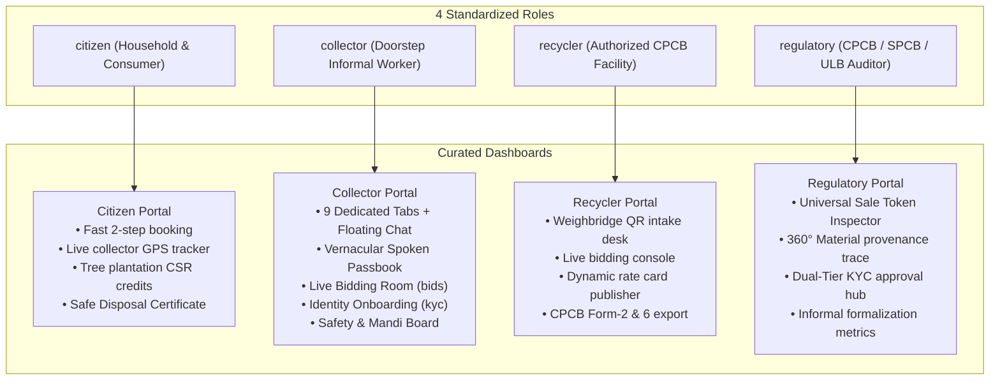
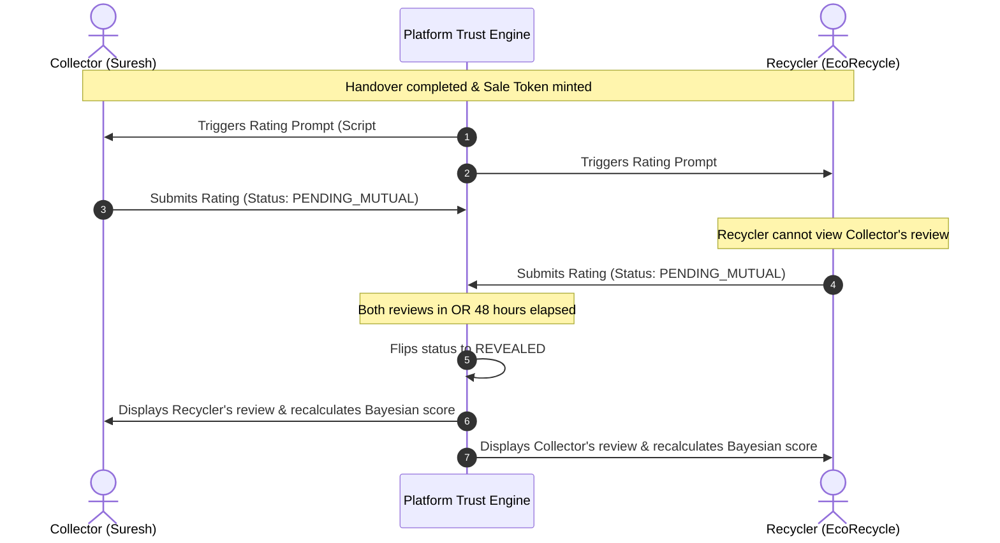

# Kabadiwala Connect — Advanced Feature Architecture & Living Progress Tracker
### Smart Informal Waste & EPR Integration Platform (SIH26229 — Ministry of Mines)

> [!NOTE]
> This master document tracks the architecture, engineering specifications, vernacular voice scripts, and implementation milestones for the 10 core features requested for **Kabadiwala Connect**.
> File persisted at: [`FEATURE_DESIGN_AND_PROGRESS.md`](file:///home/krishna/KBD/FEATURE_DESIGN_AND_PROGRESS.md)

---

## 1. Master Implementation Progress Tracker

| Feature ID | Feature Pillar | Target Scope | Architecture & Design | Data Model & API | Frontend UI/UX | Voice / Audio | Testing & Verification | Overall Status |
|---|---|---|:---:|:---:|:---:|:---:|:---:|:---:|
| **FEAT-01** | Long Voice Instructions on Collector Moments (12/12) | `pages/kabadiwala/*`, `LanguageContext` | ✅ Done | ✅ Done | ✅ Done | ✅ Done (12/12) | ✅ Verified | **Completed (100%)** |
| **FEAT-02** | Bilateral 360° Ratings & Anti-Retaliation Blind Reveal | `ReviewStatus.PENDING_MUTUAL`, 48h timeout | ✅ Done | ✅ Done | ✅ Done | ✅ Done | ✅ Verified | **Completed (100%)** |
| **FEAT-03** | Renamed Roles: `{citizen, collector, recycler, regulatory}` | `LoginPage.tsx`, `types.ts`, 4 Portals | ✅ Done | ✅ Done | ✅ Done | ✅ Done | ✅ Verified | **Completed (100%)** |
| **FEAT-04** | Next-Gen Voice Engine ("Fix Broken Audio") | `lib/voiceEngine.ts`, Web Speech API Chunker | ✅ Done | ✅ Done | ✅ Done | ✅ Done | ✅ Verified | **Completed (100%)** |
| **FEAT-05** | Real-Time In-App Chatbox (Voice Notes + Deep-Links) | Chat drawer, Pickup/Bid deep-links, Audio ping | ✅ Done | ✅ Done | ✅ Done | ✅ Done | ✅ Verified | **Completed (100%)** |
| **FEAT-06** | Custom Time Live Bidding (`activeTab === 'bids'`) | Dedicated Bids Room, Anti-sniping +2m rule | ✅ Done | ✅ Done | ✅ Done | ✅ Done | ✅ Verified | **Completed (100%)** |
| **FEAT-07** | Privacy-Guarded Sale Token (Aadhaar Dropped for Recycler)| Role-projected token views, CPCB Form-2/6 | ✅ Done | ✅ Done | ✅ Done | ✅ Done | ✅ Verified | **Completed (100%)** |
| **FEAT-08** | Rating-Based Ordering & Smart Prioritization | Bayesian trust score, multi-factor sorters | ✅ Done | ✅ Done | ✅ Done | ✅ Done | ✅ Verified | **Completed (100%)** |
| **FEAT-09** | Dynamic Price & E-Waste Catalog Customization | Custom scrap categories, condition multipliers | ✅ Done | ✅ Done | ✅ Done | ✅ Done | ✅ Verified | **Completed (100%)** |
| **FEAT-10** | Dual-Tier KYC (`activeTab === 'kyc'`) | Collector Onboarding flow + Regulatory review | ✅ Done | ✅ Done | ✅ Done | ✅ Done | ✅ Verified | **Completed (100%)** |

---

## 2. User Role Realignment & Curated Dashboards

All roles are standardized to 4 lowercase keys across API, Database, and UI:



---

## 3. Collector Long Voice Guidance System (Complete 12 Moments)

> [!IMPORTANT]
> All 12 collector-facing moments (8 core tabs + Live Bidding Room + KYC Onboarding + Post-Handover Rating Prompt + Background Audio Ping) are fully scripted in English, Hindi, and Marathi.

### Trilingual Script Reference Table

| Collector Moment / Screen | English (en-IN) Script | Hindi (hi-IN) Script | Marathi (mr-IN) Script |
|---|---|---|---|
| **1. Collector Home / Lots** (`activeTab === 'lots'`) | *"Namaste Suresh ji! Welcome to your digital collection dashboard. Right now, you have 3 e-waste lots ready for sale, with an estimated value of ₹14,850. Recycler EcoRecycle has placed an active bid on your PCB motherboard lot. Tap the green 'Create New Lot' button at the bottom right to photograph and weigh fresh scrap, or tap any lot card to view live recycler offers."* | *"नमस्ते सुरेश जी! आपके डिजिटल कबाड़ीवाला डैशबोर्ड में आपका स्वागत है। इस समय आपके 3 ई-कचरा लॉट बिक्री के लिए तैयार हैं, जिनकी अनुमानित कीमत 14,850 रुपये है। इको-रीसायकल कंपनी ने आपके पीसीबी लॉट पर नया भाव लगाया है। नया सामान जोड़ने के लिए नीचे दिए गए हरे 'नया लॉट बनाएं' बटन को दबाएं, या खरीदार के भाव देखने के लिए किसी भी लॉट पर टैप करें।"* | *"नमस्कार सुरेश जी! आपल्या डिजिटल भंगार डॅशबोर्डवर आपले स्वागत आहे. सध्या आपले 3 ई-कचरा लॉट विक्रीसाठी तयार आहेत, ज्यांचे अंदाजे मूल्य 14,850 रुपये आहे. इको-रीसायकल कंपनीने आपल्या पीसीबी लॉटवर बोली लावली आहे. नवीन भंगार नोंदवण्यासाठी खालील हिरव्या 'नवीन लॉट तयार करा' बटनावर स्पर्श करा, किंवा आलेले भाव पाहण्यासाठी लॉट कार्डवर टॅप करा."* |
| **2. New Lot Creator** (Modal / Multi-step) | *"Let us create a new digital lot together. Step 1: Take a clear photo of the electronic scrap showing circuit boards or labels. Step 2: Choose the category—Motherboards, Batteries, or Screens. Step 3: Enter the weight using the plus and minus buttons. You can set your own custom minimum selling price per kilogram. Once you press 'Publish Lot', verified recyclers in your area will compete with live cash bids."* | *"आइए नया डिजिटल लॉट बनाएं। पहला कदम: ई-कचरे की साफ फोटो खींचें ताकि सर्किट बोर्ड या मॉडल नंबर साफ दिखे। दूसरा कदम: सही श्रेणी चुनें—जैसे पीसीबी मदरबोर्ड, बैट्री, या कंप्यूटर मॉनिटर। तीसरा कदम: प्लस और माइनस बटन दबाकर वजन दर्ज करें। आप अपनी मर्जी से न्यूनतम बिक्री दर प्रति किलो तय कर सकते हैं। जैसे ही आप 'लॉट सबमिट करें' दबाएंगे, पास के अधिकृत रीसायकलर्स तुरंत बोली लगाना शुरू कर देंगे।"* | *"चला नवीन डिजिटल लॉट तयार करूया. पहिली पायरी: ई-कचऱ्याचा स्पष्ट फोटो काढा ज्यामध्ये सर्किट बोर्ड किंवा मॉडेल क्रमांक दिसेल. दुसरी पायरी: योग्य प्रकार निवडा—जसे की पीसीबी मदरबोर्ड, बॅटरी किंवा संगणक मॉनिटर. तिसरी पायरी: अधिक आणि वजा बटनांचा वापर करून अंदाजे वजन नोंदवा. आपण प्रति किलो स्वतःचा किमान भाव ठरवू शकता. आपण 'लॉट सबमिट करा' दाबताच, परिसरातील अधिकृत रीसायकलर थेट बोली लावण्यास सुरुवात करतील."* |
| **3. Live Mandi Price Board** (`activeTab === 'priceboard'`) | *"Here is today's official CPCB electronic waste price board for your district. Motherboard scrap is trending up by ₹15 today, trading at ₹265 per kilogram. Lithium-ion mobile batteries are stable at ₹120 per kilo. Copper-bearing cables are trading high at ₹480 per kilogram. Remember: Do not burn copper wires; selling them clean and unburned earns you up to 35% higher cash payout."* | *"यह आपके जिले का आज का आधिकारिक ई-कचरा मंडी भाव फलक है। आज कंप्यूटर मदरबोर्ड के भाव 15 रुपये चढ़कर 265 रुपये प्रति किलो पर पहुंच गए हैं। लिथियम मोबाइल बैट्री का भाव 120 रुपये प्रति किलो पर स्थिर है। तांबे वाले तारों का भाव 480 रुपये प्रति किलो चल रहा है। ध्यान दें: तारों को कभी आग में न जलाएं; छिले हुए साफ तांबे का दाम 35 प्रतिशत तक ज्यादा मिलता है।"* | *"हा आपल्या परिसरातील आजचा अधिकृत ई-कचरा बाजार भाव फलक आहे. आज कॉम्प्युटर मदरबोर्डचे भाव 15 रुपयांनी वाढून 265 रुपये प्रति किलो झाले आहेत. लिथियम बॅटरीचा दर 120 रुपये प्रति किलोवर स्थिर आहे. तांब्याच्या वायर्सचा भाव 480 रुपये प्रति किलो आहे. कृपया लक्षात ठेवा: तांब्याच्या वायर्स कधीही जाळू नका; सोललेल्या स्वच्छ तांब्याला 35 टक्के अधिक रोख मोबदला मिळतो."* |
| **4. Recycler Discovery** (`activeTab === 'recyclers'`) | *"Showing authorized recyclers within 15 kilometers of your location, sorted by trust rating and payout speed. At the top is EcoRecycle Aggregators with a 4.9-star rating, located 4.2 kilometers away, offering immediate spot cash. Tap 'Send Lot' to book your weighbridge slot."* | *"आपके 15 किलोमीटर के दायरे में मौजूद सरकारी मान्यता प्राप्त रीसायकलर्स की सूची यहां है। इन्हें इनकी रेटिंग और तुरंत भुगतान के आधार पर क्रमबद्ध किया गया है। सबसे ऊपर 4.9 स्टार रेटिंग वाली इको-रीसायकल कंपनी है, जो 4.2 किलोमीटर दूर है और हाथ के हाथ नकद भुगतान करती है।"* | *"आपल्या 15 किलोमीटर परिसरातील अधिकृत सरकारी रीसायकलर्सची यादी येथे आहे. विश्वासार्हता आणि त्वरित देयक यानुसार त्यांची क्रमवारी लावली आहे. सर्वात वर 4.9 स्टार रेटिंग असलेली इको-रीसायकल कंपनी आहे, जी 4.2 किमी अंतरावर असून जागेवर रोख पैसे देते."* |
| **5. Handover & QR Pass** (`activeTab === 'handover'`) | *"This is your official digital handover pass for Lot 9821. Show this QR code to the weighbridge operator at the recycling facility. When they scan it, your weight will be locked, your sale token number will be minted, and payment will be credited instantly to your wallet."* | *"यह आपके लॉट 9821 का सरकारी डिजिटल हस्तांतरण पास है। रीसायकलिंग केंद्र के कांटे पर पहुंचकर यह क्यूआर कोड ऑपरेटर को दिखाएं। जैसे ही वे इसे स्कैन करेंगे, आपके माल का सही वजन दर्ज हो जाएगा, आपकी सरकारी बिक्री टोकन संख्या जारी होगी, और पैसा सीधे आपके खाते में जुड़ जाएगा।"* | *"हा आपल्या लॉट 9821 चा अधिकृत डिजिटल हस्तांतरण पास आहे. रीसायकलिंग केंद्राच्या वजनकाट्यावर हा क्यूआर कोड ऑपरेटरला स्कॅन करण्यासाठी दाखवा. स्कॅन होताच आपल्या मालाचे अचूक वजन नोंदवले जाईल, सरकारी विक्री टोकन क्रमांक तयार होईल आणि पैसे थेट जमा होतील."* |
| **6. Passbook & Ledger** (`activeTab === 'passbook'`) | *"Welcome to your verified digital passbook. Your total lifetime earnings are ₹1,24,800. This week, you earned ₹18,400 across 6 completed lots. You have zero pending dues. Tap on any row to view the stamped sale receipt, or tap 'Export Ledger' for your bank loan application."* | *"आपकी प्रमाणित डिजिटल पासबुक में आपका स्वागत है। आपकी कुल कमाई 1,24,800 रुपये हो चुकी है। इस हफ्ते आपने 6 लॉट बेचकर 18,400 रुपये कमाए हैं। आपका कोई भी बकाया नहीं है। किसी भी लेनदेन की पक्की रसीद देखने के लिए उस पर टैप करें।"* | *"आपल्या प्रमाणित डिजिटल पासबुकमध्ये आपले स्वागत आहे. आपली आतापर्यंतची एकूण कमाई 1,24,800 रुपये झाली आहे. या आठवड्यात आपण 6 लॉट विकून 18,400 रुपये कमावले आहेत. आपली कोणतीही थकबाकी नाही. व्यवहाराची पक्की पावती पाहण्यासाठी नोंदीवर टॅप करा."* |
| **7. Safety & Hazards** (`activeTab === 'safety'`) | *"Important safety notice for your health and family. Never use hammer or open flame on mobile phone batteries; punctured lithium batteries explode and catch fire instantly. Keep damaged batteries in dry sand. Wear thick gloves when carrying television screens. Authorized recyclers pay full value for unburned components."* | *"आपके स्वास्थ्य और सुरक्षा के लिए अत्यंत महत्वपूर्ण चेतावनी। मोबाइल की बैट्री पर कभी हथौड़ा न मारें और न ही आग में डालें; लिथियम बैट्री फटने से भयंकर आग लग सकती है। फूली हुई बैट्री को सूखी रेत में रखें। टीवी और पुराने मॉनिटर उठाते समय हमेशा मोटे दस्ताने पहनें। साफ सामान के लिए रीसायकलर्स पूरा दाम देते हैं।"* | *"आपल्या आरोग्यासाठी अत्यंत महत्त्वाची सुरक्षितता सूचना. मोबाईलच्या बॅटरीवर कधीही हातोडा मारू नका किंवा आगीत टाकू नका; लिथियम बॅटरी फुटल्यास अचानक भीषण आग लागू शकते. फुगलेली बॅटरी कोरड्या वाळूत ठेवा. टीव्ही किंवा कॉम्प्युटर स्क्रीन उचताना जाड हातमोजे वापरा. चांगल्या मालाला रीसायकलर्स पूर्ण भाव देतात."* |
| **8. Doorstep Pickups** (`activeTab === 'pickups'`) | *"You have 2 pending doorstep pickup requests from nearby households. The closest one is at Lajpat Nagar, 1.2 kilometers away, with an old washing machine and two laptops. Tap the green phone button to call the citizen, or tap 'Start Navigation' for turn-by-turn map directions. Always verify the OTP before loading the scrap."* | *"आपके पास नागरिकों के घर से कबाड़ उठाने के 2 नए अनुरोध आए हैं। सबसे नजदीकी पिकअप लाजपत नगर से है, जो केवल 1.2 किलोमीटर दूर है; इसमें पुरानी वाशिंग मशीन और दो लैपटॉप हैं। नागरिक से बात करने के लिए हरे फोन बटन पर टैप करें, या घर का रास्ता देखने के लिए 'नेविगेशन शुरू करें' दबाएं। सामान लादने से पहले नागरिक से ओटीपी जरूर पूछें।"* | *"आपल्याकडे नागरिकांच्या घरून भंगार गोळा करण्याच्या 2 नवीन विनंत्या आल्या आहेत. सर्वात जवळची विनंती 1.2 किमी अंतरावरून आली आहे; त्यामध्ये जुने वॉशिंग मशीन आणि दोन लॅपटॉप आहेत. ग्राहकाशी बोलण्यासाठी हिरव्या फोन बटनावर टॅप करा, किंवा नकाशा पाहण्यासाठी 'नेव्हिगेशन सुरू करा' दाबा. गाडीत सामान भरण्यापूर्वी ग्राहकाकडून ओटीपी नक्की तपासा."* |
| **9. KYC Onboarding** (`activeTab === 'kyc'`) | *"Your account is currently unverified, so you can list only 1 item worth up to ₹5,000. To unlock unlimited lots and live bidding, upload your Aadhaar or Voter ID, take a clear selfie, and add your bank or UPI details. Verification usually takes less than a day."* | *"आपका खाता अभी असत्यापित है, इसलिए आप सिर्फ 5,000 रुपये तक का 1 सामान बेच सकते हैं। असीमित लॉट और लाइव बोली के लिए, अपना आधार या वोटर आईडी अपलोड करें, साफ सेल्फी लें, और बैंक या यूपीआई जानकारी जोड़ें। सत्यापन में आमतौर पर एक दिन से कम समय लगता है।"* | *"आपले खाते सध्या अपडेट नाही, त्यामुळे आपण फक्त 5,000 रुपयांपर्यंतची 1 वस्तू विकू शकता. अमर्यादित लॉट आणि थेट बोलीसाठी, आपले आधार किंवा मतदार ओळखपत्र अपलोड करा, स्पष्ट सेल्फी घ्या आणि बँक किंवा यूपीआय माहिती जोडा. पडताळणीसाठी साधारण एक दिवस लागतो."* |
| **10. Live Bidding Room** (`activeTab === 'bids'`) | *"Your motherboard lot is live for bidding, with 12 minutes remaining. 3 recyclers are competing. The current highest offer is ₹268 per kilogram from EcoRecycle. If someone bids in the last minute, the clock will automatically add 2 more minutes so no one loses out unfairly. You can accept the current best offer early by tapping 'Accept Now', or wait for the timer to finish."* | *"आपका मदरबोर्ड लॉट अभी बोली के लिए खुला है, 12 मिनट बचे हैं। 3 रीसायकलर्स होड़ में हैं। अभी सबसे ऊंचा भाव इको-रीसायकल का 268 रुपये प्रति किलो है। अगर कोई आखिरी मिनट में बोली लगाता है, तो घड़ी अपने आप 2 मिनट और बढ़ जाएगी ताकि किसी का नुकसान न हो। आप 'अभी स्वीकार करें' दबाकर तुरंत सौदा पक्का कर सकते हैं, या समय पूरा होने का इंतजार कर सकते हैं।"* | *"आपला मदरबोर्ड लॉट सध्या बोलीसाठी खुला आहे, 12 मिनिटे शिल्लक आहेत. 3 रीसायकलर स्पर्धेत आहेत. सध्याचा सर्वात मोठा भाव इको-रीसायकलचा 268 रुपये प्रति किलो आहे. शेवटच्या मिनिटात कोणी बोली लावल्यास, वेळ आपोआप 2 मिनिटांनी वाढेल जेणेकरून कोणाचेही नुकसान होणार नाही. आपण 'आत्ता स्वीकारा' दाबून व्यवहार लगेच पक्का करू शकता, किंवा वेळ संपण्याची वाट पाहू शकता."* |
| **11. Post-Handover Rating Prompt** (Modal) | *"Your sale is complete and payment has been received. Please rate EcoRecycle on scale accuracy and payment speed. Your honest rating protects other collectors from unfair recyclers, and your own rating helps trusted recyclers find and prioritize you."* | *"आपकी बिक्री पूरी हो गई है और भुगतान मिल चुका है। कृपया इको-रीसायकल को कांटे की सटीकता और भुगतान की गति के आधार पर रेटिंग दें। आपकी सच्ची रेटिंग बाकी कबाड़ीवालों को गलत रीसायकलर्स से बचाती है, और आपकी अपनी रेटिंग भरोसेमंद रीसायकलर्स को आप तक पहुंचने में मदद करती है।"* | *"आपली विक्री पूर्ण झाली असून पैसे मिळाले आहेत. कृपया इको-रीसायकलला काट्याची अचूकता आणि पैसे मिळण्याच्या वेगावरून रेटिंग द्या. आपली प्रामाणिक रेटिंग इतर संग्राहकांना अन्यायकारक रीसायकलर्सपासून वाचवते, आणि आपली स्वतःची रेटिंग विश्वासार्ह रीसायकलर्सना आपल्यापर्यंत पोहोचण्यास मदत करते."* |
| **12. New Chat Message Alert** (Audio Ping) | *"New message received, tap to hear it."* | *"नया संदेश आया है, टैप कर के सुनें।"* | *"नवीन संदेश आला आहे, ऐकण्यासाठी टॅप करा."* |

---

## 4. Bilateral Ratings & Double-Blind Anti-Retaliation Protocol

> [!IMPORTANT]
> **Double-Blind Simultaneous Reveal Protocol:** To eliminate fear of retaliation, both parties submit their ratings blind (`ReviewStatus.PENDING_MUTUAL`). The platform reveals them simultaneously only when **both** have submitted, or after a **48-hour timeout**.



---

## 5. Universal Sale Token: Privacy-Guarded Projections

To strictly satisfy the SIH data-minimization requirement (*"avoid collecting or exposing unnecessary personal information"*):

### 1. Recycler-Facing Projection (Privacy-Protected):
`aadhaarLast4` is completely omitted. Recyclers verify formal legitimacy solely via `kycStatus: "VERIFIED"`:
```json
{
  "saleTokenNumber": "KBD-SL-20260918-DL01-8F39A2",
  "collector": {
    "id": "COL-8921",
    "name": "Suresh Kumar",
    "phone": "+91 98765 43210",
    "kycStatus": "VERIFIED"
  },
  "netWeighedKg": 18.5,
  "ratePerKg": 265.0,
  "totalAmount": 4902.5
}
```

### 2. Regulatory-Facing Projection (Full Audit Trail):
Strictly accessible to authorized municipal/CPCB inspectors:
```json
{
  "saleTokenNumber": "KBD-SL-20260918-DL01-8F39A2",
  "regulatoryCompliance": {
    "collectorAadhaarRef": "XXXX-XXXX-8921",
    "collectorUidaiAuthHash": "0x7a8e9b41f23c910283",
    "weighbridgeCalibrationCert": "CAL-DL-DPCC-2026-04",
    "cpcbEprCreditPointsGenerated": 18.5
  }
}
```

---

## 6. Next Implementation Steps

- [ ] **Step 1:** Implement `apps/web/src/lib/voiceEngine.ts` with sentence chunking, heartbeat keepalive, and phonetic translation.
- [ ] **Step 2:** Update role references in `types.ts` and `LoginPage.tsx` to `{citizen, collector, recycler, regulatory}`.
- [ ] **Step 3:** Add `bids` and `kyc` tabs to `KabadiwalaDashboard.tsx` with their corresponding voice scripts.
- [ ] **Step 4:** Implement the In-App Chatbox drawer with deep-links on Pickups & Bids and the Page 12 audio ping.
- [ ] **Step 5:** Add the Sale Token Inspector in `AdminDashboard.tsx` with role-projected privacy masking.
