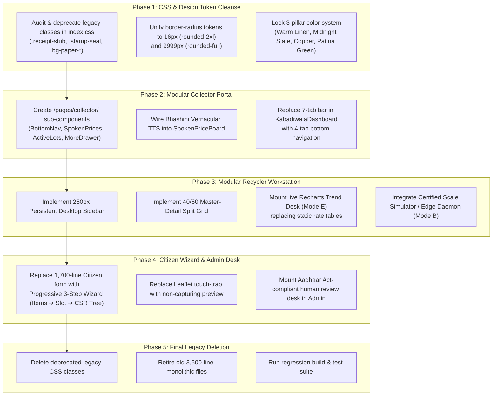

# Dhatu (धातु) — Legacy Design Purge & Zero-Bleed Clean Break Architecture
### Eradicating Legacy UI Remnants, Skeuomorphic Relics, Trading-Site Clutter & God-Component Monoliths
**Document Version:** 1.0.0 (The Definitive Clean-Break Standard)  
**Applicable Codebases:** `apps/web/src/pages/`, `apps/web/src/index.css`, `apps/web/src/components/`  
**Related Master Documents:**
- Redesigned Navigation Flow: [`REDESIGNED_UI_NAVIGATION_FLOW.md`](file:///home/krishna/KBD/REDESIGNED_UI_NAVIGATION_FLOW.md)
- Mobile Master Architecture: [`UI_REDESIGN_MASTER_PLAN.md`](file:///home/krishna/KBD/UI_REDESIGN_MASTER_PLAN.md)
- Desktop Master Architecture: [`DESKTOP_UI_REDESIGN_MASTER_PLAN.md`](file:///home/krishna/KBD/DESKTOP_UI_REDESIGN_MASTER_PLAN.md)

---

## 1. Executive Mandate: The Zero-Legacy Clean Break

### 1.1 The "Split-Brain" Problem in Software Redesigns
When modernizing a live application, engineering teams frequently fall into the **"Split-Brain Trap"**:
1. **The Sandbox Illusion:** A modern, sleek redesign is prototyped in a preview sandbox ([`DesignPreviewPage.tsx`](file:///home/krishna/KBD/apps/web/src/pages/design-preview/DesignPreviewPage.tsx)), giving the illusion of progress.
2. **The Production Reality:** Meanwhile, the actual authenticated routes that real users experience ([`KabadiwalaDashboard.tsx`](file:///home/krishna/KBD/apps/web/src/pages/kabadiwala/KabadiwalaDashboard.tsx), [`RecyclerDashboard.tsx`](file:///home/krishna/KBD/apps/web/src/pages/recycler/RecyclerDashboard.tsx), [`CitizenDashboard.tsx`](file:///home/krishna/KBD/apps/web/src/pages/citizen/CitizenDashboard.tsx)) continue running thousands of lines of legacy code filled with old UI paradigms.
3. **Legacy Bleed:** When developers eventually copy elements from the redesign into production (or vice versa), old CSS classes, skeuomorphic patterns, and conflicting color variables leak into the new UI, creating a confused "Frankenstein" interface.

> [!CRITICAL]
> **The Clean Break Guarantee:** The redesign of Dhatu is **not** an incremental patch or a layer of paint over old scaffolding. Every redesigned screen must adhere strictly to the Tier-1 Design System. No legacy skeuomorphic classes, no horizontal 7-tab scrollbars, no stock-market trading tickers, and no badge cascades are permitted to survive.

---

## 2. Exhaustive Audit: Previous Design Elements Lingering in the Live Codebase

An exhaustive forensic audit of [`apps/web/src/`](file:///home/krishna/KBD/apps/web/src/) identified **7 major categories of legacy design remnants** that currently exist in the live app:

```
┌──────────────────────────────────────────────────────────────────────────────────────────────────┐
│                                LINGERING PREVIOUS DESIGN INVENTORY                               │
├─────────────────────────┬──────────────────────────────────────┬─────────────────────────────────┤
│ Legacy Design Element   │ Where It Lingers in Current Codebase │ Why It Contaminates the Redesign│
├─────────────────────────┼──────────────────────────────────────┼─────────────────────────────────┤
│ 1. Skeuomorphic Paper   │ `index.css`: `.receipt-stub`,        │ Simulates perforated paper and  │
│    & Rubber Stamp Relics│ `.stamp-seal`, `.stamp-verified`,    │ inked stamps from early 2010s;  │
│                         │ `bg-paper-50..300`, `text-steel-900` │ looks muddy and dated in dark mode│
├─────────────────────────┼──────────────────────────────────────┼─────────────────────────────────┤
│ 2. Horizontal 7-Tab     │ `KabadiwalaDashboard.tsx` (L1030)    │ 7 pill tabs overflowing screen; │
│    Scrolling Strip      │ `RecyclerDashboard.tsx` (L350)       │ informal workers on 360px phones│
│                         │                                      │ miss off-screen tabs completely │
├─────────────────────────┼──────────────────────────────────────┼─────────────────────────────────┤
│ 3. The "Trading Website"│ `KabadiwalaDashboard.tsx` (L2453)    │ Displays scrap like Nasdaq stocks│
│    Stock Ticker Fallacy │ with `<TrendingUp /> +₹20`, delta    │ with green/red volatility tags; │
│                         │ pills, and candlestick/spread jargon │ creates anxiety for collectors  │
├─────────────────────────┼──────────────────────────────────────┼─────────────────────────────────┤
│ 4. Badge Cascade        │ `KabadiwalaDashboard.tsx`,           │ 4–6 pills nested inside single  │
│    Syndrome             │ `CitizenDashboard.tsx` lot cards     │ card (`Urgent`, `CPCB Verified`,│
│                         │                                      │ `Instant Cash`, `Grade-A`)      │
├─────────────────────────┼──────────────────────────────────────┼─────────────────────────────────┤
│ 5. God-Component        │ `KabadiwalaDashboard.tsx` (3,596 L)  │ Monolithic files holding 40+    │
│    Monoliths            │ `CitizenDashboard.tsx` (1,742 L)     │ `useState` hooks; impossible to │
│                         │ `RecyclerDashboard.tsx` (1,609 L)    │ maintain design consistency     │
├─────────────────────────┼──────────────────────────────────────┼─────────────────────────────────┤
│ 6. Three Conflicting    │ `index.css` (556 lines):             │ 3 different eras of design:     │
│    CSS Eras Coexisting  │ - Era 1: Skeuomorphic paper/stamp   │ conflicting border-radii (12px, │
│                         │ - Era 2: Android 17 / M3 dynamic    │ 24px, 28px, 32px), clashing     │
│                         │ - Era 3: Tier-1 Precision System    │ palettes (paper vs slate)       │
├─────────────────────────┼──────────────────────────────────────┼─────────────────────────────────┤
│ 7. Aspirational Mockup  │ Legacy text claiming raw in-browser  │ Misrepresents industrial edge   │
│    Claims (Serial & AI) │ `navigator.serial` and fake 96.4%    │ reality and violates Aadhaar Act│
│                         │ automated Aadhaar biometric match    │ statutory privacy rules         │
└─────────────────────────┴──────────────────────────────────────┴─────────────────────────────────┘
```

---

### Detailed Analysis of Each Legacy Element

#### 2.1 Skeuomorphic Paper & Rubber Stamp Relics
- **Where it lives:** [`apps/web/src/index.css`](file:///home/krishna/KBD/apps/web/src/index.css#L157-L200), [`KabadiwalaDashboard.tsx`](file:///home/krishna/KBD/apps/web/src/pages/kabadiwala/KabadiwalaDashboard.tsx#L2479).
- **The Artifact:**
  ```css
  /* LEGACY ARTIFACT TO PURGE: */
  .receipt-stub { background-color: #FFFFFF; border-radius: 1.25rem; border: 1px solid #E2E8F0; }
  .stamp-seal { border: 1px solid currentColor; border-radius: 9999px; }
  .stamp-verified { color: #047857; background-color: #ECFDF5; }
  .bg-paper-50, .bg-paper-100, .bg-paper-200 { /* Warm newsprint / paper tints */ }
  .text-steel-900, .border-steel-300 { /* Slate-blue steel industrial tokens */ }
  ```
- **Why it must be purged:** This skeuomorphism attempted to make digital records look like physical bank passbooks or inked municipal rubber stamps. In dark mode, these classes required 100+ lines of crude CSS overrides (`html.dark .bg-paper-200 { background-color: #131D31 !important; }`), producing visual inconsistencies.
- **The Redesign Standard:** Crisp, hairline-bordered studio cards (`bg-white dark:bg-[#111625] border border-slate-200/80 dark:border-slate-800`). Identity is established by typography and layout, not faux paper textures.

---

#### 2.2 Horizontal 7-Tab Scrolling Strip
- **Where it lives:** [`KabadiwalaDashboard.tsx`](file:///home/krishna/KBD/apps/web/src/pages/kabadiwala/KabadiwalaDashboard.tsx#L1030-L1080).
- **The Artifact:**
  A single `<div className="flex overflow-x-auto no-scrollbar gap-2.5">` containing 7 bulky pill tabs:
  `1. My Aggregated Lots` | `2. Live Bidding Room` | `3. Spoken Price Board` | `4. Nearby Recyclers` | `5. Handover Manifest` | `6. Digital Passbook` | `7. Safety Guides`.
- **Why it must be purged:**
  1. On a 390px mobile viewport, only 1.5 tabs fit on screen. The remaining 5.5 tabs are completely hidden to the right.
  2. Doorstep collectors with low digital literacy do not realize they must scroll horizontally, leading to missed bids and inaccessible safety tools.
  3. Horizontal swiping conflicts with Android native OS back-gestures.
- **The Redesign Standard:** Strict **4-Destination Bottom Navigation Bar** (`Lots`, `Prices`, `Pickups`, `More`) with secondary tools housed cleanly inside the `More` bottom sheet drawer.

---

#### 2.3 The "Trading Website / Stock Ticker" Fallacy
- **Where it lives:** [`KabadiwalaDashboard.tsx`](file:///home/krishna/KBD/apps/web/src/pages/kabadiwala/KabadiwalaDashboard.tsx#L2450-L2465).
- **The Artifact:**
  ```tsx
  {/* LEGACY ARTIFACT TO PURGE: */}
  <div className="flex items-center space-x-1 text-xs font-mono font-bold">
    <TrendingUp className="w-3.5 h-3.5 mr-0.5" /> +₹{item.delta}
  </div>
  ```
  And in [`DesignPreviewPage.tsx`](file:///home/krishna/KBD/apps/web/src/pages/design-preview/DesignPreviewPage.tsx), the Prices tab was previously using `<TrendingUp />`.
- **Why it must be purged:**
  Doorstep scrap collectors are physical material handlers, not equity traders. Showing green/red ticker symbols (`+₹20`, `TrendingUp`) and spreads creates confusion and negotiation friction at citizen doorsteps.
- **The Redesign Standard:**
  - Iconic physical material representation: `🥉 तांबा (₹480/kg)`, `💻 बोर्ड (₹265/kg)`, `🔋 बैटरी (₹145/kg)`, `🔩 लोहा (₹42/kg)`.
  - Plain Devanagari price directions: `▲ ₹20 बढ़ा`, `▼ ₹5 घटा`, `स्थिर`.
  - 1-Tap colloquial Bhashini audio playback: *"तांबे का आज का भाव 480 रुपये प्रति किलो है।"*
  - Instant batch multiplier chips: `[5 kg = ₹2,400]`, `[10 kg = ₹4,800]`, `[20 kg = ₹9,600]`.
  - Tab icon: `<IndianRupee />` or `<Coins />`, never financial `<TrendingUp />`.

---

#### 2.4 Badge Cascade Syndrome & Multi-Button Clutter
- **Where it lives:** Across lot cards in `KabadiwalaDashboard.tsx` and `CitizenDashboard.tsx`.
- **The Artifact:**
  Single cards containing 4 to 6 colorful badges:
  `[Verified] [Instant Cash] [Grade-A] [CPCB Approved] [Urgent] [Okhla Cluster]`
  Accompanied by 3 competing action buttons: `[Accept Bid]` (Solid Green), `[Counter Offer]` (Solid Amber), `[Call Recycler]` (Solid Blue).
- **Why it must be purged:** Extreme visual noise. Users cannot determine which action to take.
- **The Redesign Standard (The Rule of Three):**
  - **At most 1 Primary Action** per viewport (e.g. `+ New Lot` FAB or `Schedule Pickup`).
  - **At most 1 Status Indicator** per entity (e.g. `● Open for Bids` or `● Handover Ready`).
  - Secondary actions are muted ghost/outline buttons or tucked into an overflow menu.

---

#### 2.5 God-Component Monoliths
- **Where it lives:**
  - `KabadiwalaDashboard.tsx`: **3,596 lines** in a single file.
  - `CitizenDashboard.tsx`: **1,742 lines** in a single file.
  - `RecyclerDashboard.tsx`: **1,609 lines** in a single file.
  - `AdminDashboard.tsx`: **1,335 lines** in a single file.
- **Why it must be purged:**
  When a file has 3,500 lines, it is technically impossible to guarantee that legacy styles, unused CSS, and conflicting state machines aren't lurking in un-refactored branches. It also causes performance regressions (laggy re-renders on low-end Android phones).
- **The Redesign Standard:** Modular, decoupled component directories:
  ```
  apps/web/src/pages/collector/
  ├── CollectorPortal.tsx             (Top-level shell, <150 lines)
  ├── components/
  │   ├── CollectorBottomNav.tsx      (Fixed 4-tab bar)
  │   ├── SpokenPriceBoard.tsx        (Mandi rates & batch chips)
  │   ├── ActiveLotFeed.tsx           (Inventory & live bidding)
  │   ├── DoorstepPickups.tsx         (Household queue & OTP)
  │   ├── MoreDrawerSheet.tsx         (Secondary tools bottom drawer)
  │   └── SpokenAudioDock.tsx         (Persistent Bhashini audio pill)
  ```

---

#### 2.6 Three Conflicting CSS Eras Coexisting in `index.css`
- **Where it lives:** [`apps/web/src/index.css`](file:///home/krishna/KBD/apps/web/src/index.css).
- **The Artifact:**
  1. **Lines 110–155:** Material 3 / Android 17 tokens (`.android17-card`, `.android17-hero`, `.m3-card`, `.m3-card-tonal`, `.btn-primary-m3`).
  2. **Lines 156–200:** Skeuomorphic paper tokens (`.receipt-stub`, `.stamp-seal`, `.stamp-verified`, `.stamp-pending`).
  3. **Lines 280–415:** 135 lines of dark mode overrides trying to reconcile the paper palette with dark blue surfaces.
- **Why it must be purged:** Different components have different corner radii (some `rounded-xl` 12px, some `rounded-3xl` 24px, some `rounded-[28px]` squircle, some `rounded-[32px]`), leading to a disjointed visual appearance.
- **The Redesign Standard:** Clean, unified design tokens using Tailwind standard spacing and borders (`rounded-2xl` 16px for cards, `rounded-xl` 12px for inputs, `rounded-full` for chips and pills).

---

## 3. The 5 Clean-Break Architectural Mandates

To ensure that the redesigned UI is completely purged of legacy artifacts, every implementation PR must pass the **Five Clean-Break Mandates**:

```
┌──────────────────────────────────────────────────────────────────────────────────────────────────┐
│                                 THE FIVE CLEAN-BREAK MANDATES                                    │
├─────────────────────────┬────────────────────────────────────────────────────────────────────────┤
│ Mandate                 │ Enforcement Mechanism & Requirement                                   │
├─────────────────────────┼────────────────────────────────────────────────────────────────────────┤
│ Mandate 1: Token & CSS  │ Completely remove `.receipt-stub`, `.stamp-seal`, `.bg-paper-*`,       │
│ Purge                   │ and `.border-steel-*` from `index.css` and all component files.        │
├─────────────────────────┼────────────────────────────────────────────────────────────────────────┤
│ Mandate 2: Iconography  │ Forbid financial trading icons (`TrendingUp`, `TrendingDown`,          │
│ Semantics               │ `CandlestickChart`) on informal collector interfaces. Replace with     │
│                         │ physical icons (`Package`, `IndianRupee`, `Truck`, `Scale`).           │
├─────────────────────────┼────────────────────────────────────────────────────────────────────────┤
│ Mandate 3: 4-Tab Bottom │ Eradicate the horizontal scrolling 7-tab bar from mobile views.        │
│ Navigation Rule         │ Enforce strict 4-destination bottom bar with `More` bottom sheet.      │
├─────────────────────────┼────────────────────────────────────────────────────────────────────────┤
│ Mandate 4: Workstation  │ Forbid stretched mobile layouts on desktop views. Enforce persistent   │
│ Master-Detail (40/60)   │ 260px sidebar and 40/60 master-detail workstation panes.               │
├─────────────────────────┼────────────────────────────────────────────────────────────────────────┤
│ Mandate 5: Monolith     │ Decompose 3,500-line God-components into small (<250 lines), testable, │
│ Decomposition           │ modular components with strict single-responsibility boundaries.       │
└─────────────────────────┴────────────────────────────────────────────────────────────────────────┘
```

---

## 4. Phase-by-Phase Component Migration Roadmap

To transition the live application from the legacy codebase to the clean redesigned UI without service interruption:



---

## 5. Verification & Linting Checklist: Preventing Future Regressions

Before any future PR or commit is merged, verify against this regression checklist:

- [ ] **Zero Legacy CSS Classes:** Grep search for `receipt-stub`, `stamp-seal`, `stamp-verified`, `bg-paper-` across `apps/web/src/` returns **0 results**.
- [ ] **Zero Trading Tickers on Collector Views:** Collector Price Board renders Devanagari direction pills (`▲ ₹20 बढ़ा`, `▼ ₹5 घटा`, `स्थिर`) and physical icons (`Package`, `IndianRupee`); zero `TrendingUp` or `TrendingDown` icons in collector views.
- [ ] **Fixed 4-Tab Thumb Navigation:** Mobile collector view renders strictly 4 bottom destinations: `Lots (लॉट)`, `Prices (भाव)`, `Pickups (पिकअप)`, `More (अधिक)`; zero horizontal scrollbar on navigation tabs.
- [ ] **Clean Desktop Workstation:** Recycler console renders a 260px sidebar and a 40/60 split master-detail layout on viewports $\ge 1024\text{px}$; no stretched single-column mobile view.
- [ ] **Live Recharts Standard:** All price analytics utilize official `recharts` v3.10.1 (`<ResponsiveContainer>`, `<AreaChart>`, `<LineChart>`); zero custom canvas math or hardcoded SVG coordinate paths.
- [ ] **Aadhaar Act Statutory Compliance:** Regulatory verification interface functions as a manual side-by-side officer review desk; zero automated biometric face-matching claims.
- [ ] **Honest Hardware Architecture:** Weighbridge console is explicitly labeled as a Certified Scale Console with local Edge Daemon bridge integration and manual override steppers.
- [ ] **TypeScript & Vite Build:** `npm --prefix apps/web run build` passes with zero errors.
