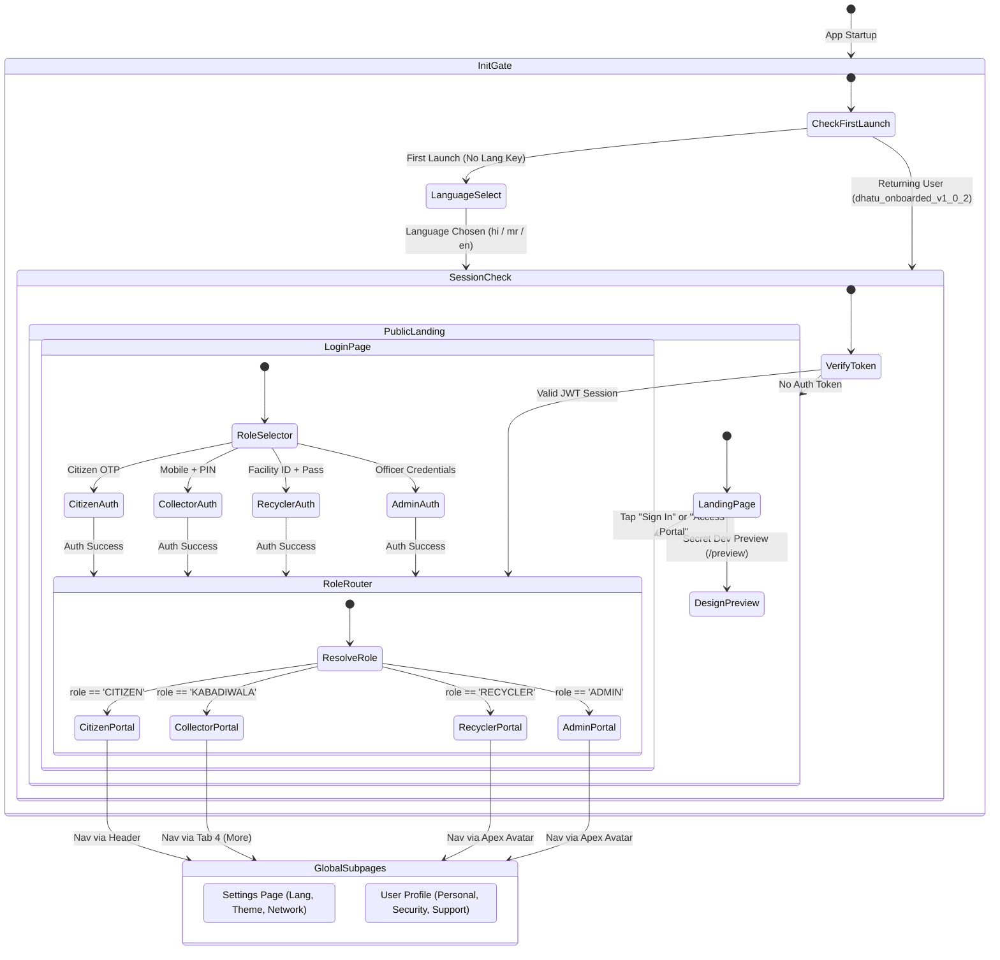
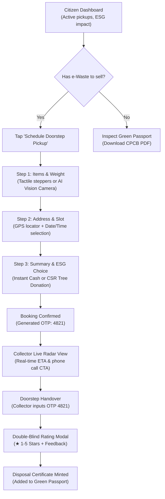
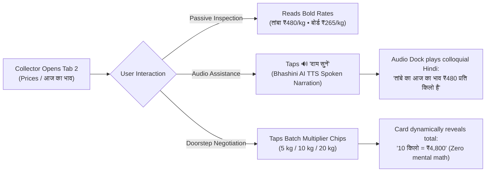
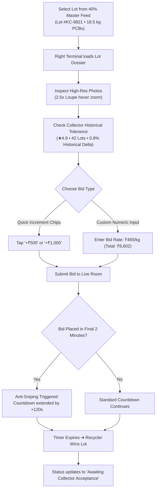
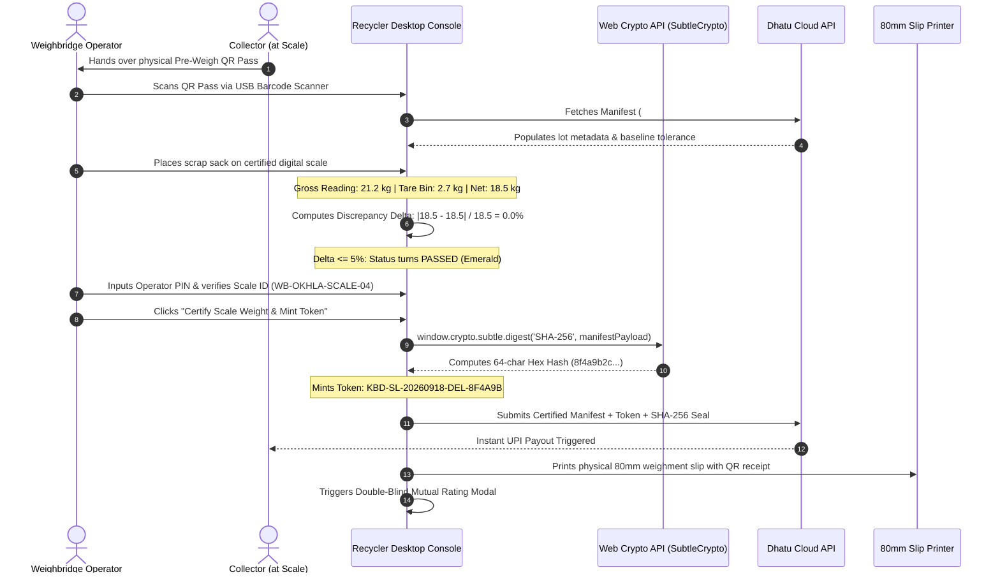
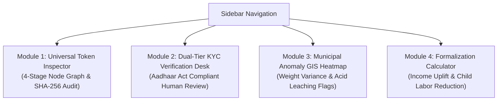
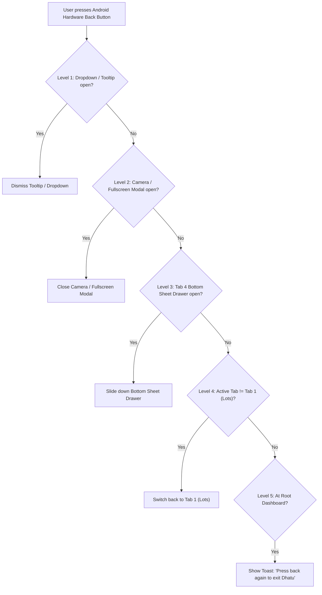
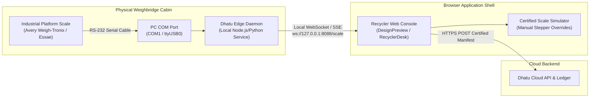
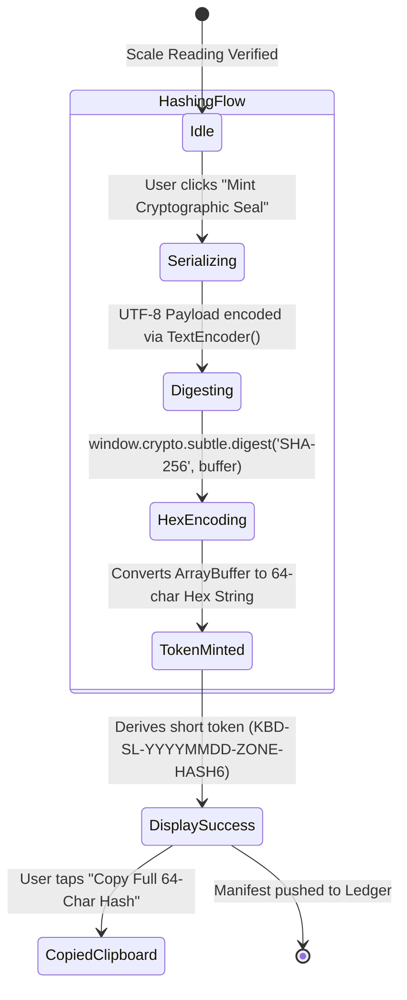
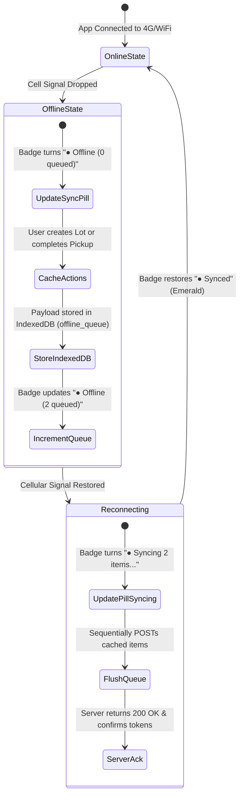

# Dhatu (धातु) — Redesigned UI Complete Navigation Flow & Interaction Specification
### End-to-End User Journeys, State Machines, Viewport Topographies & Edge Integrations
**Document Version:** 1.0.0 (The Definitive Production Standard)  
**Applicable Codebases:** `apps/web/src/App.tsx`, `apps/web/src/pages/`, `apps/api/`  
**Companion Architectural Blueprints:**
- Mobile Smartphone Master Plan: [`UI_REDESIGN_MASTER_PLAN.md`](file:///home/krishna/KBD/UI_REDESIGN_MASTER_PLAN.md)
- Desktop Workstation Master Plan: [`DESKTOP_UI_REDESIGN_MASTER_PLAN.md`](file:///home/krishna/KBD/DESKTOP_UI_REDESIGN_MASTER_PLAN.md)
- Visual Design Gallery: [`ui-smartphone-designs/README.md`](file:///home/krishna/KBD/ui-smartphone-designs/README.md)
- Dual-Viewport Interactive Preview: [`apps/web/src/pages/design-preview/DesignPreviewPage.tsx`](file:///home/krishna/KBD/apps/web/src/pages/design-preview/DesignPreviewPage.tsx)

---

## 1. Executive Navigation Blueprint & Architectural Principles

### 1.1 The Dual-Viewport Navigation Paradigm
The Dhatu platform serves fundamentally different user personas across completely distinct operating environments:
1. **Smartphone Viewport (`360px – 430px` Android Capacitor APK & PWA):**
   - **Primary Users:** Informal Doorstep Collectors (*Kabadiwalas*) and Household Consumers (*Citizens*).
   - **Ergonomic Context:** One-handed thumb usage, 42°C outdoor sunlight, spotty 3G/4G connectivity, semi-literate users who depend on physical iconography, large typography, and spoken vernacular audio.
   - **Navigation Structure:** 4-Destination Persistent Bottom Navigation Bar (56px), Thumb-Zone Floating Action Button (FAB), Persistent Floating Audio Dock, and gesture-driven Bottom Sheets. No multi-level cascading dropdowns, zero desktop-style hamburger drawer nesting.
2. **Desktop Workstation Viewport (`1024px – 2560px` Widescreen & Weighbridge Terminal):**
   - **Primary Users:** Authorized CPCB Commercial Recyclers, Weighbridge Operators, Smelter Logistics Directors, and Municipal/CPCB Regulatory Compliance Auditors.
   - **Ergonomic Context:** High-throughput data entry, hardware peripherals (USB barcode scanners, RS-232 digital weighbridge load cells, thermal printers), keyboard-driven ergonomics (`Cmd+K`, tab cycling), multi-screen mass-balance forensics.
   - **Navigation Structure:** Persistent 260px Collapsible Left Sidebar (compactable to 72px mini-rail), 56px Apex Header with global lookup, Master-Detail 40/60 split panels, and multi-mode contextual workstations. Never "stretched mobile" or centered floating cards.

```
┌──────────────────────────────────────────────────────────────────────────────────────────────────┐
│                                 DUAL-VIEWPORT NAVIGATION SHELL MATRIX                            │
├─────────────────────────┬──────────────────────────────────────┬─────────────────────────────────┤
│ Dimension               │ Smartphone Viewport (360px – 430px)  │ Desktop Workstation (1024–1920px│
├─────────────────────────┼──────────────────────────────────────┼─────────────────────────────────┤
│ Primary Nav Container   │ Fixed Bottom Nav Bar (56px height)   │ Persistent Left Sidebar (260px) │
│ Primary Action Trigger  │ Bottom-Right FAB (56×56px)           │ Apex Header Action / Detail CTA │
│ Secondary Navigation    │ Swipeable Bottom Drawer Sheet        │ Sidebar Sub-items & Tab Strips  │
│ Search & Lookup         │ Integrated Header Search / Barcode   │ Global `Cmd+K` Spotlight Search │
│ Audio Assist Access     │ Centered Floating Vernacular Pill    │ Status Bar Audio Preview Button │
│ Screen Back Handling    │ Capacitor Native Back Stack Loop     │ Browser History & Breadcrumbs   │
│ Screen Transition Model │ Slide Left/Right & Sheet Up/Down     │ Instant Instantaneous Pane Swap │
└─────────────────────────┴──────────────────────────────────────┴─────────────────────────────────┘
```

---

### 1.2 "Anti-Clutter" & Cognitive Safety in Navigation
The navigation system enforces four ironclad rules:
1. **The Rule of Three Viewport Constraint:** At most **one** primary call-to-action button, at most **one** status indicator per entity card, and a disciplined semantic 3-pillar color palette (Burnished Copper `#C2410C`, Patina Forest Green `#0F766E`, Sun Brass `#B45309`).
2. **Zero Nested Modals:** An active modal can never spawn another modal on top of itself. Any secondary flow (e.g. KYC upgrade from Lot creation) must transition cleanly via a full-sheet slide or replace the active view.
3. **Ergonomic Thumb Zones (Mobile):** 75% of mobile actions are placed in the bottom 40% of the screen. Critical triggers (Confirm Weight, Capture Photo, Play Voice, Scan OTP) never live in the top stretch zone.
4. **Sub-Second Keyboard Shortcuts (Desktop):** All recurrent workstation actions support standard accelerators:
   - `Cmd / Ctrl + K`: Global Universal Token / Collector search.
   - `1` to `5`: Quick switch between workstation modes (Bids, Scale, Trends, Rates, Form-2).
   - `Enter`: Confirm certified weighbridge reading & mint token.
   - `Esc`: Dismiss active slide-over drawer or exit modal.

---

## 2. Global Application Shell & Routing Infrastructure



### 2.1 Role-Based Routing Matrix

| Route Key | Screen Component | Allowed Roles | Default Initial View | Modal / Overlay Dependencies |
|---|---|---|---|---|
| `language-select` | [`LanguageSelectScreen.tsx`](file:///home/krishna/KBD/apps/web/src/pages/auth/LanguageSelectScreen.tsx) | Public | First run after installation | Fullscreen takeover |
| `landing` / `home` | [`LandingPage.tsx`](file:///home/krishna/KBD/apps/web/src/pages/LandingPage.tsx) | Public | Unauthenticated root | Public marketing navbar |
| `login` | [`LoginPage.tsx`](file:///home/krishna/KBD/apps/web/src/pages/auth/LoginPage.tsx) | Public | Sign-in portal selector | Phone OTP / Password modals |
| `citizen` | [`CitizenDashboard.tsx`](file:///home/krishna/KBD/apps/web/src/pages/citizen/CitizenDashboard.tsx) | `CITIZEN` | Household Pickup Request & Tracker | Camera ML Scanner, Rating Modal |
| `kabadiwala` | [`KabadiwalaDashboard.tsx`](file:///home/krishna/KBD/apps/web/src/pages/kabadiwala/KabadiwalaDashboard.tsx) | `KABADIWALA` | 4-Tab Collector Console | Camera Modal, Bottom Drawer, Rating |
| `recycler` | [`RecyclerDashboard.tsx`](file:///home/krishna/KBD/apps/web/src/pages/recycler/RecyclerDashboard.tsx) | `RECYCLER` | B2B Master-Detail Workstation | Scale Terminal, Recharts, Rating |
| `admin` | [`AdminDashboard.tsx`](file:///home/krishna/KBD/apps/web/src/pages/admin/AdminDashboard.tsx) | `ADMIN` | CPCB Regulatory Command Center | Token Inspector, KYC Review Drawer |
| `design-preview` | [`DesignPreviewPage.tsx`](file:///home/krishna/KBD/apps/web/src/pages/design-preview/DesignPreviewPage.tsx) | All / Dev | Dual-Viewport Interactive Simulator | Live Recharts, SubtleCrypto Seal |
| `settings` | [`SettingsPage.tsx`](file:///home/krishna/KBD/apps/web/src/pages/settings/SettingsPage.tsx) | All Authenticated | App Configuration & Diagnostics | Cache flush confirmation |
| `profile` | [`ProfilePage.tsx`](file:///home/krishna/KBD/apps/web/src/pages/profile/ProfilePage.tsx) | All Authenticated | Personal Identity & Trust Score | Tab switcher (personal/security/support) |

---

### 2.2 Global Shell Topography & Z-Index Stack

```
┌──────────────────────────────────────────────────────────────────────────────────────────────────┐
│ Z-INDEX HIERARCHY SPECIFICATION                                                                  │
├─────────┬────────────────────────────┬───────────────────────────────────────────────────────────┤
│ Level   │ Name                       │ Contained Components                                      │
├─────────┼────────────────────────────┼───────────────────────────────────────────────────────────┤
│ `z-0`   │ Canvas Base                │ Main page content, master triage lists, background grids  │
│ `z-10`  │ Persistent Surface Frames  │ Apex header (56px), Desktop sidebar (260px), Mobile foot  │
│ `z-20`  │ Sticky Dock Elements       │ Floating Action Button (FAB), Centered Spoken Audio Pill  │
│ `z-30`  │ Backdrop & Drawers         │ Swipeable bottom sheets (Tab 4 "More"), Sidebar flyouts   │
│ `z-40`  │ Fullscreen Modals          │ Camera ML scanner, QR pass modal, Weighbridge terminal    │
│ `z-50`  │ System Overlays & Toasts   │ Haptic toast notifications, Offline sync banner, Dialogs │
└─────────┴────────────────────────────┴───────────────────────────────────────────────────────────┘
```

---

## 3. Role 1: Citizen (Household Consumer) Navigation Flow

### 3.1 Citizen High-Level Journey Map


### 3.2 Detailed Step-by-Step Screen Transitions

#### Screen 1.1: Citizen Dashboard Hub (`CitizenDashboard.tsx`)
- **Header:** Personalized greeting (`नमस्ते Priya Sharma`), Live synchronization badge (`● Synced`), and Green Impact summary pill (`🌳 3 Trees Planted`).
- **Primary Viewport Action:** Giant 56px high-contrast button: `Schedule Doorstep Pickup (कबाड़ पिकअप बुक करें)`.
- **Secondary Active List:**
  - Active Pickups card: Shows assigned collector name (`Suresh Kumar`), live status pill (`En Route - 1.2 km away`), ETA countdown (`14 mins`), and prominent 4-digit **Handover OTP** (`4821`).
  - Recent Diverted Scrap history with weight in `JetBrains Mono` (`14.2 kg`).
- **Navigation Outlets:**
  - Tap `Schedule Pickup` ➔ Launches Progressive Wizard Modal (`Step 1`).
  - Tap `Live Route Map` ➔ Expands non-trapping Leaflet route tracker.
  - Tap `Download CPCB Certificate` ➔ Generates official Form-6 Safe Disposal PDF.

#### Screen 1.2: Camera ML Scrap Scanner Modal
- **Trigger:** Tap camera icon inside Item Selection step.
- **View:** Fullscreen native camera viewfinder with circular crosshairs and corner bounding guide.
- **Flow & Defensive Safety:**
  1. Captures picture from device camera (`input type="file" capture="environment"` or Capacitor Camera plugin).
  2. **Defensive Invariant:** Raw 4MB camera image passes through client-side HTML5 canvas compression clamping maximum resolution to `1024×1024px` at WebP/JPEG `0.75` quality (~120KB). This guarantees browser memory is protected and prevents `QuotaExceededError`.
  3. Image buffer submits to `/api/ml/classify` (Gemini Multimodal Vision detector).
  4. Returns detected classification pill (`High-Grade PCB • 94% Confidence • ₹265/kg`) with pre-populated scrap category.
  5. Tap `Add to List` ➔ Dismisses modal back to Wizard Step 1.

#### Screen 1.3: 3-Step Progressive Wizard (`BookingWizard`)
Replaces confusing 800-line vertical forms with a linear, focused wizard:
1. **Step 1: Items & Weight:**
   - Visual category cards: `Mobile Phones`, `Laptops & PCBs`, `Home Appliances`, `Cables & Wires`.
   - Tactile weight steppers with large `[-]` and `[+]` touch targets: `4.5 kg`.
   - Guaranteed Mandi price band calculation: `Indicative Value: ₹1,200 – ₹1,550`.
   - CTA: `Continue to Scheduling ➔`
2. **Step 2: Pickup Location & Time Window:**
   - Auto-detected geolocation with manual door/flat number input.
   - 3-Day Chip selector: `Today (Afternoon)`, `Tomorrow (Morning)`, `Saturday`.
   - CTA: `Continue to Review ➔`
3. **Step 3: Verification & CSR Green Tree Toggle:**
   - Summary card listing items, estimated weight, and payout amount.
   - **CSR Green Tree Donation Switch:** 1-tap toggle: `Donate payout to Plant Trees (Get 80G Tax Benefit Receipt)`.
   - CTA: `Confirm Pickup Request (पिकअप पक्का करें)` ➔ Haptic vibration (`Light impact`) ➔ Generates booking in database.

#### Screen 1.4: Post-Handover Double-Blind Rating Modal (`RatingModal.tsx`)
- Triggered immediately once collector completes doorstep verification:
  - 5-Star tactile rating selector for collector professionalism and scale accuracy.
  - Quick-tag pills: `Accurate Weight`, `On Time`, `Polite Behavior`, `Instant Cash`.
  - Tap `Submit Rating` ➔ Dismisses modal; updates citizen trust ledger.

---

## 4. Role 2: Kabadiwala / Collector (Informal Worker) Navigation Flow

### 4.1 Collector High-Level Journey Map
```mermaid
flowchart TD
    subgraph Mobile App Shell (Persistent 4-Tab Bottom Bar)
        T1["Tab 1: Lots (लॉट)\nInventory & Live Bids"]
        T2["Tab 2: Prices (भाव)\nSpoken Daily Mandi Board"]
        T3["Tab 3: Pickups (पिकअप)\nDoorstep Intake & OTP"]
        T4["Tab 4: More (अधिक)\nKYC, QR Pass, Passbook"]
    end

    subgraph Tab 1 Actions
        T1 --> FAB["FAB (+ New Lot)"]
        FAB --> KYC_CHK{"Tier Quota OK?"}
        KYC_CHK -->|Within Limit| CAM["Camera Modal (1024px Clamp)"]
        KYC_CHK -->|Exceeded| T4_KYC["Redirect to Tier-2 KYC"]
        CAM --> LOT_FORM["Lot Form (Weight, Reserve Price)"]
        LOT_FORM --> BROADCAST["Broadcast to Recyclers"]
        BROADCAST --> BID_RCV["Bid Arrives (EcoRecycle ₹8,500)"]
        BID_RCV --> ACCEPT_BID["Accept Bid ➔ Handover Pending"]
        ACCEPT_BID --> GEN_PASS["Generate Pre-Weigh QR Pass"]
    end

    subgraph Tab 2 Actions
        T2 --> TTS_PLAY["1-Tap Bhashini Audio Playback\n('दाम सुनें' / 'सभी भाव सुनें')"]
        T2 --> CALC_CHIP["Doorstep Batch Multiplier Chips\n('10 kg = ₹4,800')"]
    end

    subgraph Tab 3 Actions
        T3 --> ROUTE_MAP["Route to Citizen Doorstep"]
        ROUTE_MAP --> OTP_IN["Enter Citizen OTP (4821)"]
        OTP_IN --> LEDGER_CREDIT["Doorstep Payout Logged\n(Added to Passbook)"]
    end

    subgraph Tab 4 Actions
        T4 --> MORE_SHEET["Swipeable Bottom Sheet Drawer"]
        MORE_SHEET --> SUB_KYC["Aadhaar Onboarding (Human Review)"]
        MORE_SHEET --> SUB_PASS["Fullscreen Pre-Weigh QR Pass"]
        MORE_SHEET --> SUB_BOOK["Cash Passbook Ledger (₹18,400)"]
        MORE_SHEET --> SUB_DIR["Authorized Recycler Directory"]
        MORE_SHEET --> SUB_SAFE["Safety Voice Guides (Lithium Fire)"]
    end
```

---

### 4.2 Tab 1: `Lots (लॉट)` Navigation & Lot Creation Flow

```
┌──────────────────────────────────────────────────────────────────────────────────────────────────┐
│ TAB 1 SCREEN TOPOGRAPHY (360px – 430px Smartphone)                                              │
├──────────────────────────────────────────────────────────────────────────────────────────────────┤
│ HEADER (56px): [ Logo: धातु Dhatu ]    [ ● Synced ]    [ Suresh Kumar ★4.9 ]    [ 🔔 ]           │
├──────────────────────────────────────────────────────────────────────────────────────────────────┤
│ SEGMENTED PILL SWITCHER:   [ My Lots (3) - Active ]       [ Live Bids (1) ]                      │
├──────────────────────────────────────────────────────────────────────────────────────────────────┤
│ ACTIVE LOT FEED (Single Column Vertical Scroll):                                                 │
│ ┌──────────────────────────────────────────────────────────────────────────────────────────────┐ │
│ │ LOT #KC-9821  •  High-Grade PCBs                                          ● Open for Bids     │
│ │ [Photo: 80×80px]  Weight: 18.5 kg (Mono Tabular)   Reserve: ₹8,000         Top Bid: ₹8,500    │
│ │ Action: [ View 1 Active Bid ➔ ]                                                               │
│ └──────────────────────────────────────────────────────────────────────────────────────────────┘ │
│ ┌──────────────────────────────────────────────────────────────────────────────────────────────┐ │
│ │ LOT #KC-9818  •  Insulated Copper Wire                                    ● Handover Ready    │
│ │ [Photo: 80×80px]  Weight: 42.0 kg                  Final Price: ₹20,160    Buyer: EcoRecycle  │
│ │ Action: [ Show Weighbridge QR Pass 🎫 ]                                                      │
│ └──────────────────────────────────────────────────────────────────────────────────────────────┘ │
├──────────────────────────────────────────────────────────────────────────────────────────────────┤
│ FLOATING ACTION BUTTON (FAB):  [ + ] (Positioned: bottom-20 right-4, 56×56px Burnished Copper)  │
│ PERSISTENT VERNACULAR AUDIO DOCK:  [ 🔊 Tap to listen to summary in Hindi ]                      │
│ PERSISTENT BOTTOM BAR (56px):  [ 📦 Lots ]    [ 🏷️ Prices ]    [ 🚚 Pickups ]    [ ☰ More ]      │
└──────────────────────────────────────────────────────────────────────────────────────────────────┘
```

#### Detailed State Transition: Lot Creation Flow
1. **Tap FAB `(+)`:**
   - Triggers `checkKYCQuota(currentUserId)`.
   - **Branch A (Tier-1 Basic User at >₹5,000 threshold):** Blocks form with warning sheet: *"Aadhaar verification required for transactions over ₹5,000"*. CTA navigates directly to `Tab 4 ➔ KYC Onboarding`.
   - **Branch B (Eligible):** Slides up Fullscreen Lot Creation Modal.
2. **Lot Creation Modal:**
   - **Photo Upload:** User captures physical scrap sack. Client-side canvas compresses to 1024px WebP.
   - **Category Picker:** 4 accessible icon chips (`Copper`, `PCBs`, `Batteries`, `Mixed`).
   - **Declared Gross Weight:** Large numeric stepper in `JetBrains Mono` (`18.5 kg`).
   - **Reserve Price:** Pre-calculated baseline from daily Mandi benchmark (`₹8,000`).
   - **Tap `Publish Lot to B2B Market`:**
     - Dispatches WebSocket event to authorized CPCB recyclers within 25km radius.
     - Lot status transitions to `OPEN_FOR_BIDS`.
     - Haptic feedback confirms submission; modal dismisses to Tab 1.
3. **Bid Reception & Acceptance Transition:**
   - When a recycler places a bid, Segmented Pill increments badge: `Live Bids (1)`.
   - User switches to `Live Bids` tab.
   - Bid Card displays Recycler Name (`EcoRecycle Plant Okhla`), Rating (`★ 4.8`), and Offer (`₹8,500`).
   - User taps `Accept Bid (मंजूर करें)`:
     - Confirmation dialog verifies choice.
     - Lot status transitions to `HANDOVER_PENDING`.
     - System automatically mints the **Pre-Weigh Manifest Handover QR Pass**.
     - Modal pops with option to view QR pass immediately or return to inventory.

---

### 4.3 Tab 2: `Prices (भाव - आज का भाव)` Daily Mandi Board Flow

- **Design Standard:** Physical scrap cards, massive rates, zero trading graphs, colloquial Hindi audio narration.



#### Navigation & Interaction Details:
- **Commodity Cards:**
  1. `🥉 तांबा (Copper Wire)`: `₹480 / kg` • `▲ ₹20 बढ़ा`
  2. `💻 बोर्ड (Computer PCBs)`: `₹265 / kg` • `▲ ₹15 बढ़ा`
  3. `🔋 बैटरी (Inverter / Li-ion)`: `₹145 / kg` • `▼ ₹5 घटा`
  4. `🔩 लोहा (Heavy Iron)`: `₹42 / kg` • `स्थिर (Same)`
- **Audio Triggers:**
  - Individual Card Trigger: 1 tap on 🔊 `दाम सुनें` plays local audio clip without navigating away.
  - Global Trigger: 1 tap on floating bottom pill 🔊 `सभी भाव सुनें` plays continuous spoken sequence of all 4 commodities.
- **Batch Multiplier Chips:** Tapping `[10 kg]` chip immediately expands the card inline to reveal total batch value (`₹4,800`), enabling transparent doorstep negotiation without opening a separate calculator app.

---

### 4.4 Tab 3: `Pickups (पिकअप)` Doorstep Intake Flow

1. **Pickup Feed View:** Cards sorted by proximity (`0.8 km`, `1.4 km`).
2. **Card Content:** Citizen Address, Scrap Type (`Old Inverter Battery`), Indicative Weight (`15 kg`), and 1-tap `Call Citizen` and `Navigate (Google Maps)` buttons.
3. **Arrival & Doorstep Handover:**
   - Collector taps `Arrived at Doorstep (पहुंच गए)`.
   - Card prompts for **4-digit Citizen Handover OTP**.
   - Collector enters OTP (`4821`) provided verbally by citizen.
   - Tap `Verify & Complete Pickup`:
     - System verifies OTP against pickup record.
     - Payout amount is logged into Collector's digital Passbook.
     - Status transitions to `COMPLETED`.
     - Prompts Double-Blind Mutual Rating for Citizen.

---

### 4.5 Tab 4: `More (अधिक)` Swipeable Bottom Sheet Drawer

Tapping `More` in the bottom nav bar does **not** open a confusing nested sub-page; it slides up a native gesture-driven bottom drawer (`z-30`) containing 6 dedicated tool cards:

```
┌──────────────────────────────────────────────────────────────────────────────────────────────────┐
│ TAB 4: MORE TOOLS (SWIPEABLE BOTTOM SHEET DRAWER)                                                │
├──────────────────────────────────────────────────────────────────────────────────────────────────┤
│ [ ─ Drag Handle ─ ]                                                                              │
│                                                                                                  │
│  [ 🛡️ KYC & Trust Profile ]          ➔ Upgrades transaction limit from ₹5,000 to ₹1,00,000     │
│  [ 🎫 Handover QR Pass ]              ➔ Opens fullscreen pre-weigh manifest QR for weighbridge   │
│  [ 📖 Cash Passbook & Ledger ]        ➔ Running balance (₹18,400), withdrawal vouchers & history │
│  [ 🏭 Authorized Recyclers ]          ➔ Directory of CPCB licensed plants with distance & rating │
│  [ ⚠️ Safety Voice Guides ]           ➔ Audio lessons on lithium battery fire & CRT handling     │
│  [ ⚙️ App Settings & Language ]       ➔ Switch between Hindi, Marathi, and English               │
│                                                                                                  │
│ [ Close Drawer ✕ ]                                                                               │
└──────────────────────────────────────────────────────────────────────────────────────────────────┘
```

#### Sub-route 4.1: KYC & Trust Profile Drawer (`KYCOnboarding`)
- **Step 1:** Displays current status (`Tier-1 Active • ₹5,000 Limit`).
- **Step 2:** Collector captures government ID (Aadhaar / Voter ID) and a live selfie.
- **Step 3 (Legal Compliance):** Screen clearly discloses: *"Your identity is reviewed manually by a CPCB verification officer in accordance with the Aadhaar Act, 2016. No automated biometric extraction is performed."*
- **Step 4:** Tap `Submit for Verification` ➔ Moves record to Regulatory Officer Review Queue. Status badge updates to `Under Review`. Drawer closes cleanly.

#### Sub-route 4.2: Fullscreen Handover QR Pass Modal
- Opens full-screen view containing high-density 2D QR Code representing the active handover manifest.
- **Hardware Integration:** Automatically requests maximum screen brightness via Capacitor ScreenBrightness plugin (preventing reflection issues under outdoor weighbridge scanners).
- Contains human-readable 6-character fallback lot code (`KC-LOT-9821`) if camera scanner fails.
- Pressing Android Hardware Back Button or tapping `✕` restores screen brightness and dismisses modal.

---

## 5. Role 3: Recycler (Authorized CPCB Facility) Navigation Flow

### 5.1 Desktop Layout Architecture (40/60 Master-Detail Split)

```
┌──────────────────────────────────────────────────────────────────────────────────────────────────┐
│ RECYCLER B2B DESK TOPOGRAPHY (1280px – 1920px Widescreen Desktop)                                │
├──────────────────────────────────────────────────────────────────────────────────────────────────┤
│ APEX HEADER (56px): [ धातु Dhatu B2B ] [ Okhla Recycling Unit-3 ] [ Cmd+K Search ] [ 🔔 ] [ 👤 ] │
├───────────────────────┬──────────────────────────────────────────────────────────────────────────┤
│ PERSISTENT SIDEBAR    │ MAIN WORKSTATION CANVAS (Master-Detail 40/60 Split)                      │
│ (Width: 260px)        ├──────────────────────────────────────────────────────────────────────────┤
│                       │ GLOBAL METRIC RIBBON: [ 18.4 MT Intake ] [ ₹14.8L Disbursed ] [ 99.1% OK]│
│ - Mode A: Live Bids   ├────────────────────────────────────┬─────────────────────────────────────┤
│ - Mode B: Scale Desk  │ LEFT COLUMN (40% Width)            │ RIGHT COLUMN (60% Width)            │
│ - Mode E: Trends Desk │ MASTER INTAKE TRIAGE FEED          │ CONTEXTUAL ACTION TERMINAL          │
│ - Mode C: Mandi Rates │ - Real-time incoming lot list      │ Swaps dynamically based on mode:    │
│ - Mode D: CPCB Form-2 │ - Filter: All / Open / Handover    │ - Mode A: Live Bidding Room         │
│                       │ - Distance & Tolerance badges      │ - Mode B: Weighbridge Scale Console │
│ [ ⮜ Collapse Sidebar] │ - Click lot to load into Terminal  │ - Mode E: Recharts Trend Desk       │
└───────────────────────┴────────────────────────────────────┴─────────────────────────────────────┘
```

---

### 5.2 Mode A: Live Bidding Room Flow



---

### 5.3 Mode B: Certified Digital Scale Console & Token Minting Flow

- **Operating Standard:** Honest Certified Scale Simulator with Manual Steppers (Demo) / Local Edge Daemon Bridge over RS-232 (Production Physical Plant).



#### Error & Anomaly Branching in Mode B:
- If scale reading deviates $>5\%$ from declared weight (e.g. Declared 18.5 kg vs Actual 14.0 kg):
  - Scale Console immediately locks the `Certify Weight` CTA.
  - Status changes to **ANOMALY DETECTED (Rose/Amber)**.
  - Operator must select an Anomaly Resolution Action:
    1. `Re-weigh with Secondary Scale`: Triggers secondary scale verification prompt.
    2. `Bilateral Weight Renegotiation`: Dispatches real-time SMS counter-offer to collector.
    3. `Split Ticket / Foreign Object Deduction`: Logs deduction for non-recyclable moisture/debris with photo evidence.
  - Without resolved clearance, token cannot be minted, preventing inventory fraud.

---

### 5.4 Mode E: Commodity Price Trend & Market Intelligence Desk Flow

- **Graphing Architecture:** Powered strictly by **Recharts (`recharts` v3.10.1)**. Zero homegrown math or canvas renderers.

```
┌──────────────────────────────────────────────────────────────────────────────────────────────────┐
│ MODE E: COMMODITY PRICE TREND WORKSTATION (RECHARTS POWERED)                                    │
├──────────────────────────────────────────────────────────────────────────────────────────────────┤
│ CONTROLS STRIP:                                                                                  │
│ [ Commodity: Insulated Copper Wire ▾ ]    [ Timeframe: 7D | 30D | 90D | 1Y | ALL ]   [ Export ▾] │
├──────────────────────────────────────────────────────────────────────────────────────────────────┤
│ LIVE RECHARTS CANVAS (<ResponsiveContainer width="100%" height={320}>):                          │
│                                                                                                  │
│  ₹500 ───┬───────────────────────────────────────────────────────────────────────────── (Today)  │
│          │                                                        ╭─── Area: Spot Price          │
│  ₹480 ───┼────────────────────────────────────────────╭───────────╯  ● ₹480 / kg                 │
│          │                              ╭─────────────╯                                          │
│  ₹460 ───┼─────────────────╭────────────╯ ╌ ╌ ╌ ╌ ╌ ╌ ╌ ╌ ╌ ╌ ╌ ╌ ╌  Line: 7-Day SMA            │
│          │    ╭────────────╯                                                                     │
│  ₹440 ───┴────╯────────────────────────────────────────────────────────────────────────────────  │
│             12 Sep       13 Sep       14 Sep       15 Sep       16 Sep       17 Sep      18 Sep      │
│                                                                                                  │
│ Tooltip on Hover: [ 18 Sep: Spot ₹480/kg  |  7D SMA ₹468.50/kg  |  Intake Volume: 3.2 MT ]       │
├──────────────────────────────────────────────────────────────────────────────────────────────────┤
│ STATISTICAL METRICS:                                                                             │
│ - Spot Rate: ₹480.00 / kg (▲ +7.8% vs 7D ago)          - 7-Day Simple Moving Avg (SMA): ₹468.50  │
│ - APMC Mandi Spread: ₹455.00 – ₹490.00                 - Weekly Processed Volume: 14.2 MT        │
└──────────────────────────────────────────────────────────────────────────────────────────────────┘
```

#### Navigation & Interaction Actions:
- **Commodity Switcher:** Tapping between `Copper Wire`, `Computer PCBs`, and `Li-ion Batteries` swaps the dataset with smooth declarative transitions.
- **Timeframe Selector:** Switching between `7D`, `30D`, `90D`, and `1Y` adjusts domain scaling without full page reloading.
- **Data Export Trigger:** Clicking `Export` opens dropdown with:
  - `Export Time-Series CSV` (for ERP / SAP integration).
  - `Generate CPCB Mass-Balance PDF` (for official regulatory returns).

---

## 6. Role 4: Regulatory & CPCB Command Center Navigation Flow

### 6.1 Command Center Layout (1440px – 2560px Widescreen)
The Regulatory Command Center provides municipal oversight, anti-leakage audits, and mass-balance enforcement.



---

### 6.2 Module 1: Universal Sale Token Inspector & Cryptographic Node Graph

1. **Search Input:** Officer enters Token ID (`KBD-SL-20260918-DEL-8F4A9B`) or uploads receipt QR code.
2. **Interactive 4-Stage Provenance Node Graph:**
   - **Stage 1: Citizen Origin Node:** Shows household pickup address, citizen verification timestamp, and Handover OTP confirmation.
   - **Stage 2: Collector Aggregation Node:** Shows collector identity, AI classification log, and initial declared weight.
   - **Stage 3: Weighbridge Intake Node:** Shows certified gross/tare/net scale weights, scale calibration certificate ID, operator PIN, and discrepancy variance.
   - **Stage 4: Smelter Refining Node:** Shows destination authorized smelting facility, CPCB Form-2 log entry, and final metal extraction yield.
3. **Dual-Privacy Unmasking Toggle:**
   - Default View: PII is masked (`Suresh K**** • Aadhaar: XXXX-XXXX-9421`) for general compliance viewing.
   - **Enforcement Officer Unmask Mode:** Requires Officer Digital Signature authentication. Once verified, reveals complete unmasked names, live phone numbers, and un-redacted transit GPS coordinates for legal enforcement.
4. **SHA-256 Cryptographic Verification Seal:**
   - Displays the canonical JSON payload.
   - Displays the genuine 64-character hash computed via `SubtleCrypto`.
   - 1-Click `Verify Cryptographic Integrity`: Re-digests manifest payload in-browser to confirm hash matches the minted token, proving zero tampering.

---

### 6.3 Module 2: Dual-Tier KYC Verification Desk (Aadhaar Act Compliant Human Review)

- **Strict Statutory Compliance:** Fully adheres to Sections 8 & 29 of the Aadhaar Act, 2016 and UIDAI circulars. Replaces unlawful private biometric face-matching claims with **Side-by-Side Officer Human Review**.

```
┌──────────────────────────────────────────────────────────────────────────────────────────────────┐
│ MODULE 2: REGULATORY OFFICER SIDE-BY-SIDE HUMAN REVIEW DESK                                      │
├──────────────────────────────────────────────────────────────────────────────────────────────────┤
│ QUEUE (Left 30%): [ Suresh Kumar - KBD-9421 ]  [ Ramesh Lal - KBD-9422 ]  [ Anita Devi - KBD-9423]│
├──────────────────────────────────────────────────────────────────────────────────────────────────┤
│ WORKSTATION INSPECTION DESK (Right 70%):                                                         │
│ ┌──────────────────────────────┬──────────────────────────────┬────────────────────────────────┐ │
│ │ PANE 1: LIVE ONBOARDING      │ PANE 2: GOVERNMENT ID        │ PANE 3: VERIFICATION CHECKLIST │ │
│ │ SELFIE                       │ DOCUMENT (Aadhaar / Voter)   │                                │ │
│ │ [ High-Res Live Photo ]      │ [ Scanned ID Card ]          │ [x] Face Clarity Confirmed     │ │
│ │ Timestamp: 18 Sep 09:14 AM   │ Extracted Name: Suresh Kumar │ [x] Name Consistency Verified  │ │
│ │ Liveness Check: PASSED       │ Masked ID: XXXX-XXXX-9421    │ [x] Non-Biometric Human Review │ │
│ └──────────────────────────────┴──────────────────────────────┴────────────────────────────────┘ │
│ ACTION BAR:                                                                                      │
│ [ ✕ Reject with Vernacular SMS Reason ]        [ ✓ Approve & Issue Officer Digital Stamp #048 ]  │
└──────────────────────────────────────────────────────────────────────────────────────────────────┘
```

#### Verification Execution Flow:
1. Officer clicks a pending applicant from the queue.
2. Desk renders applicant's live onboarding selfie side-by-side with their scanned government identity document.
3. Officer reviews checklist items: Photo clarity, name consistency, age threshold (>18 years).
4. **Approve Action:** Applies timestamped Officer Digital Stamp (`Approved by CPCB Officer ID #DEL-AUD-048`). Upgrades collector from Tier-1 (₹5,000 cap) to Tier-2 (₹1,00,000 cap). Sends congratulations SMS in Hindi to collector.
5. **Reject Action:** Officer selects dropdown reason (`ID Image Blurry`, `Name Mismatch`, `Selfie Mismatch`). System dispatches automated vernacular SMS prompting collector to re-upload without penalties.

---

## 7. Edge Cases, Hardware Interfacing & State Transitions

### 7.1 Android Native Hardware Back-Button Priority Stack
When running as an Android APK via Capacitor, pressing the device physical/gesture back button must never exit the app accidentally. The app implements a strict **5-Level LIFO Priority Stack**:



---

### 7.2 Weighbridge Integration Architecture: Edge Daemon vs Web Serial



- **Why Browser Web Serial Alone Fails in Production:**
  1. Industrial truck/platform scales stream continuous unprompted ASCII packets containing manufacturer-specific control characters (STX, CR, LF, checksums).
  2. The browser Web Serial API is restricted solely to desktop Chromium browsers; it is completely unsupported on Safari, Firefox, iOS, and Android.
  3. Browser sandbox security forces a manual user-gesture permission prompt every time a serial cable is re-plugged or power-cycled.
- **Production Implementation:** Physical recycling facilities run the lightweight **Dhatu Edge Daemon** as a background service on the weighbridge cabin desktop. The daemon claims the COM port, parses serial strings, filters noise, and broadcasts pristine JSON frames over local WebSocket (`ws://localhost:8088`). The browser connects seamlessly to this local bridge.
- **Simulation Fallback:** In demonstration and test environments, the UI functions as a certified simulator with tactile Gross/Tare adjustment steppers, allowing full end-to-end verification without requiring physical scales.

---

### 7.3 SubtleCrypto SHA-256 Generation State Machine



---

### 7.4 Offline PWA & Network Interruption State Machine

The mobile collector interface operates reliably in remote aggregation yards with zero cellular connectivity:



---

## 8. Comprehensive Navigation Route & Screen Master Matrix

| Internal View ID | Target Audience | Primary Visual Container | Modal / Child Flow | Exit / Back Action |
|---|---|---|---|---|
| `language-select` | All first-time users | Fullscreen Language Grid | None | Save choice ➔ Navigate `login` |
| `landing` | Public visitors / Press | Marketing Apex + Hero | Role Portal Links | Scroll sections / Navigate `login` |
| `login` | Unauthenticated users | Clean Auth Modal Card | Phone OTP verification | Success ➔ Route to user role |
| `citizen` | Household Consumers | Mobile 1-Col / Desktop 60-40 | Booking Wizard, Rating Modal | Logout ➔ `landing` |
| `citizen.wizard.items` | Citizens | Wizard Step 1 Card | Camera ML Vision Scanner | Cancel ➔ Return `citizen` hub |
| `citizen.wizard.schedule`| Citizens | Wizard Step 2 Card | Geolocation picker | Back ➔ Step 1 |
| `citizen.wizard.confirm` | Citizens | Wizard Step 3 Card | CSR Green Tree Switch | Back ➔ Step 2 |
| `kabadiwala.tab1.lots` | Informal Collectors | Mobile 4-Tab Bar (Tab 1) | Create Lot Modal, Bid Review | Back Button ➔ App Exit Prompt |
| `kabadiwala.tab1.create`| Informal Collectors | Fullscreen Modal (1024px) | Camera Viewfinder | Dismiss ➔ Return Tab 1 feed |
| `kabadiwala.tab2.prices`| Informal Collectors | Mobile 4-Tab Bar (Tab 2) | Bhashini Spoken Audio Wave | Back Button ➔ Return Tab 1 |
| `kabadiwala.tab3.pickups`| Informal Collectors | Mobile 4-Tab Bar (Tab 3) | Citizen Handover OTP Input | Back Button ➔ Return Tab 1 |
| `kabadiwala.tab4.more` | Informal Collectors | Swipeable Bottom Drawer | KYC, QR Pass, Passbook | Swipe Down / Tap ✕ ➔ Return |
| `recycler.modeA.bids` | Commercial Recyclers | Master-Detail 40/60 Pane | Photo Loupe, Anti-Sniping | Switch Sidebar Menu |
| `recycler.modeB.scale`| Weighbridge Operators | Master-Detail 40/60 Pane | SubtleCrypto SHA-256 Minting | Switch Sidebar Menu |
| `recycler.modeE.trends`| Plant Executives | Master-Detail 40/60 Pane | Recharts Area/Line View | Switch Sidebar Menu |
| `recycler.modeC.rates` | Plant Executives | Master-Detail 40/60 Pane | Broadcast Rates Confirmation | Switch Sidebar Menu |
| `recycler.modeD.cpcb` | Compliance Officers | Master-Detail 40/60 Pane | Form-2 / Form-6 Export | Switch Sidebar Menu |
| `admin.token-audit` | CPCB / SPCB Auditors | Widescreen Node Graph | Dual Privacy Unmask Toggle | Switch Module Ribbon |
| `admin.kyc-desk` | CPCB Review Officers | Side-by-Side Review Desk | Human Review Approval Stamp | Switch Module Ribbon |
| `admin.gis-heatmap` | Municipal Planners | Fullscreen GIS Mapbox | Anomaly Cluster Drilldown | Switch Module Ribbon |
| `admin.formalization` | Policy Analysts | Interactive Slider Desk | Economic Uplift Calculator | Switch Module Ribbon |
| `settings` | All Authenticated | Fullscreen Settings Canvas | Cache Flush Confirm Dialog | `handleBack()` ➔ Previous View |
| `profile` | All Authenticated | Fullscreen Profile Canvas | Tab switch (Personal/Security) | `handleBack()` ➔ Previous View |
| `design-preview` | Devs / Evaluators | Dual-Viewport Simulator | Live Recharts, Real Crypto | Tap "Back to App" ➔ Fallback |

---

## 9. Verification & Acceptance Checklist for Developers & Testers

- [ ] **Dual-Viewport Integrity:** Verify that viewing the app on screen widths `<768px` automatically activates the 4-tab mobile bar and touch targets, while widths `>1024px` activate the persistent 260px sidebar and 40/60 master-detail desks.
- [ ] **Zero-Clutter Mandi Board:** Confirm that `Tab 2 (Prices)` contains zero sparklines, zero candlestick charts, and zero financial spread percentages; verify large Devanagari typography, clear direction badges (`बढ़ा / घटा`), and instant batch multipliers.
- [ ] **Bhashini Voice Audio Narration:** Confirm tapping 🔊 `दाम सुनें` triggers colloquial Hindi audio playback and floating sound wave animation without reloading the page.
- [ ] **Genuine SubtleCrypto Hashing:** Inspect browser console during scale confirmation in Mode B; confirm `window.crypto.subtle.digest('SHA-256', ...)` computes a valid 64-character hexadecimal string and derives the Universal Sale Token.
- [ ] **Live Recharts Execution:** Verify that switching commodities (Copper, PCB, Battery) on the Recycler Trends desk smoothly recalculates the live Recharts area curve and 7-day moving average line without SVG coordinate bugs.
- [ ] **Aadhaar Human Review Compliance:** Confirm that the KYC verification module functions as a side-by-side human officer inspection desk and contains zero unlawful automated biometric face-matching claims.
- [ ] **Edge Daemon Reality:** Confirm weighbridge desk is honestly labeled as an Edge Daemon / Certified Simulator console with manual calibration overrides.
- [ ] **Hardware Back-Button LIFO:** On Android Capacitor APK, verify that pressing hardware back dismisses modals and drawers before navigating away from active tabs.
- [ ] **Offline Resilience:** Disconnect network in browser DevTools; verify the sync badge transitions to `● Offline`, actions queue in IndexedDB, and automatically sync when connectivity is restored.
