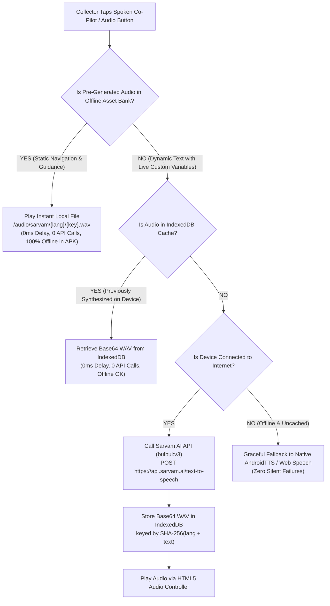

# Dhatu (धातु) — Sarvam AI Vernacular Voice & Navigation Co-Pilot Plan
### Ultra-Ergonomic Spoken Guidance System for Informal Scrap Collectors (Kabadiwalas)
**Target Viewports:** Android Capacitor APK (Offline Scrap Yards), Mobile PWA (360px–430px), Desktop Aggregation Hubs  
**AI Voice Provider:** Sarvam AI (`bulbul:v3` — High-Fidelity Indian Vernacular Speech)  
**Supported Languages:** Hindi (`hi-IN`), Marathi (`mr-IN`), Indian English (`en-IN`)  
**Voice Speaker:** `aditya` (Warm, authoritative Indian cadence, fluent Devanagari trade phonetics)  
**Core Directive:** Zero-cost repeated listening via pre-generated audio files, instant IndexedDB caching, and step-by-step physical UI navigation cues.

---

## 1. Ergonomic Audit: Why Most Voice Systems Fail Informal Collectors

Doorstep informal collectors (*kabadiwalas*) face unique cognitive and physical hurdles:
1. **Low Literacy / Tech Anxiety:** Many cannot read English or formal Hindi text. If a voice only reads abstract English headings ("Live Mandi Benchmark Rates"), it does not help them know **what button to press next**.
2. **Outdoor Friction:** In 42°C bright sunlight, glare makes tiny buttons invisible. Hands are often dusty or gloved while handling tricycles and scales.
3. **Noisy Environments:** Scrap yards and traffic require loud, punchy audio with high dynamic range and clear spoken numbers.
4. **Spotty 2G/3G Connectivity:** Inside metallic godowns and weighbridges, cell signals drop. Audio that requires an API roundtrip fails or hangs indefinitely.

### The Dhatu Voice Philosophy: "Show Me Where to Press"
Every voice prompt must provide **physical navigation cues** referencing **colors, shapes, icons, and locations on the screen**:
- ❌ *Abstract:* "Digital Lot Creator. Enter items and view valuation."
- ✅ *Actionable & Navigational:* *"नया लॉट बनाने के लिए 3 आसान कदम हैं: सबसे पहले नीचे नीले कैमरे वाले बटन पर दबाएं और कबाड़ का साफ फोटो लें।"* (Mentions the specific blue camera button and step 1).

---

## 2. Multi-Tiered "Zero-API-Redundancy" Audio Architecture

To guarantee **zero API cost on repeated listening** and **instant zero-lag playback in offline scrap yards**:

### Tier 1: Bundled Offline Asset Bank (`apps/web/public/audio/sarvam/`)
- All 30+ core navigation walkthroughs, step-by-step form guides, Mandi price breakdowns, and safety alerts are pre-generated during development via a Python script.
- Stored directly as optimized 22050Hz `.wav` files under `/audio/sarvam/hi/`, `/audio/sarvam/mr/`, `/audio/sarvam/en/`.
- Copied into Android Capacitor `assets/public/` so the APK plays them with **zero network dependency**.

### Tier 2: Dynamic Runtime Cache (IndexedDB `dhatu_sarvam_audio_cache`)
- When custom dynamic text occurs (e.g. unique customer addresses or calculated batch weights):
  - The text is hashed (`sha256(lang + text)`).
  - IndexedDB is queried. If found, it plays from device flash storage.
  - If missing, Sarvam AI API is invoked once, saved to IndexedDB, and all subsequent taps are free.

### Tier 3: Instant Tap-to-Stop & Heartbeat Protection
- Every audio button acts as a 1-tap **Play / Stop toggle**.
- Tapping any audio button immediately cancels any previous speech.
- Visual feedback: Animated soundwave bars bounce during playback; icon changes to a pulsing `VolumeX` button.

---

## 3. Highly Actionable Voice & Navigation Inventory (Collector Dashboard)

Here are the exact spoken scripts engineered specifically to help informal collectors navigate the interface with total confidence:

### 3.1 Persistent Header: Daily Co-Pilot Briefing (`briefing_daily_overview`)
- **Trigger:** Top golden pill in apex header: 🔊 **"आज का हाल और निर्देश सुनें"** (Listen Today's Briefing & Guide)
- **Hindi:** *"नमस्ते सुरेश जी! धातु ऐप में आपका स्वागत है। आज तांबे का भाव 480 रुपये और पीसीबी 3,200 रुपये प्रति किलो है। आपके इलाके में 2 नए पिकअप आए हैं। नीचे दिए गए तीसरे बटन 'पिकअप' पर जाकर ग्राहक का पता देखें और कबाड़ उठाएं।"*
- **Marathi:** *"नमस्कार सुरेश जी! धातु अ‍ॅपमध्ये आपले स्वागत आहे. आज तांब्याचा भाव 480 रुपये आणि पीसीबी 3,200 रुपये प्रति किलो आहे. आपल्या भागात 2 नवीन संकलन विनंत्या आल्या आहेत. खालील तिसऱ्या 'पिकअप' बटनावर जाऊन पत्ता पहा आणि भंगार गोळा करा."*
- **English:** *"Welcome Suresh ji to Dhatu. Today's copper is 480 Rupees and PCB is 3,200 Rupees per kg. You have 2 new pickup requests. Tap the 3rd button 'Pickups' at the bottom to view the customer address."*

---

### 3.2 Tab 1: Digital Lot Creator — Step-by-Step Audio Walkthrough

Informal collectors often get stuck when creating lots. The voice breaks it down into **3 physical visual steps**:

#### Master Lot Walkthrough (`lot_creation_walkthrough`):
- **Trigger:** Top card in Lot Creation tab: 🔊 **"लॉट कैसे बनाएं? सुनें"**
- **Hindi:** *"नया लॉट बनाने के तीन आसान कदम हैं: पहला, नीचे नीले कैमरा बटन को दबाकर कबाड़ की साफ फोटो लें। दूसरा, कांटे पर वजन तौलकर प्लस और माइनस बटन से वजन सेट करें। तीसरा, अपनी नजदीकी मंडी चुनकर सबसे नीचे हरा बटन 'लॉट जमा करें' दबाएं।"*
- **Marathi:** *"नवीन लॉट तयार करण्याचे तीन सोपे टप्पे आहेत: पहिला, खालील निळ्या कॅमेरा बटनावर दाबून भंगाराचा स्पष्ट फोटो घ्या. दुसरा, काट्यावरील वजन पाहून प्लस आणि मायनस बटनाने वजन सेट करा. तिसरा, जवळची बाजारपेठ निवडून सर्वात खालील हिरवे बटन 'लॉट जमा करा' दाबा."*
- **English:** *"Creating a lot takes 3 simple steps: First, tap the blue camera button to photograph scrap. Second, set the scale weight using the plus and minus buttons. Third, pick your nearby scrap hub and tap the green 'Submit Lot' button at the bottom."*

#### Step 1: Camera Photo Assistance (`lot_step_camera`):
- **Trigger:** Beside Camera Upload Zone: 📷 🔊 **"फोटो निर्देश"**
- **Hindi:** *"कैमरा खोलने के लिए नीले कैमरे वाले डिब्बे पर टैप करें। स्क्रैप को अच्छी रोशनी में रखें ताकि धातु की किस्म और तांबे की चमक साफ दिखे। हमारी एआई अपने आप पहचान लेगी।"*
- **Marathi:** *"कॅमेरा उघडण्यासाठी निळ्या कॅमेरा बॉक्सवर टॅप करा. भंगार चांगल्या प्रकाशात ठेवा जेणेकरून धातूचा प्रकार स्पष्ट दिसेल. आमची एआय आपोआप प्रकार ओळखेल."*
- **English:** *"Tap the blue camera box to capture photo. Keep scrap in good light so AI can accurately classify the grade."*

#### Step 2: Weight Stepper & Mandi Valuation (`lot_step_weight`):
- **Trigger:** Beside Weight Input: ⚖️ 🔊 **"वजन कैसे भरें?"**
- **Hindi:** *"कांटे पर जितना वजन आया है, उसे प्लस (+) दबाकर बढ़ाएं या माइनस (-) दबाकर घटाएं। वजन डालते ही नीचे सरकारी मंडी के हिसाब से आपकी कुल कमाई अपने आप दिखने लगेगी।"*
- **Marathi:** *"काट्यावरील वजन प्लस (+) दाबून वाढवा किंवा मायनस (-) दाबून कमी करा. वजन टाकताच खाली बाजारभावानुसार आपली एकूण कमाई आपोआप दिसेल."*
- **English:** *"Use the plus (+) and minus (-) buttons to set the scale weight. Your total payout based on official Mandi rates will calculate automatically below."*

#### Step 3: Yard / Hub Selection (`lot_step_hub`):
- **Trigger:** Beside Scrap Yard Dropdown: 📍 🔊 **"यार्ड चुनें"**
- **Hindi:** *"माल किस स्क्रैप यार्ड या फैक्ट्री में पहुंचाना चाहते हैं, उस यार्ड पर टैप करें। फिर सबसे नीचे बड़े हरे बटन 'लॉट जमा करें' को दबाएं।"*
- **Marathi:** *"माल कोणत्या भंगार बाजारात किंवा कारखान्यात पोहोचवायचा आहे, तो यार्ड निवडा. नंतर सर्वात खालील मोठ्या हिरव्या बटनावर 'लॉट जमा करा' दाबा."*
- **English:** *"Select the scrap hub or recycling factory where you want to deliver. Then tap the large green 'Submit Lot' button at the bottom."*

#### Step 4: Submission Confirmation (`lot_created_success`):
- **Trigger:** Plays automatically upon successful lot registration:
- **Hindi:** *"बधाई हो! आपका लॉट सफलतापूर्वक दर्ज हो गया है। अब रिसाइक्लर इस पर अपनी बोली लगाएंगे। बोलियां देखने के लिए दूसरे टैब 'लाइव बोलियां' पर जाएं।"*
- **Marathi:** *"अभिनंदन! आपला लॉट यशस्वीरित्या नोंदवला गेला आहे. आता कारखाने यावर बोली लावतील. बोली पाहण्यासाठी दुसऱ्या 'थेट लिलाव' टॅबवर जा."*
- **English:** *"Congratulations! Your lot has been registered. Recyclers will now bid on it. Go to the second tab 'Live Bids' to view offers."*

---

### 3.3 Tab 2: Live Bidding Room (`bids_walkthrough`)
- **Trigger:** Header banner in Bids tab: 🔊 **"बोली कैसे स्वीकार करें?"**
- **Hindi:** *"यहाँ रिसाइकलर्स द्वारा लगाई गई बोलियां दिख रही हैं। जो फैक्ट्री सबसे ज्यादा दाम दे रही है, उसका नाम सबसे ऊपर है। माल बेचने के लिए उसके सामने वाले हरे बटन 'बोली स्वीकार करें' पर दबाएं।"*
- **Marathi:** *"येथे कारखान्यांनी लावलेल्या बोली दिसत आहेत. सर्वाधिक भाव देणारा कारखाना सर्वात वर आहे. माल विकण्यासाठी समोरील हिरव्या 'बोली स्वीकारा' बटनावर टॅप करा."*
- **English:** *"Here are active recycler bids. The highest paying recycler is at the top. Tap the green 'Accept Bid' button beside their offer to confirm the sale."*

---

### 3.4 Tab 3: Today's Mandi Price Board (दाम और हिसाब बोर्ड)
Informal collectors need both the unit rate AND quick mental math calculations (e.g. "10 kg = ₹4,800"):

#### Master Rate Tour (`mandi_listen_all`):
- **Trigger:** Top banner button: 🔊 **"आज के सभी भाव सुनें"** (Listen All Today's Rates)
- **Hindi:** *"आज की आधिकारिक मंडी दरें: तांबा 480 रुपये प्रति किलो, पीसीबी 3,200 रुपये प्रति किलो, एल्युमिनियम 165 रुपये प्रति किलो, लोहा 38 रुपये प्रति किलो, और बैटरियां 120 रुपये प्रति किलो हैं। किसी भी स्क्रैप का 10 किलो का हिसाब सुनने के लिए उसके पीले बटन को दबाएं।"*
- **Marathi:** *"आजचे अधिकृत बाजार भाव: तांबे 480 रुपये प्रति किलो, पीसीबी 3,200 रुपये प्रति किलो, अ‍ॅल्युमिनियम 165 रुपये प्रति किलो, लोखंड 38 रुपये प्रति किलो, आणि बॅटऱ्या 120 रुपये प्रति किलो आहेत. 10 किलोचा हिशोब ऐकण्यासाठी पिवळे बटन दाबा."*
- **English:** *"Today's official Mandi rates: Copper 480 Rupees/kg, PCB 3,200 Rupees/kg, Aluminium 165 Rupees/kg, Iron 38 Rupees/kg, and Batteries 120 Rupees/kg. Tap the yellow speaker on any card to hear 10kg batch calculations."*

#### Individual Commodity Guidance (e.g. Copper `mandi_copper`):
- **Trigger:** 🔊 "दाम सुनें" on Copper Card:
- **Hindi:** *"तांबा स्क्रैप: भाव 480 रुपये प्रति किलो है। कल से भाव 20 रुपये बढ़ा है। 5 किलो के 2,400 रुपये और 10 किलो के 4,800 रुपये बनते हैं।"*
- **Marathi:** *"तांबे भंगार: भाव 480 रुपये प्रति किलो आहे. कालपेक्षा भाव 20 रुपयांनी वाढला आहे. 5 किलोचे 2,400 रुपये आणि 10 किलोचे 4,800 रुपये होतात."*
- **English:** *"Copper scrap: Rate is 480 Rupees per kg, up 20 Rupees from yesterday. 5 kg equals 2,400 Rupees, and 10 kg equals 4,800 Rupees."*

*(Similar batch calculation scripts generated for PCB, CRT, Aluminium, Iron, Battery, Mobile, Laptop)*

---

### 3.5 Tab 8: Citizen Doorstep Pickups (घर-घर पिकअप)

This is the most critical operation for doorstep collectors. A collector arriving at a citizen's house needs precise step-by-step guidance:

#### Pickups Overview (`pickups_walkthrough`):
- **Trigger:** Top of Pickups tab: 🔊 **"पिकअप कैसे करें? निर्देश सुनें"**
- **Hindi:** *"यहाँ आपके आसपास के घरों से पिकअप रिक्वेस्ट हैं। ग्राहक के पास जाने के लिए नीले बटन 'नक्शा देखें' पर दबाएं। फोन करने के लिए हरे फोन बटन पर दबाएं। कबाड़ तोलने के बाद ग्राहक से 4 अंकों का ओटीपी जरूर पूछें।"*
- **Marathi:** *"येथे परिसरातील घरांच्या संकलन विनंत्या आहेत. पत्त्यावर जाण्यासाठी निळ्या 'नकाशा' बटनावर दाबा. फोन करण्यासाठी हिरव्या फोन बटनावर दाबा. वजन केल्यावर ग्राहकाकडून 4-अंकी ओटीपी अवश्य घ्या."*
- **English:** *"Here are doorstep pickup requests. Tap the blue 'Map' button for directions. Tap the green phone button to call the customer. After weighing scrap, collect the 4-digit OTP from the customer."*

#### OTP Verification Step (`pickup_otp_guidance`):
- **Trigger:** Beside the 4 OTP Input Boxes: 🔢 🔊 **"ओटीपी निर्देश"**
- **Hindi:** *"ग्राहक के मोबाइल पर 4 अंकों का एक सीक्रेट कोड आया होगा। ग्राहक से वह 4 अंक पूछें और इन 4 डिब्बों में भरें, फिर नीचे हरा बटन 'ओटीपी सत्यापित करें' दबाएं। इससे पैसा तुरंत आपके खाते में जमा हो जाएगा।"*
- **Marathi:** *"ग्राहकाच्या मोबाईलवर 4-अंकी कोड आला असेल. ग्राहकाकडून ते 4 अंक विचारा आणि या 4 डब्यांत भरा, नंतर खालील हिरवे बटन 'ओटीपी तपासा' दाबा. रक्कम लगेच आपल्या खात्यात जमा होईल."*
- **English:** *"Ask the customer for the 4-digit OTP sent to their mobile. Enter the 4 digits into these boxes and tap the green 'Verify OTP' button to instantly credit your wallet."*

---

### 3.6 Tab 5: Weighbridge Handover & QR Pass (`handover_walkthrough`)
- **Trigger:** Beside QR Code in Handover Tab: 🎫 🔊 **"गेट पास कैसे दिखाएं?"**
- **Hindi:** *"यह आपका अधिकृत धर्मकांटा गेट पास है। जब आप माल लेकर फैक्ट्री यार्ड पहुंचे, तो गेट पर गार्ड या ऑपरेटर को यह बड़ा क्यूआर कोड दिखाएं। वे इसे स्कैन करेंगे और धर्मकांटे पर वजन दर्ज करेंगे। आपको कोई कागज दिखाने की जरूरत नहीं है।"*
- **Marathi:** *"हा आपला अधिकृत वजनकाटा गेट पास आहे. यार्डमध्ये पोहोचल्यावर गेटवरील ऑपरेटरला हा मोठा क्यूआर कोड दाखवा. ते हा कोड स्कॅन करून वजन नोंदवतील. कोणत्याही कागदाची गरज नाही."*
- **English:** *"This is your official weighbridge gate pass. When you reach the factory yard, show this large QR code to the weighbridge operator. They will scan it to record weights. No paperwork is needed."*

---

### 3.7 Tab 6: Cash Passbook & Earnings (`passbook_walkthrough`)
- **Trigger:** Beside Wallet Card: 💰 🔊 **"कमाई का हिसाब सुनें"**
- **Hindi:** *"कैश पासबुक: आपके वॉलेट में 18,400 रुपये उपलब्ध हैं। पिछले पिकअप के 4,800 रुपये आपके बैंक खाते में सफलतापूर्वक भेजे जा चुके हैं। नया भुगतान निकालने के लिए नीचे हरे बटन 'पैसे निकालें' पर दबाएं।"*
- **Marathi:** *"कॅश पासबुक: आपल्या वॉलेटमध्ये 18,400 रुपये शिल्लक आहेत. मागील संकलनाचे 4,800 रुपये आपल्या बँकेत जमा झाले आहेत. पैसे काढण्यासाठी खालील हिरव्या बटनावर दाबा."*
- **English:** *"Cash passbook: You have 18,400 Rupees available. Previous payout of 4,800 Rupees was sent to your bank. Tap 'Withdraw Funds' to transfer earnings."*

---

### 3.8 Tab 7: KYC & Limit Upgrade (`kyc_walkthrough`)
- **Trigger:** Beside Aadhaar Upload: 🛡️ 🔊 **"केवाईसी क्यों जरूरी है?"**
- **Hindi:** *"बिना आधार सत्यापन के आप दिन में केवल 5,000 रुपये का कबाड़ बेच सकते हैं। अपनी सीमा 50,000 रुपये करने के लिए अपने आधार कार्ड का फोटो खींचकर अपलोड करें। सरकार द्वारा प्रमाणित होने पर आपको सरकारी सीपीसीबी का हरा बैज मिलेगा।"*
- **Marathi:** *"आधार पडताळणीशिवाय आपण दिवसाला फक्त 5,000 रुपयांचे भंगार विकू शकता. मर्यादा 50,000 करण्यासाठी आधार कार्डाचा फोटो अपलोड करा. आपल्याला अधिकृत सीपीसीबीचा हिरवा बॅज मिळेल."*
- **English:** *"Without Aadhaar verification, your daily trading limit is 5,000 Rupees. Upload your Aadhaar photo to raise your daily limit to 50,000 Rupees and receive a certified CPCB Green Badge."*

---

### 3.9 Tab 9: Safety & Hazard Precautions (`safety_walkthrough`)
- **Trigger:** Top of Safety Tab: ⚠️ 🔊 **"सुरक्षा नियम सुनें"**
- **Hindi:** *"खतरनाक कबाड़ से बचने के नियम: मोबाइल और लैपटॉप की लिथियम बैटरी को कभी न तोड़े और न ही आग या पानी में डालें—इससे विस्फोट हो सकता है। सीआरटी टीवी और शीशा उठाते समय भारी दस्ताने जरूर पहनें।"*
- **Marathi:** *"धोकादायक कचरा हाताळण्याचे नियम: मोबाईल व लॅपटॉपची लिथियम बॅटरी कधीही फोडू नका किंवा आगीजवळ ठेवू नका. सीआरटी टीव्ही हाताळताना हातमोजे अवश्य वापरा."*
- **English:** *"Hazardous scrap safety: Never puncture lithium batteries or expose them to water or fire. Always wear heavy-duty work gloves when handling CRT glass."*

---

### 3.10 Persistent Smartphone Bottom Audio Dock (`CoPilotDock`)
- Fixed at the bottom of the mobile viewport right above the 56px navigation bar.
- Shows an amber floating pill: 🎧 **"इस स्क्रीन के निर्देश सुनें"** (Hear Instructions for This Screen) with animated live frequency bars.
- Automatically detects which tab the user is viewing and plays the corresponding walkthrough.

---

## 4. Technical Robustness & Quality Assurance

1. **Audio Pre-Generation (`scripts/generate_sarvam_audio.py`):**
   - Synthesizes all 36 clips × 3 languages = 108 high-quality `.wav` files using Sarvam AI `bulbul:v3`.
   - Generates `apps/web/src/lib/sarvamAudioCatalog.ts` containing the complete mapping of audio keys to static URLs.

2. **Zero Redundant API Calls:**
   - Pre-generated audio files are served from `/audio/sarvam/{lang}/{key}.wav` (or local file assets in the APK).
   - Once generated, clicking a button 100 times generates **0 HTTP requests** to Sarvam AI.

3. **Instant Stop & Audio Mutual Exclusion:**
   - Only 1 audio track can play at a time. Starting any clip stops the previous clip with 0 audio overlap.
   - Calling `stopVernacularSpeech()` immediately pauses and resets the audio stream.

4. **Offline Resilience:**
   - 100% of core navigation instructions exist as local files in `apps/web/public/audio/sarvam/`.
   - Even if the phone is placed in Airplane Mode, all voice instructions continue playing with 0ms delay.
