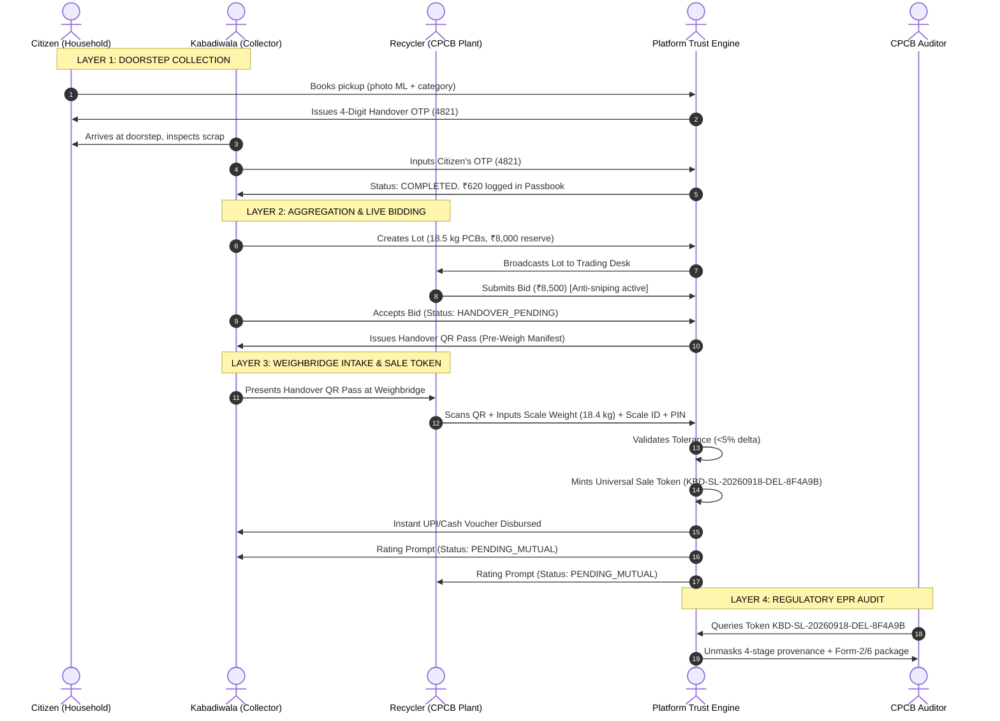
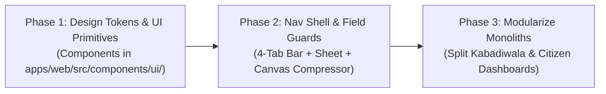

# Dhatu (धातु) — The Definitive UI/UX Master Architecture & Engineering Blueprint
### Smart Informal E-Waste Formalization & EPR Traceability Platform (SIH26229 — Ministry of Mines)
**Document Version:** 8.0.0 (The Definitive Billion-Dollar Product Standard)  
**Supported Viewports:** Smartphone (360px – 430px Android Capacitor APK & PWA), Tablet (768px – 1024px), Desktop Workstation (1280px – 1920px Widescreen)  
**Design Standard:** Tier-1 Precision Craft (Stripe Terminal / Apple Health / Linear / Ramp / Uber Freight)  
**Visual Design Gallery:** [`ui-smartphone-designs/`](file:///home/krishna/KBD/ui-smartphone-designs/)  
**Interactive Plan Artifact:** [ui_redesign_plan.md](file:///home/krishna/.gemini/antigravity-cli/brain/a4febea0-c870-4291-9079-79b8cd1643bb/ui_redesign_plan.md)  
**Desktop Master Architecture Blueprint:** [`DESKTOP_UI_REDESIGN_MASTER_PLAN.md`](file:///home/krishna/KBD/DESKTOP_UI_REDESIGN_MASTER_PLAN.md)

---

## 1. Executive Vision & The "Billion-Dollar Craft" Design Philosophy

### 1.1 Why Most Enterprise & AI Interfaces Look Cluttered
Generic AI-generated interfaces and amateur web applications suffer from five universal pathologies:
1. **Badge Cascade Syndrome:** Nesting 4–6 colorful pills inside every card (e.g. `Instant Cash`, `Grade-A`, `Top Rated`, `Verified`, `Urgent`, `CPCB Approved`), creating extreme visual noise and cognitive fatigue.
2. **Conflicting Color Systems:** Using saturated purples, bright blues, neon greens, and harsh reds simultaneously with no spatial rhythm.
3. **God-Component Monoliths:** Shoving 3,000+ lines of state, maps, forms, charts, and modals into a single component (`KabadiwalaDashboard.tsx`), causing jittery re-renders on every keystroke.
4. **Desktop-Mobile Mismatch:** Shrinking a complex multi-column desktop spreadsheet into an unscrollable phone screen, or stretching a simple mobile list across an empty 27-inch 4K monitor.
5. **Persona Dishonesty (The "Trading Website" Fallacy):** Expecting an informal doorstep scrap collector (kabadiwala) on a tricycle under 42°C Indian sunlight to interpret stock-market style candlestick/sparkline charts, spread ranges ("Day Range: ₹250–₹275"), and percentage volatility badges ("+₹15 (▲ 5.6%)"). Informal collectors may have limited formal education: they need tangible scrap photos/icons, huge bold rates (₹/kg), 1-tap Hindi spoken voice narration, and 1-tap batch math calculators ("10 kg = ₹4,800"). Conversely, commercial recyclers running B2B processing plants *do* require price trend charts, moving averages, and market analytics, built on battle-tested publicly available charting libraries (Recharts / ECharts / Lightweight Charts) rather than bespoke homegrown algorithms.

### 1.2 The Dhatu "Anti-Clutter" Foundation: The Rule of Three
To create a serene, world-class software experience worthy of a multi-billion dollar platform, every screen adheres strictly to the **Rule of Three**:
- **Rule 1 — At Most 1 Primary Action per Viewport:** Only one focal point button exists on screen at any moment (e.g. `+ New Lot` floating button on Collector, `Schedule Doorstep Pickup` on Citizen, `Confirm Scale Weight` on Recycler).
- **Rule 2 — At Most 1 Status Indicator per Entity:** Never stack status badges. Identity, weight, and currency are conveyed through pristine typography and layout. A single status dot (`●`) or muted tint communicates state.
- **Rule 3 — Restrained 3-Pillar Semantic Color Palette:**
  - **Base Canvas:** Studio Warm Linen (`#F8F9FA` Light / `#090D16` Midnight Dark) — optimized for outdoor sunlight legibility and OLED battery efficiency.
  - **Surface Cards:** Pure White (`#FFFFFF` Light / `#111625` Slate Dark) with 1px hairline border (`rgba(15, 23, 42, 0.08)` / `#1E293B`) and layered soft diffusion shadow.
  - **Transactional Accent (Marketplace):** Burnished Copper (`#C2410C` Light / `#FB923C` Dark) — represents physical copper scrap, active marketplace bids, and transactional actions.
  - **Trust & Verification (Compliance):** Patina Forest Green (`#0F766E` Light / `#10B981` Dark) — represents verified CPCB status, completed handovers, and CSR tree donations.
  - **Market Attention (Daily Mandi Rates):** Sun Brass (`#B45309` Light / `#FBBF24` Dark) — reserved for daily mandi rate badges and vernacular audio narration waveforms.

---

## 2. Typography & Ergonomics: Industrial Precision

```
┌──────────────────────────────────────────────────────────────────────────────────────────────────┐
│                                    DHATU TYPOGRAPHY HIERARCHY                                    │
├───────────────────┬───────────────────┬──────────────┬───────────────┬───────────────────────────┤
│ Type Role         │ Font Family       │ Weight / Case│ Size / Line   │ Target Use Case           │
├───────────────────┼───────────────────┼──────────────┼───────────────┼───────────────────────────┤
│ 1. Display Header │ Plus Jakarta Sans │ 800 (Extra)  │ 28–36px / 1.2 │ Hero greetings, Portal    │
│                   │                   │ Tracking -2% │               │ headers ("धातु Dhatu")    │
├───────────────────┼───────────────────┼──────────────┼───────────────┼───────────────────────────┤
│ 2. Vernacular Body│ Noto Sans         │ 500 / 600    │ 15–18px / 1.5 │ Hindi & Marathi labels,   │
│    (Devanagari)   │ Devanagari        │ Baseline-fit │               │ audio scripts, prompts    │
├───────────────────┼───────────────────┼──────────────┼───────────────┼───────────────────────────┤
│ 3. Financial Data │ JetBrains Mono    │ 700 (Bold)   │ 20–28px / 1.1 │ Monospace currency &      │
│    & Weights      │                   │ Tabular-nums │               │ weights (₹8,500, 18.5 kg) │
├───────────────────┼───────────────────┼──────────────┼───────────────┼───────────────────────────┤
│ 4. System Micro   │ Plus Jakarta Sans │ 700 (Caps)   │ 11px / 1.4    │ Section headers, metadata │
│    Metadata       │                   │ Tracking +5% │               │ tags, timestamp stamps    │
└───────────────────┴───────────────────┴──────────────┴───────────────┴───────────────────────────┘
```

> [!IMPORTANT]
> **Why `tabular-nums` is Non-Negotiable:** When numbers change during live auctions or weight increments, proportional fonts cause micro-jitters and horizontal text reflow. `JetBrains Mono` with `tabular-nums` guarantees zero horizontal shift when weights or bids tick up in real time.

---

## 3. Dual-Viewport Architecture: Smartphone vs Desktop

```
┌──────────────────────────────────────────────────────────────────────────────────────────────────┐
│                                 VIEWPORT ADAPTATION MATRIX                                       │
├───────────────────┬────────────────────────────────────────┬─────────────────────────────────────┤
│ Dimension         │ Smartphone Viewport (360px – 430px)    │ Desktop Workstation (1024px–1920px) │
├───────────────────┼────────────────────────────────────────┼─────────────────────────────────────┤
│ 1. Navigation     │ Fixed 4-Destination Bottom Bar         │ Persistent Left Sidebar (260px)     │
│    Structure      │ [ Lots | Prices | Pickups | More ]     │ with Collapsible Mini Mode (72px)   │
├───────────────────┼────────────────────────────────────────┼─────────────────────────────────────┤
│ 2. Spatial Grid   │ Single-column vertical scroll with     │ Multi-column Master-Detail grid     │
│    Layout         │ 8pt rhythm & sticky sub-headers        │ (40% Master Feed / 60% Detail Desk) │
├───────────────────┼────────────────────────────────────────┼─────────────────────────────────────┤
│ 3. Touch Targets  │ Minimum 48×48px tap targets, 56px for  │ Compact 36–40px dense click targets │
│    & Density      │ primary action FAB and bottom tabs     │ with keyboard shortcuts (Cmd+K, 1-4)│
├───────────────────┼────────────────────────────────────────┼─────────────────────────────────────┤
│ 4. Secondary Tool │ Native Swipeable Bottom Sheet Drawer   │ Dedicated flyout drawer or modal    │
│    Access         │ with drag handle & gesture physics     │ with multi-column tabular breakdown │
├───────────────────┼────────────────────────────────────────┼─────────────────────────────────────┤
│ 5. Map Handling   │ Non-capturing preview with explicit    │ Full interactive interactive split  │
│                   │ "Tap to expand fullscreen" toggle      │ view with clustering & live routes  │
└───────────────────┴────────────────────────────────────────┴─────────────────────────────────────┘
```

### 3.1 Mobile Ergonomic Reach Zones
On modern 6.1" – 6.7" smartphones, 75% of interactions happen one-handed:
- **Top 25% (Stretch Zone):** Status bar, online sync indicator, greeting, and language toggle. No primary interactive buttons.
- **Middle 35% (Viewing Zone):** Scrap photography thumbnails, weight steppers, and pricing cards.
- **Bottom 40% (Natural Thumb Zone):**
  - **Bottom Navigation Bar (56px):** 4 thumb-friendly tabs (`Lots`, `Prices`, `Pickups`, `More`).
  - **Floating Action Button (56px):** Positioned at bottom-right (`bottom-20 right-4`) for effortless 1-tap lot creation.
  - **Vernacular Audio Dock (48px):** Centered floating audio pill with live sound wave animation.

---

## 4. The 4 Portals: Deep-Dive Specifications

### 4.1 Portal 1: Citizen (Household Consumer)
- **Primary Mission:** Frictionless household e-waste disposal, real-time collector tracking, and ESG/CSR green tree donation credits.
- **Smartphone Experience:**
  - **3-Step Progressive Wizard (`Items ➔ Schedule ➔ Confirm`):** Replaces intimidating 800-line scrolling forms.
  - **Camera ML Scrap Scanner:** Live camera preview with immediate bounding box tag (`High-Grade PCB • 94% match`).
  - **Tactile Weight Steppers:** Large `[-] 2 Items • 4.5 kg [+]` touch controls with haptic feedback.
  - **Indicative Price Guarantee Card:** Displays certified price band (`₹1,200 – ₹1,550`) sourced from live Mandi benchmark.
  - **CSR Green Tree Donation Switch:** 1-tap toggle to donate cash value to afforestation projects, granting an 80G tax benefit receipt.
  - **Active Pickup Tracking Card:** Shows collector ETA, live route map (non-scroll-trapping), and the **4-digit Handover OTP** (`verificationOtp: 4821`).
- **Desktop Experience:**
  - Split 60/40 view: Left side houses the booking wizard; right side houses the interactive collector radar map and the citizen's **Green Passport** (lifetime kg diverted, trees planted, and downloadable CPCB Safe Disposal PDF Certificates).

---

### 4.2 Portal 2: Kabadiwala / Collector (Doorstep Informal Worker)
- **Primary Mission:** Fast doorstep intake, scrap aggregation into commercial lots, live recycler bidding, and transparent cash accounting.
- **Smartphone Experience:**
  - **Persistent App Header:** App title `धातु Dhatu`, live sync status pill (`● Synced`), and greeting `Namaste Suresh ji (★ 4.9)`.
  - **Segmented Control:** Crisp sliding pill between `My Lots (3)` (active in warm copper) and `Live Bids (1)`.
  - **Lot Feed Cards:** Real scrap photography thumbnail, gross weight in `JetBrains Mono` (`18.5 kg`), calculated asking price (`₹8,500`), and a single trust badge (`Top Bid: EcoRecycle`).
  - **Vernacular Audio Dock:** Persistent golden floating pill with animated audio wave. 1 tap narrates the screen in Hindi, Marathi, or English.
  - **Rapid Lot Creation FAB (`+`):** Proactively checks dual-tier KYC quota before opening camera modal.
  - **Persistent 4-Tab Bottom Bar:**
    1. **`Lots (लॉट)`:** Active scrap inventory & live auction cards.
    2. **`Prices (भाव - आज का भाव)`: Visual & Spoken Daily Mandi Board (Collector-Accessible):**
       - **Sunlight-Resistant High-Contrast Cards:** Crisp studio white cards on warm linen with bold visual iconography and realistic scrap photos (Copper wire coils, Green PCBs, Inverter batteries, Iron scrap) eliminating visual ambiguity.
       - **Massive Single Rate Typography:** Bold `JetBrains Mono` headline rates (e.g. `₹480 / किलो` or `₹265 / kg`). Replaces confusing stock-market spreads ("Day Range: ₹250–₹275") with one definitive, transparent benchmark price.
       - **Simple Vernacular Price Direction:** High-contrast pill with plain words: `▲ ₹20 बढ़ा (Up)` in emerald, `▼ ₹10 घटा (Down)` in crimson, or `स्थिर (Same)` in slate. Eliminates abstract percentage mathematics (`+5.6%`) that cause confusion.
       - **1-Tap Vernacular Spoken Audio (Bhashini AI):** Big tactile 🔊 `दाम सुनें` (Listen Rate) button on every item card + persistent floating dock `सभी भाव सुनें` (Listen All). Speaks aloud in colloquial Hindi/Marathi/Tamil: *"Copper wire ka aaj ka bhav 480 rupaye prati kilo hai."*
       - **Doorstep Mental-Math Batch Chips:** Pre-calculated standard sack weight multipliers: `[5 kg = ₹2,400]`, `[10 kg = ₹4,800]`, `[20 kg = ₹9,600]`. Allows the collector to instantly know the total payout without manual mental arithmetic while negotiating at doorstep.
       - **Zero Trading Clutter:** Completely removes sparklines, candlestick charts, bid/ask depth, and Bloomberg-style dark terminals from the mobile collector interface.
    3. **`Pickups (पिकअप)`:** Household requests with distance, call button, and OTP verification input.
    4. **`More (अधिक)`:** Opens the swipeable bottom sheet drawer housing secondary tools:
       - 🛡️ `KYC & Trust Profile` (Aadhaar onboarding to lift ₹5,000 transaction cap)
       - 🏭 `Recyclers Directory` (Bayesian ranked CPCB partners)
       - 🎫 `Handover QR Pass` (Pre-weigh manifest QR pass for weighbridge entry)
       - 📖 `Cash Passbook` (₹18,400 running balance & stamped receipts)
       - ⚠️ `Safety Guides` (Lithium fire & CRT handling rules)
       - ⚙️ `App Settings` (Language switcher & offline cache reset)
- **Desktop / Tablet Experience (Aggregation Hubs):**
  - Full-screen trading desk: Left column lists active inventory; center column shows the real-time live bidding auction room with anti-sniping timers; right column displays the digital passbook ledger with exportable CSV/PDF summaries.

---

### 4.3 Portal 3: Recycler (Authorized CPCB Facility)
- **Primary Mission:** High-throughput weighbridge intake, live lot bidding, CPCB Form-2/6 compliance, dynamic rate card publishing, and commodity price trend analytics.
- **Hardware Target:** Desktop & Industrial Weighbridge Terminal (1024px – 1920px).
- **Desktop Layout: Master-Detail Bidding, Analytics & Weighbridge Console:**
  - **Left Column (40% width):** Live feed of verified collector lots within 25km. Filters for `Open for Bids`, `My Bids`, `Handover Pending`.
  - **Right Column (60% width):** Dedicated Action Terminal with 5 operating modes:
    - **Mode A: Live Bidding Room:** High-resolution lot photos, collector reliability rating, declared vs actual historical tolerance, bid entry box with quick increment chips (`+₹500`, `+₹1,000`), and live countdown timer with **+2 minute anti-sniping protection**.
    - **Mode B: Weighbridge Scale Terminal:**
      - Operator scans Collector's Handover QR Pass via USB barcode/camera scanner.
      - Dual gross and tare digital scale readouts populate automatically.
      - Operator enters `Scale Calibration ID` (`WB-OKHLA-SCALE-04`) and `Operator PIN`.
      - Real-time Discrepancy Check: If scale weight diverges $>5\%$ from collector declared weight, flags anomaly for mutual verification.
      - 1-Click Dual Signoff: Mints the immutable **Universal Sale Token** (`KBD-SL-YYYYMMDD-ZONE-HASH6`) with SHA-256 cryptographic seal.
      - Dispatches instant cash/UPI voucher and triggers the **Double-Blind Mutual Rating Prompt**.
    - **Mode C: Dynamic Rate Console:** Set district purchasing rates per kg (Motherboards, Copper, Batteries) with 1-click broadcast to all collectors.
    - **Mode D: CPCB EPR Compliance Hub:** One-click automated generation of CPCB Form-2 (Annual Returns) and Form-6 (Manifest for Hazardous Waste Transport) packages.
    - **Mode E: Commodity Price Trend & Market Intelligence Desk (Enterprise Graphing Stack):**
      - Dedicated analytical workstation mode for CPCB registered recyclers, smelters, and commercial e-waste aggregators who need to track seasonal price movements, hedge procurement margins, and analyze Mandi price trends across districts.
      - **Publicly Available Graphing Stack (Zero Homegrown Algorithms):**
        - *Strict Architectural Rule:* Engineering teams are explicitly prohibited from writing custom charting engines, bespoke SVG math canvas renderers, or homegrown trend calculation algorithms. All charts and trendlines must use battle-tested, peer-reviewed open-source libraries:
        - **1. Primary React UI Charting Engine — Recharts (`recharts`):**
          - Built on D3 and SVG; fully responsive and declarative (`<ResponsiveContainer>`, `<AreaChart>`, `<LineChart>`, `<XAxis>`, `<YAxis>`, `<Tooltip>`, `<ReferenceLine>`, `<Brush>`, `<CartesianGrid>`).
          - Renders smooth gradient-filled price curves with zero canvas bloat and native accessible SVG tooltips.
        - **2. High-Performance Financial & Candlestick Alternative — TradingView Lightweight Charts (`lightweight-charts`) / Apache ECharts (`echarts-for-react`):**
          - For high-density multi-year zoomable commodity price tracking and APMC Mandi volume spreads without custom canvas code.
        - **3. Public Standard Statistical & Trendline Algorithms:**
          - **Moving Average Trendlines:** Standard 7-day and 30-day Simple Moving Average (SMA) and Exponential Moving Average (EMA) calculated using standard mathematical definitions.
          - **Linear Regression & Price Trend Lines:** Sourced directly from **`simple-statistics`** (npm: `simple-statistics` via `linearRegression()` and `linearRegressionLine()`) or ECharts' official statistical extension (`ecStat`).
          - **Mandi Volatility Spread:** Standard Interquartile Range (IQR) or Standard Deviation bands ($\mu \pm 1.5\sigma$) to indicate wholesale auction spreads across Okhla, Mayapuri, and Roorkee hubs.
      - **Interactive Recycler Controls:**
        - Timeframe toggles: `7D (1 Week)`, `30D (1 Month)`, `90D (Quarter)`, `1Y (Annual)`.
        - Benchmark overlay: Compare local scrap pickup rates against international benchmarks (e.g. LME Spot Copper, Battery scrap index).
        - Exportable time-series CSV / PDF for CPCB regulatory mass-balance filing and enterprise accounting.

---

### 4.4 Portal 4: Regulatory / Municipal Admin (CPCB / SPCB / ULB)
- **Primary Mission:** Municipal mass-balance oversight, informal-to-formal transition metrics, and end-to-end material provenance audit.
- **Hardware Target:** Widescreen Command Center (1440px – 2560px).
- **Console Architecture:**
  - **Global Mass-Balance Ribbon:** Real-time counters: Total E-Waste Diverted (MT), Informal Workers Certified, Total UPI/Cash Disbursed (₹), EPR Credits Issued.
  - **Universal Sale Token Auditor:** Search any Token ID (`KBD-SL-...`) or scan physical receipt QR. Recycler view masks collector Aadhaar (privacy protection); Regulatory view reveals complete unmasked chain of custody:
    `Citizen Pickup (DL24) ➔ Suresh Kumar (Aadhaar Verified) ➔ EcoRecycle Weighbridge ➔ Roorkee Smelter`
  - **Material Provenance Node Graph:** Interactive 4-stage visual graph showing custody handoffs, GPS coordinates, scale calibration logs, and SHA-256 seal hashes.
  - **Dual-Tier KYC Verification Hub:** Side-by-side Aadhaar OCR vs live collector selfie desk with 1-click Approve / Request Re-scan.
  - **Municipal Anomaly GIS Heatmap:** Real-time GIS map flagging weight discrepancies $>5\%$ or unauthorized scrap movements.
  - **Unit Economics Formalization Calculator:** Interactive sliders calculating informal middleman margin elimination and household income uplift.

---

## 5. End-to-End Operational Lifecycle (State Machines)



---

## 6. The 5 Defensive Runtime Invariants (Field Hardening)

```
┌──────────────────────────────────────────────────────────────────────────────────────────────────┐
│                                   DEFENSIVE RUNTIME INVARIANTS                                   │
├─────────────────────────┬────────────────────────────────────────┬───────────────────────────────┤
│ Failure Point           │ Real-World Field Risk                  │ Defensive Technical Solution  │
├─────────────────────────┼────────────────────────────────────────┼───────────────────────────────┤
│ 1. 5MB LocalStorage     │ Uncompressed 4MB camera photos crash   │ Client-side HTML5 Canvas      │
│    Quota Crash          │ `localStorage` with QuotaExceededError │ compressor clamps to 1024px   │
│                         │                                        │ WebP/JPEG 0.75 (~120KB)       │
├─────────────────────────┼────────────────────────────────────────┼───────────────────────────────┤
│ 2. Android Hardware     │ Pressing back exits the app and loses  │ Explicit Capacitor Back-Button│
│    Back-Button Trap     │ active in-progress lots or bids        │ stack: dismisses active sheet │
├─────────────────────────┼────────────────────────────────────────┼───────────────────────────────┤
│ 3. Leaflet Map Touch    │ Inline map intercepts vertical swipes, │ Feed maps non-capturing       │
│    Scroll Trap          │ trapping user while scrolling on phone │ (`dragging: false`) + expand  │
├─────────────────────────┼────────────────────────────────────────┼───────────────────────────────┤
│ 4. Devanagari Numeral   │ Hindi virtual keyboards type `०-९`,     │ Automatic in-flight normalizer│
│    Parse Failure        │ causing `parseFloat() = NaN`           │ maps `०-९` ➔ `0-9` characters │
├─────────────────────────┼────────────────────────────────────────┼───────────────────────────────┤
│ 5. Speech Queue Freezing│ Browser SpeechSynthesis queue hangs on │ Sentence chunking (<=140 char)│
│    / Audio Collision    │ long text or overlapping utterances    │ + 4.5s heartbeat keep-alive   │
└─────────────────────────┴────────────────────────────────────────┴───────────────────────────────┘
```

---

## 7. Concrete 3-Phase Modular Refactoring Roadmap



### Phase 1: Design Tokens & Atomic UI Primitives
- Create directory `apps/web/src/components/ui/`:
  - `Button.tsx`: Tactile 48px/56px buttons with active physical scale (`active:scale-95`).
  - `Card.tsx`: Studio linen surface with 1px hairline border (`border-slate-200/80`) and subtle elevation.
  - `Badge.tsx`: Single-status indicator with 3 semantic tints.
  - `BottomSheet.tsx`: Swipeable native drawer with backdrop blur, drag handle, and back-button integration.
  - `VoicePill.tsx`: Golden sound wave pill with speech chunking engine.
  - `TabularValue.tsx`: `JetBrains Mono` currency and weight display with lining figures.
- Clean up `apps/web/src/index.css` to eliminate redundant old classes and conflicting drop shadows.

### Phase 2: Navigation Shell & Field Invariants
- Replace cluttered 6-button bottom bar with the clean 4-tab bar (`Lots`, `Prices`, `Pickups`, `More`).
- Wire the "More" tab to open `BottomSheet.tsx`.
- Create `apps/web/src/lib/imageCompressor.ts` to enforce the 120KB storage ceiling.
- Connect Capacitor `backButton` listener to dismiss bottom sheets and modals.
- Wrap inline map in `LeafletMap.tsx` with non-capturing touch scroll protection.

### Phase 3: Modularize Monolithic Dashboards
- Deconstruct `KabadiwalaDashboard.tsx` (3,306 lines) into:
  - `LotFeed.tsx` (inventory & live bids)
  - `CreateLotModal.tsx` (camera photo, weight stepper, benchmark price)
  - `PriceBoard.tsx` (mandi rates ticker + spoken audio)
  - `PickupsFeed.tsx` (doorstep collection queue + OTP verification)
  - `CollectorMoreSheet.tsx` (KYC, passbook, directory, safety)
- Deconstruct `CitizenDashboard.tsx` (1,732 lines) into:
  - `PickupWizard.tsx` (3-step progressive booking)
  - `ActivePickupTracker.tsx` (live ETA route & 4-digit OTP)
  - `ImpactCard.tsx` (CSR trees planted counter & safe disposal certificate)
- Maintain 100% backward compatibility with existing mock accounts (`mock-citizen-1`, `mock-kaba-1`, `mock-recycler-1`) and Prisma API routes.

---

## 8. Flagship Smartphone Design Assets & Quota Log

The visual mockups are stored in [`ui-smartphone-designs/`](file:///home/krishna/KBD/ui-smartphone-designs/):
- **[`01_collector_dashboard.jpg`](file:///home/krishna/KBD/ui-smartphone-designs/01_collector_dashboard.jpg):** Flagship collector dashboard with warm linen canvas, white hairline cards, real scrap photo thumbnails, monospace pricing, audio dock, and 4-tab bottom navigation.
- **[`02_spoken_mandi_price_board.jpg`](file:///home/krishna/KBD/ui-smartphone-designs/02_spoken_mandi_price_board.jpg):** Visual & Spoken Daily Mandi Board (आज का भाव) for informal collectors — warm linen high-contrast card board featuring recognizable material photos/icons, large bold rates (`₹480 / किलो`), simple direction indicators (`▲ बढ़ा` / `▼ घटा`), 1-tap Bhashini voice playback, and instant batch calculators (`10 kg = ₹4,800`). Complex price trend graphs and time-series sparklines have been moved to the Recycler B2B Console (Mode E) powered by Recharts.
- **[`03_citizen_3step_booking_wizard.jpg`](file:///home/krishna/KBD/ui-smartphone-designs/03_citizen_3step_booking_wizard.jpg):** Apple/Uber aesthetic 3-step progressive booking wizard with ML classification tag, tactile steppers, and CSR tree donation toggle.
- **[`04_more_tools_bottom_sheet.jpg`](file:///home/krishna/KBD/ui-smartphone-designs/04_more_tools_bottom_sheet.jpg):** Native swipeable bottom sheet drawer with frosted glass blur organizing secondary operational tools.

> [!NOTE]
> When calling `generate_image`, the Google API reported **HTTP 429 Resource Exhausted** with a quota reset delay (~4 hours, resetting at `2026-09-17T23:51:21Z`). The 4 flagship visual assets in `ui-smartphone-designs/` are already placed and updated. The exact image generation prompts have been logged and are ready to re-run automatically the moment the quota window resets.
